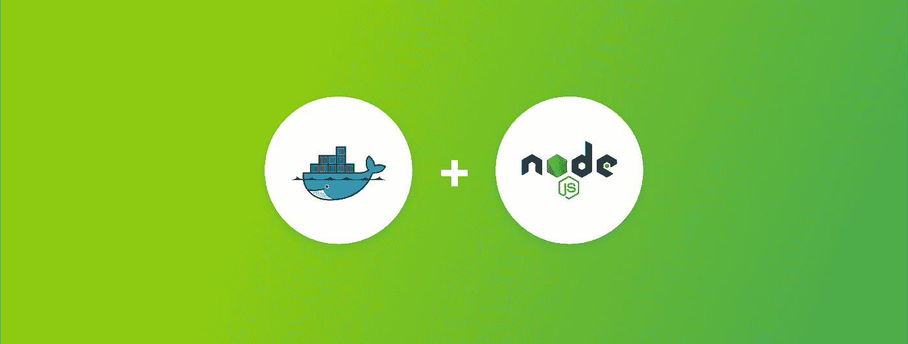

# 如何停靠 Node.js 应用程序

> 原文：<https://medium.com/hackernoon/how-to-dockerize-a-node-js-application-4fbab45a0c19>

[Node.js](https://hackernoon.com/tagged/nodejs) 和 [Docker](https://hackernoon.com/tagged/docker) 。如果你没有在过去的 7 年里呆在水下洞穴里，在珊瑚床上玩单人纸牌游戏，你一定至少听说过这两种在 web 开发行业中永远流行的技术。在本指南中，我们将向您解释如何为 Node.js 应用程序创建 Docker 映像。

# 我为什么要将我的申请归档

如果你曾经听说过 Docker 的事情，你可能会一直问这样一个问题:“何必呢？”嗯，原因如下:

*   您可以设置开发环境，完全有能力。这可以在任何支持 Docker 的计算机上完成；不需要安装库、依赖项、下载包、修改配置文件等等。
*   应用程序的工作环境在整个工作流程中保持一致。换句话说，无论是在开发、试运行还是生产服务器上，应用程序对开发人员、测试人员和客户来说都运行完全相同的*。*

简而言之，Docker 似乎是对软件开发中老生常谈的回应的反制:“奇怪，它对我有效！”

# 喜欢你读的吗？[点击此处查看全文](https://buddy.works/guides/how-dockerize-node-application)。

