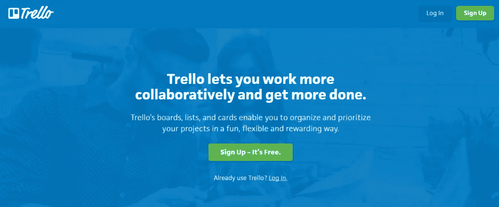
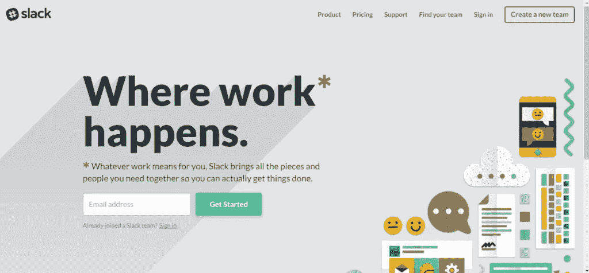
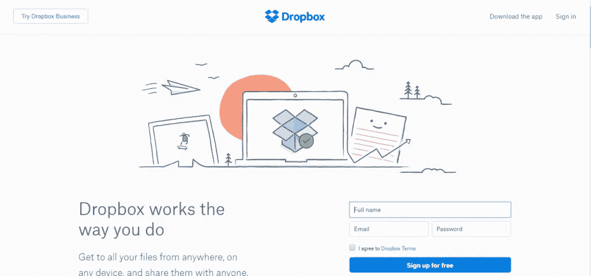
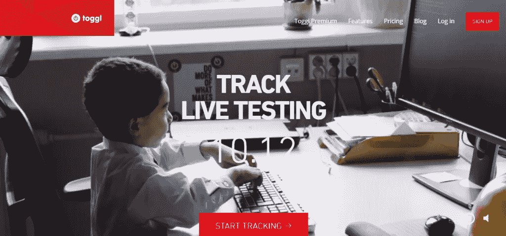

# 轻松管理自由职业者的 18 个最佳工具

> 原文：<https://medium.com/hackernoon/how-to-easily-manage-freelancers-tools-and-tips-c2fd025c1798>

## [技术工具和提示]

# 自由职业者

自由职业者已经有 5300 万，预计到 2020 年，40%的劳动力将成为自由职业者。

虽然与自由职业者一起工作可以为小企业带来一些优势，但管理自由职业者也可能是一项艰巨的挑战。

由于自由职业者为许多不同的客户工作，而不是雇员，确保他们在工作量、可交付成果和截止日期上保持一致变得至关重要。当建立自由团队时，事情会变得更加复杂。

# 明智管理自由职业者的需要

自由职业者不是员工；他们是独立的顾问，可以随时随地工作。作为一个小企业主，你最好的办法是通过有效的沟通和设定一致的截止日期来管理它们。尝试通过法律文件提前勾勒出你自由职业关系的规则，并投资可能有助于沟通的项目管理软件。

如果你是一名自由职业者，重要的是要善于沟通，提前了解客户的需求，了解他们的愿景。努力去理解和被理解。当沟通不畅时，你很容易丢掉工作或得到一个糟糕的评价。

正如我们在 2017 年一样，越来越多的软件平台将赋予创业公司管理自由职业者的能力。许多将是交钥匙解决方案。像 Basecamp 这样的 SaaS 产品允许项目经理创建任务列表，并允许公司和自由职业者通过共享笔记、文档和截止日期进行交流。我强烈建议为你的自由职业者创建流程，并且明确目标和期限。事实证明，这份给自由职业者开发票的指南很有帮助。

还有自由职业者管理系统(FMS)可以帮助你找到并监督自由职业者。劳动力市场是 FMS 的一个例子，当涉及到随需应变的劳动力时，它有助于发现、验证、加入、跟踪和保持公司的合规性。它还允许社区对工作进行评级。他们的大多数客户都是企业级的，所以如果你是一名自由职业者，这可能是一个站在大公司前面的机会。

# 这里有一些管理自由职业者的小技巧

## 了解他们想要什么

你需要问的第一个问题是:他们为什么有兴趣做这份工作？“可能是钱，发展新技能的机会，或者和优秀的人一起工作的机会，”Pink 说。“你给那个人什么作为交换，让他或她的才能借给你的组织？”因为你不会像你团队中的人一样了解自由职业者，你可能需要直接向他们提出这个问题。(平克说:“在生活中，仅仅问是一种很少使用的技巧。”。你可能会说，“告诉我你希望从这项任务中得到什么。”那就确保你能兑现承诺。

## 设定期望值

与此同时，你需要清楚自己想要什么回报——是精心设计的小册子、新网站，还是每两周一次的建议。起草一份详细说明你需要什么和什么时候需要的声明是一个好习惯。为他们提供背景也很重要。平克说，因为自由职业者不是一直都在，“他们不会像你的员工那样通过潜移默化来达到锻炼的目的”。你必须花额外的时间来谈论目标是什么，它如何与大局相联系，以及它为什么重要。

## 建立关系

“公平地说，你不必像一名雇员那样为一名自由职业者投入那么多，”金说。但是，Pink 警告说，“不要陷入纯粹的交易陷阱”。通过询问他们的家庭、他们在工作之外对什么感兴趣以及他们正在做的其他项目来了解他们(假设你不是他们唯一的客户)。如果你将来还想和这个人共事，这一点尤其重要。

## 让他们觉得自己是团队的一部分

金最近(尚未发表)对自由职业者的研究表明，他们更愿意为那些把他们视为团队一员的雇主工作。因此，尽量避免所有可能让承包商感觉自己是二等公民的微妙的身份差异——例如，他们的 id 徽章的颜色或进入公司健身房的权利——而是要非常包容。邀请他们参加重要的会议，让他们参加饮水机对话，并把他们添加到团队电子邮件列表中。一些组织的合规部门可能会担心，出于法律和税收目的，做这些事情会让自由职业者看起来太像员工，经理们当然需要小心，不要超越任何劳动法或人力资源指导方针。但是，金指出:“没有什么说他们不能来参加团队午餐。”

## 不要微观管理

你的承包商很可能成为自由职业者，因为他们想要自主权。金和平克都认为给他们自由很重要。金说:“要成为一名成功的自由职业者，你需要有上进心，能够在没有人监视的情况下工作。”对他们的时间表和其他承诺要有弹性。你可能不是他们唯一的客户。给他们工作的空间。“你不应该管理承包商的工作产品。如果是的话，那就另找一个，”他说。

## 给出反馈

没有必要和自由职业者一起做正式的评估(“我甚至不太喜欢给员工做绩效评估，”Pink 承认)，但这并不意味着你应该忽略反馈。告诉他们你对他们工作的看法会提高他们的表现并加深关系。“此外，大多数自由职业者都渴望这种投入，”平克说。

这可以简单到在约定结束时花五分钟讨论什么做对了，什么做错了，但金说持续的反馈甚至更好。“定期重温工作说明书或合同，弄清楚他们是否达到了目标，”他建议道。“如果他们为你做得很好，感谢他们，尤其是在别人面前。”如果他们表现不佳，不要拐弯抹角。“说改进或离开很容易，部分原因是你可以随时解雇他们，而且你不必为此感到难过。”

## 给他们优厚的报酬

不要因为承包商是为雇佣而工作就认为你应该占便宜。他们应该得到公平的对待。平克说:“按市场价付给他们，如果你重视他们的工作，就给他们更多。”即使你想在和她一起做一个大项目之前测试一下这个人，也不要要求冒险；主动支付“试用”所需的时间。“人们互相交谈，”Pink 警告说，你不想冒名声不好的风险。

# 高效管理自由职业者的工具

# 特雷罗

Trello 是一个可视化的项目管理工具，允许工人以一种简单而有组织的方式进行协作。您可以快速轻松地将项目分成任务，并跟踪个人贡献和整体进度。

对于每个项目，您可以添加评论、上传附件、创建清单、指定截止日期等等。您控制每个项目的邀请，因此您知道谁有权访问敏感信息。

此外，所有事情都是实时发生的，因此每个人在所有设备上都可以看到相同的信息。将每个项目的每个细节都存储在一个地方几乎可以保证让您的工作更轻松。

# 松弛的

良好的沟通是减少员工流动最有效的方法。拥有良好沟通实践的企业比其他公司的离职率低 50%。因此，良好的沟通也是维护和管理移动工作人员的关键也就不足为奇了。

Slack 是团队的一体化沟通工具。它为小组讨论提供团队通道，为私人对话提供直接消息，甚至直接从应用程序进行语音和视频通话。需要时，您可以共享文档和搜索对话档案。通过将每个人与该软件解决方案联系起来，消除与团队沟通的麻烦。

# 资源大师

ResourceGuru 可以让您一目了然地看到团队中每个人的可用性。自由职业者将他们的时间表输入日历，然后你根据他们陈述的空闲时间分配任务和项目。它使日程安排变得轻而易举，并消除了与个体自由职业者就可用性进行来回交谈的耗时争论。

# 155

无论您的员工在哪里，都很难获得来自员工的真实反馈。155 采用了员工反馈的概念，并使其成为公司定期从员工那里获得详细信息的简单而有趣的方式。雇员和自由职业者每周花 15 分钟来回答从项目和生产力到同事和福利的各种问题。然后，经理们花五分钟时间回顾并评论这些回答。

155 为公司提供了一个很好的解决方案，可以随时掌握员工的动向。信息的快速传递使我们能够看到模式，并迅速找到给团队带来问题的原因。

# Dropbox

97%的财富 500 强公司使用流行的云存储和文件共享程序 Dropbox。最重要的是，广泛的适应性清楚地说明了软件的实用性。

使用 Dropbox，您可以让团队成员访问特定的文件夹，他们可以快速轻松地共享大文件。您还可以通过创建链接并与非 Dropbox 用户共享来邀请他们下载文件。

Dropbox 支持几乎所有类型的设备，包括 Windows、Mac、Linux、iOS、Android 和黑莓。文件会在设备间自动同步，因此您始终可以访问最新版本的数据。

# 托格尔

对于经理来说，跟踪员工时间和管理时间表是一项非常耗时的任务。Toggl 是一个为自由职业者设计的时间跟踪软件，可以很容易地跟踪、管理和记录花在项目上的时间。

[继续阅读](https://ontoborn.com/blog/essential-tools-for-a-lean-startup/)

# 参考

hbr.org

【mycrowd.org 

[招聘框](https://recruiterbox.com/blog/9-tools-need-use-better-manage-freelancers/)

你可以在[http://ontoborn.com](http://ontoborn.com/)按小时、周或月雇佣网络应用和移动应用开发者

> [黑客中午](http://bit.ly/Hackernoon)是黑客如何开始他们的下午。我们是 [@AMI](http://bit.ly/atAMIatAMI) 家庭的一员。我们现在[接受投稿](http://bit.ly/hackernoonsubmission)，并乐意[讨论广告&赞助](mailto:partners@amipublications.com)机会。
> 
> 如果你喜欢这个故事，我们推荐你阅读我们的[最新科技故事](http://bit.ly/hackernoonlatestt)和[趋势科技故事](https://hackernoon.com/trending)。直到下一次，不要把世界的现实想当然！

