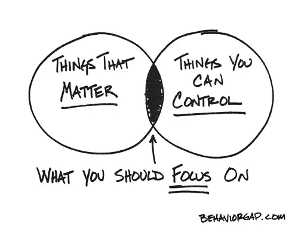
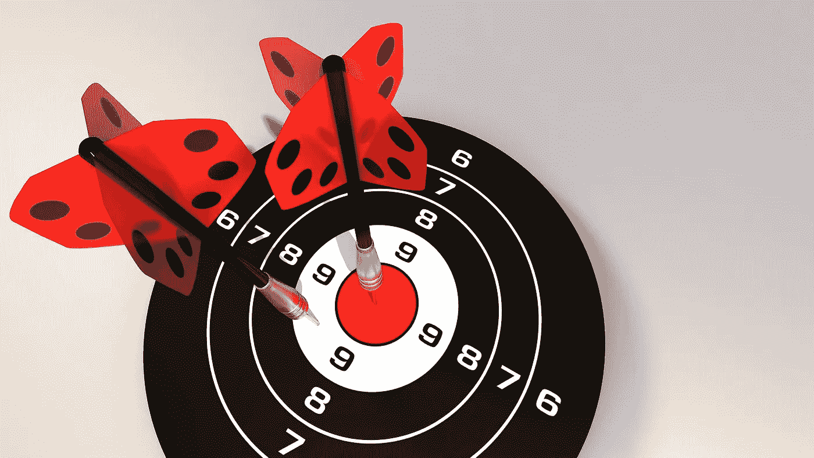
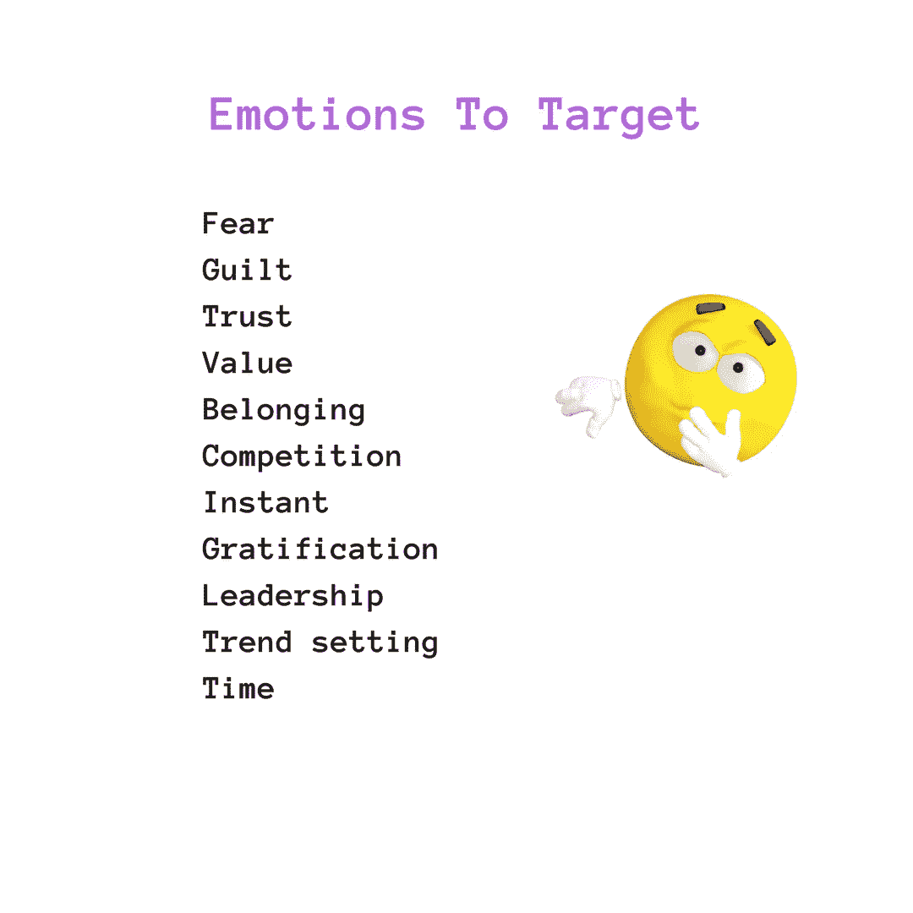
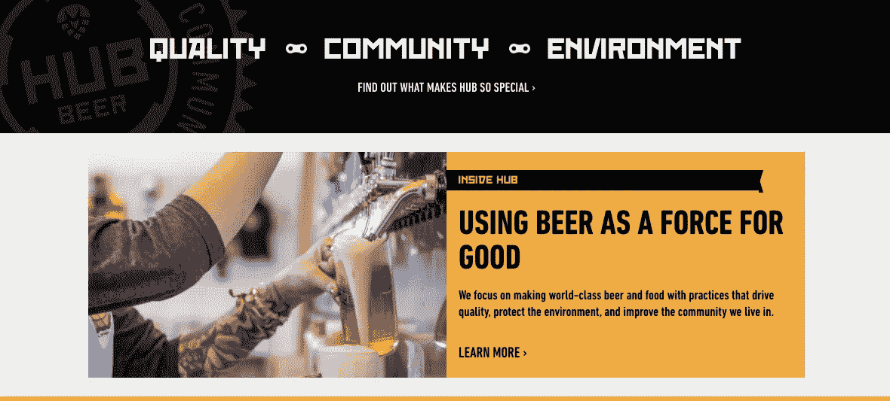
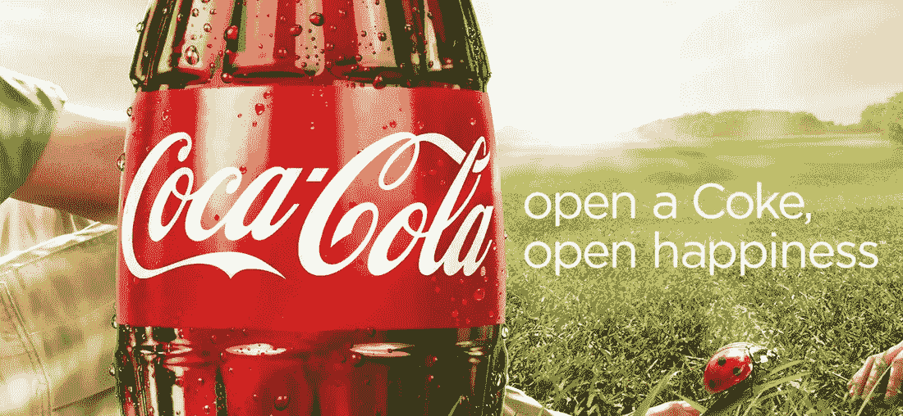
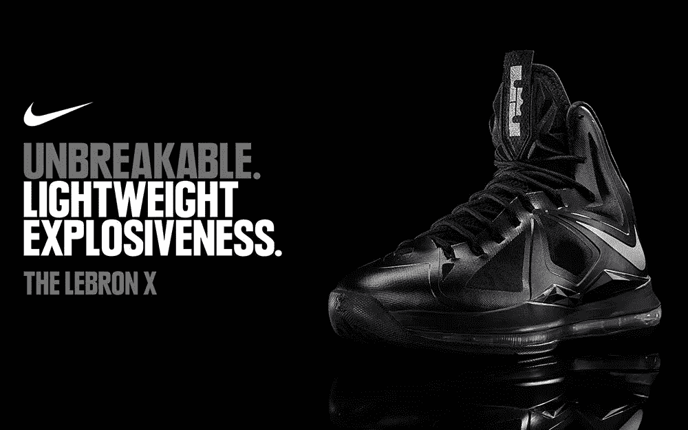
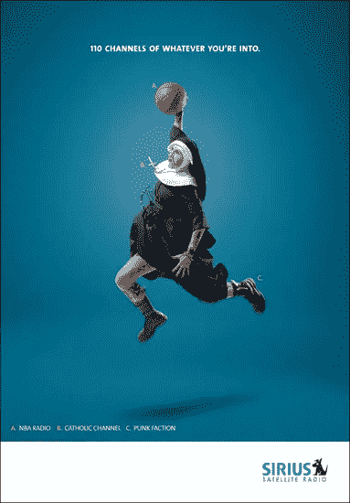

# 如何与你的用户建立情感联系

> 原文：<https://medium.com/hackernoon/how-to-emotionally-connect-with-your-user-6aa680afc5c4>

## 劝说分析概要

**说服营销**由技巧组成，主要是利用**人类情感**(情感品牌/情感营销)，你可以在营销工作中利用这些技巧来吸引和转化你**喜欢的目标受众**。

很大程度上是从自我开始的。

让我们想想主导我们采取行动的环境或事物。

当我说 **Nutiva** 的时候，你有没有感觉到**受到刺激**？如果我的目标客户是自制有机巧克力企业，那么很可能你就是我最感兴趣的目标客户之一。

因为这对我们双方都有意义，同时我们也可以通过买卖来鼓励对方。

> 一大堆**满足**得到**在这里转化**为**高端值**。

相比之下，如果我给你看一个为了让**海洋工程师**的生活更好而特别建模的**海洋自动化软件**，你会愿意继续吗？

> 你可能不会在乎。你会吗？

嗯，这种**类型的产品系列**也有大量的观众，但正如我们所知，人类只想要他们真正需要的东西，向他们展示他们真正渴望拥有的东西会更有利。

**劝说从这里开始。**

首先,**说服的首要原则**是找出**受众**中谁会**重视你的产品**。它必须在所有可能的方面对你和你的用户都有利可图。

> “苹果换苹果是一种体面的交易心态”

## 关注目标市场和目标受众

而在过去，即使企业在**预定的目标市场**内知道他们的**特定消费者群体**，他们也很难掌握相关的受众类型，因为他们缺乏资源，不像今天简单的营销纬度。

至于**瞄准**、**营销**、**销售**如何成为**的自动化流程**，天翻地覆。

😺

只有当你确定了你的**目标** **受众**时，才开始设计你的产品。

在你的产品发布过程中或在你可能做出的任何其他宣布中，它将为你节省大量时间——在谁是**目标、**同样谁是**追加销售**或**交叉销售**方面？

## 目标市场是什么？

目标市场恰恰包含那些基于相似特征而有共同需求的人。

**目标提示** —如果你的餐馆位于西班牙南部，就停止营业。**西班牙人**都是早睡者，所以晚上 8:30 以后没人会出现。

这是来自 time.com**的实际统计数据之一，**

> “世界上有 196 个不同的国家——这意味着 196 种不同的睡觉时间和醒来时间”

接下来，目标市场可以分为以下几类:

*   人口统计学的
*   地理学的
*   心理测量学
*   行为的

## 目标受众是什么？

目标受众是一群热情的消费者。他们对超个性化的商业信息表现出浓厚的兴趣。他们很有自知之明，能够如此肯定地指出营销信息中的一点点偏差会如何严重影响他们的整体生活。

因此，你的目标受众可能是任何人。从媒体专业人士、数字营销人员、数据分析师到休息室管理员。

> “目标受众正是你的目标市场的一个子集”

现在，既然你已经弄清楚了谁是你的目标受众，以及如何针对不同的目标市场编写营销信息，那么是时候学习如何说服他们了。

说服可能看起来像是一个愚蠢的主题，把所有的时间都花在这上面。可能是因为您的**脸书列表中有超过 5000 位好友。**

> 问问你自己，有多少人愿意投资你的产品？

当然，理解**说服理论**及其分析的必要性就这么简单。

在我们前进之前，

一个个人提示——如果你渴望一些说服技巧，以及心理学如何在设计一个有影响力的 **UX & CX** ，[中发挥至关重要的作用，你可能需要这本书——罗伯特·恰尔迪尼博士写的一本迷人的书。](https://books.google.co.in/books/about/Pre_Suasion.html?id=HUxUCwAAQBAJ&source=kp_cover&redir_esc=y)

## 用户在分析营销信息时采用 2 种不同的途径

*   中央路线
*   外围路线

通过不断分析**用户行为**的趋势，你可以弄清楚用户是偏向中心路线还是边缘路线。

## 中央路线

简而言之，当用户考虑分析的中心路线时，他们会在他们已经拥有的关于主题的**知识**的帮助下，检查一个**与对象相关的有说服力的信息**。他们得出的解决方案更倾向于他们大脑中的信息/知识。

## 外围路线

相比之下，当用户采取外围途径来分析一条有说服力的信息时，这通常意味着这个人对他们所接触到的信息知之甚少或**一无所知**，因此他们会凭自己的**本能**行事。

**例如**，信息是否感觉正确/错误。更有可能的是，他们是被自然的和直接的印象所驱使。

> **适时事实:**
> 
> 中心路径分析形成的行为是持久的，因此比外围路径分析形成的态度更难改变。

如 **Shopify** 所述，用户在处理信息时发出的情绪反应只取决于以下两个因素:

*   效价
*   激励

## 揭开价态和唤醒的神秘面纱

**价**是当你的信息在用户/浏览者心中注入积极或消极的想法，他们最终**转变**你的**提议**或者留下一个关于你如何滥用他们时间的差评。

**唤醒**是观众/用户是否觉得**主动**立即对信息采取行动或者懒到上床睡觉。

**在这种持久的革命氛围中，超越说服营销**的品牌！

**信任**

**满足—** [车间啤酒](http://hopworksbeer.com/)

**值**

**比赛**

**引领潮流**

**恐惧**

**归属**

到目前为止，我们已经知道人类的一些内心情感是如何运作的。

随着在如何将这些情绪标记到一个人的营销信息上的更大智慧，企业可以在持续的(永无止境的)“谁赢得最多客户”的战斗中轻松获胜。

只要用户能把自己和我们的品牌联系在一起，胜利就是必然的。要实现这一点，我们只需要向他们展示他们愿意看到或思考的东西。这可能需要在**预先确定**和**预先说服**用户的思想上掌握大量的技巧。

## 快乐劝说！