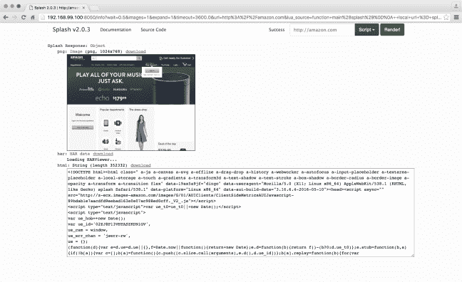

# 如何用 Splash 从基于 JavaScript 的网站中提取数据

> 原文：<https://medium.com/hackernoon/how-to-extract-data-from-javascript-based-websites-with-splash-f9eb49799619>

Scrapy 是一个用于创建网络爬虫(又名蜘蛛)的开源框架。开发 Scrapy spiders 和 web 抓取时的一个常见障碍是处理大量使用 JavaScript 的站点。由于许多现代网站都是基于 JavaScript 构建的，所以它们需要运行脚本才能正确呈现页面。

在许多情况下，页面还会显示模态和其他对话，需要与之交互才能显示整个页面。所以我们开发了 [Splash](https://scrapinghub.com/splash/) ，一个开源工具来帮助你从网络上获取结构化数据。在这篇文章中，我们将向您展示如何使用 Splash 来处理 Scrapy 项目中的 JavaScript。

# 什么是飞溅？

[Splash](https://github.com/scrapinghub/splash) 是 Zyte 内部的 JavaScript 渲染解决方案，使用 [Twisted](https://twistedmatrix.com/) 和 [QT](http://qt-project.org/) 在 Python 中实现。Splash 是一个轻量级的 web 浏览器，能够并行处理多个页面，在页面上下文中执行定制的 JavaScript，等等。

# 设置飞溅

设置 Splash 最简单的方法是通过 [Docker](https://www.docker.com/) :

```
$ docker pull scrapinghub/splash
$ docker run -p 5023:5023 -p 8050:8050 -p 8051:8051 scrapinghub/splash
```

Splash 现在将在 localhost:8050 上运行。如果你在 OS X 或 Windows 上使用 Docker 机器，它将在 Docker 虚拟机的 IP 地址上运行。

如果您想在不使用 Docker 的情况下安装 Splash，请参考[文档](http://splash.readthedocs.org/en/latest/install.html)。

# 使用飞溅与 Scrapy

现在 Splash 正在运行，您可以在浏览器中测试它:

```
[http://localhost:8050/](http://localhost:8050/)
```



在右边输入一个网址(如[http://amazon.com)](http://amazon.com%29)并点击“渲染我！”。Splash 将显示该页面的屏幕截图以及图表和请求列表及其时间。在底部，您应该会看到一个包含呈现的 HTML 的文本框。

# 用手

您可以使用[请求](http://doc.scrapy.org/en/latest/topics/request-response.html#request-objects)发送链接到 Splash:

```
req_url = "http://localhost:8050/render.json"
body = json.dumps({
    "url": url,
    "har": 1,
    "html": 0,
})
headers = Headers({'Content-Type': 'application/json'})
yield scrapy.Request(req_url, self.parse_link, method='POST',
                                 body=body, headers=headers)
```

如果您使用的是 [CrawlSpider](http://doc.scrapy.org/en/latest/topics/spiders.html#crawlspider) ，最简单的方法是覆盖蜘蛛中的 *process_links* 函数，用它们的 Splash 等价物替换链接:

```
def process_links(self, links):
    for link in links:
        link.url = "http://localhost:8050/render.html?" + urlencode({ 'url' : link.url })
    return links
```

# 飞溅(推荐)

集成 Splash 和 Scrapy 的首选方式是使用 [scrapy-splash](https://github.com/scrapy-plugins/scrapy-splash) 。见[这里](https://github.com/scrapy-plugins/scrapy-splash#why-not-use-the-splash-http-api-directly)为什么建议你使用中间件而不是手动使用。您可以使用 pip 安装 scrapy-splash:

```
pip install scrapy-splash
```

要在项目中使用 ScrapyJS，首先需要启用中间件:

```
DOWNLOADER_MIDDLEWARES = {
    'scrapy_splash.SplashCookiesMiddleware': 723,
    'scrapy_splash.SplashMiddleware': 725,
    'scrapy.downloadermiddlewares.httpcompression.HttpCompressionMiddleware': 810,
}
```

中间件需要优先于 HttpProxyMiddleware，默认情况下它位于位置 750，所以我们将中间件位置设置为小于 750 的数字。

然后，您需要在项目的 settings.py 中设置 *SPLASH_URL* 设置:

```
SPLASH_URL = 'http://localhost:8050/'
```

不要忘记，如果您在 OS X 或 Windows 上使用 Docker 机器，您需要将其设置为 Docker 虚拟机的 IP 地址，例如:

```
SPLASH_URL = 'http://192.168.59.103:8050/'
```

启用*splashdepideyargsmidderware*以支持 *cache_args* 特性:它允许通过在磁盘请求队列中不多次存储重复的 Splash 参数来节省磁盘空间。如果使用 Splash 2.1+,中间件还允许通过不向 Splash 服务器多次发送这些重复的参数来节省网络流量。

```
SPIDER_MIDDLEWARES = {
    'scrapy_splash.SplashDeduplicateArgsMiddleware': 100,
}
```

Scrapy 目前没有提供全局覆盖请求指纹计算的方法，因此您还必须设置一个自定义的 *DUPEFILTER_CLASS* 和一个自定义的缓存存储后端:

```
DUPEFILTER_CLASS = 'scrapy_splash.SplashAwareDupeFilter'
HTTPCACHE_STORAGE = 'scrapy_splash.SplashAwareFSCacheStorage'
```

如果您已经使用了另一个缓存存储后端，您将需要对其进行子类化，并将对*scrapy . util . request . request _ fingerprint*的所有调用替换为*scrapy _ splash . splash _ request _ fingerprint*。

现在 Splash 中间件已经启用，您可以使用 *SplashRequest* 来代替 *scrapy。请求*用 Splash 渲染页面。

例如，如果我们想检索一个页面的 HTML，我们可以这样做:

```
import scrapy
from scrapy_splash import SplashRequest

class MySpider(scrapy.Spider):
    start_urls = ["http://example.com", "http://example.com/foo"]

    def start_requests(self):
        for url in self.start_urls:
            yield SplashRequest(url, self.parse,
                endpoint='render.html',
                args={'wait': 0.5},
            )

    def parse(self, response):
        # response.body is a result of render.html call; it
        # contains HTML processed by a browser.
        # …
```

“args”字典包含要发送给 Splash 的参数。您可以在 HTTP API 文档中找到可用参数的完整列表。默认情况下，端点设置为“render.json”，但这里我们覆盖了它，并将其设置为“render.html”以提供 html 响应。

# 运行自定义 JavaScript

有时，您可能需要按下按钮或关闭模式才能正确查看页面。Splash 允许您在所请求的网页上下文中运行自己的 JavaScript 代码。有几种方法可以实现这一点:

# 使用 js_source 参数

可以使用 *js_source* 参数发送想要执行的 JavaScript。JavaScript 代码在页面加载完成之后、呈现之前执行。这允许使用 JavaScript 代码来修改正在呈现的页面。例如，您可以使用 Scrapy-Splash:

```
# Render page and modify its title dynamically
yield SplashRequest(
    'http://example.com',
    endpoint='render.html',
    args={'js_source': 'document.title="My Title";'},
)
```

# 启动脚本

Splash 通过其 [*执行*](http://splash.readthedocs.org/en/latest/api.html#execute) 端点支持 Lua 脚本。这是执行 JavaScript 的首选方式，因为您可以预加载库，选择何时执行 JavaScript，并检索输出。

以下是一个示例脚本:

```
function main(splash)
    assert(splash:go(splash.args.url))
    splash:wait(0.5)
    local title = splash:evaljs("document.title")
    return {title=title}
end
```

您需要将脚本发送到 *lua_source* 参数中的*执行*端点。

这将返回一个包含标题的 JSON 对象:

```
{
    "title": "Some title"
}
```

每个脚本都需要一个 main 函数作为入口点。您可以返回一个 Lua 表，它将被呈现为 JSON，这就是我们在这里所做的。我们使用 [*splash:go*](http://splash.readthedocs.org/en/latest/scripting-ref.html#splash-go) 函数告诉 splash 访问 URL。[*splash:eval js*](http://splash.readthedocs.org/en/latest/scripting-ref.html#splash-evaljs)函数让您在页面上下文中执行 JavaScript，但是，如果您不需要结果，您应该使用 [*splash:runjs*](http://splash.readthedocs.org/en/latest/scripting-ref.html#splash-runjs) 来代替。

您可以通过访问 Splash 实例的索引页面(例如 [http://localhost:8050/)在浏览器中测试 Splash 脚本。](http://localhost:8050/%29.)也可以将 Splash 与 IPython notebook 一起用作基于 web 的交互式开发环境，更多详细信息，请参见[此处](http://splash.readthedocs.io/en/stable/kernel.html)。

通常情况下，您需要在页面显示之前单击一个按钮。我们可以使用[*splash:mouse _ click*](http://splash.readthedocs.io/en/stable/scripting-ref.html#splash-mouse-click)函数来实现:

```
function main(splash)
    assert(splash:go(splash.args.url))
    local get_dimensions = splash:jsfunc([[
        function () {
            var rect = document.getElementById('button').getClientRects()[0];
            return {"x": rect.left, "y": rect.top}
        }
    ]])
    splash:set_viewport_full()
    splash:wait(0.1)
    local dimensions = get_dimensions()
    splash:mouse_click(dimensions.x, dimensions.y)
    -- Wait split second to allow event to propagate.
    splash:wait(0.1)
    return splash:html()
end
```

这里我们用 [*splash:jsfunc*](http://splash.readthedocs.io/en/stable/scripting-ref.html#splash-jsfunc) 定义一个返回元素坐标的函数，然后用[*splash:set _ viewport _ full*](http://splash.readthedocs.io/en/stable/scripting-ref.html#splash-set-viewport-full)确保元素可见，点击元素。Splash 然后返回呈现的 HTML。

# 包裹

你可以在[文档](http://splash.readthedocs.org/en/latest/api.html#execute-javascript)中找到更多关于使用 Splash 运行 JavaScript 的信息，要获得更深入的教程，请查看 [Splash 脚本教程](http://splash.readthedocs.org/en/latest/scripting-tutorial.html)。

我们希望本教程给你一个很好的 Splash 介绍，如果你有任何问题或意见，请告诉我们！


这篇文章是由 Zyte(前身为 Scrapinghub)的前软件开发人员 Richard Dowinton 撰写的。

请用心“推荐”来广泛分享这个教程。

[**了解一下网页抓取和网页数据能为你做什么**](https://scrapinghub.com/data-services/) **。**

[](http://bit.ly/HackernoonFB)[](https://goo.gl/k7XYbx)[](https://goo.gl/4ofytp)

> [黑客中午](http://bit.ly/Hackernoon)是黑客如何开始他们的下午。我们是 T21 家庭的一员。我们现在[接受投稿](http://bit.ly/hackernoonsubmission)并乐意[讨论广告&赞助](mailto:partners@amipublications.com)机会。
> 
> 如果你喜欢这个故事，我们推荐你阅读我们的[最新科技故事](http://bit.ly/hackernoonlatestt)和[趋势科技故事](https://hackernoon.com/trending)。直到下一次，不要把世界的现实想当然！

