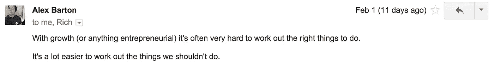
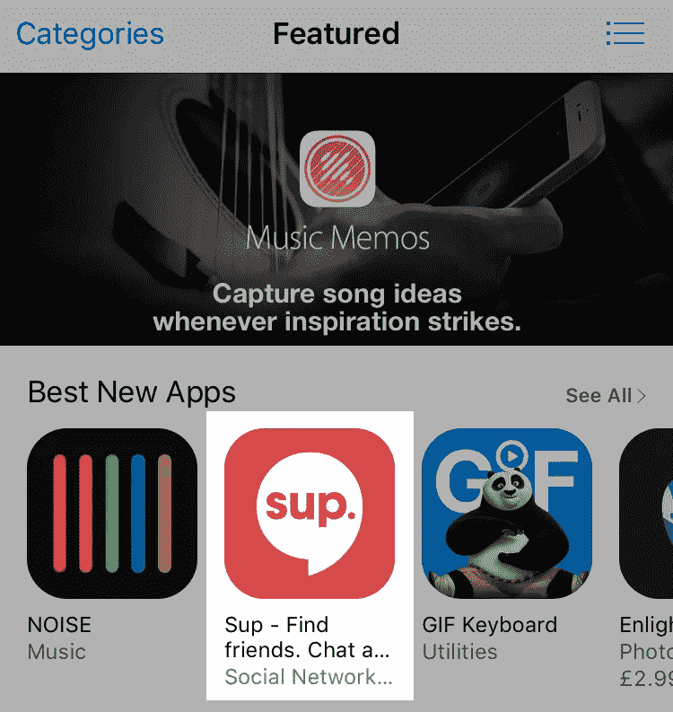

# 如何启动你的公司

> 原文：<https://medium.com/hackernoon/how-to-f-ck-up-your-startup-b0e11108a5a5>

Okay Alex. I’ll put it on the list 🙄

亚历克斯是我们在 Sup 的[首席技术官](https://hackernoon.com/tagged/cto)。当他不带领我们优秀的工程师开发优秀的东西时，他喜欢给我和[里奇](/@richpleeth)装窃听器。然而，这一次，他实际上有一个[相当](https://hackernoon.com/tagged/pretty)的优点。

我们没有定义一份帮助我们成长的规则清单，而是列出了一份我们如何把整个事情搞砸的清单。这就简单多了，可以作为“不要做”的清单。

所以，这就是:

## 1.复杂的事情

快速做出决定——不要把事情搞得太复杂，浪费时间。没人在乎你传单上的文案是否完美。继续吧。

做一些不可扩展的事情。你永远不知道…他们可能会。

We gave these out outside Facebook’s office. Hehe.

## 2.贪婪

当谈到与合作伙伴合作时，不要贪得无厌。谈判简短非常重要。你当然想得到一笔好交易，但总有一天你会达到收益递减、浪费时间和阻碍关系的地步。

接受它和/或继续前进。

## 3.忽略结果

你需要专注于结果。它们与你的预测相比如何？实验。评估。剪切/重复。

## 4.情绪化

不要执着于想法。你有一个增长流的好主意。结果发现这是个馊主意。哦好吧。克服它。不要再这样做了。

## 5.放弃

虽然砍掉无用的资源很重要，但你也需要坚持不懈。我想他们称之为“勇气”

## 6.忘记目标注册会计师

花钱很有趣。不要被没有潜力带来有效投资回报的增长流冲昏头脑。对于 Sup 而言，“每次收购成本”(CPA)需要保持在较低水平。

## 7.变得自满

几周前，我们在[产品搜索](https://www.producthunt.com/tech/sup-3-0-ios)度过了甜蜜的一天，随后是 App Store 上的一个功能。

Mama, I made it!

我们的数字变得疯狂，我觉得自己是他妈的男人。我们的📈最终变成了🔔是时候回去工作了。

不要让这种事情发生。不要自满。

增长滞后。今天没有工作=明天没有结果。

这很好地引导我去…

## 8.休眠

每天做点什么。如果有一项活动我们发现有效，那就是活动本身。每天做点什么就行了。

## 9.忽视计划

如果不提前计划，每天做一件事是不可能的。写一份成长日历，这样你就可以计划下个月的日常活动。

## 10.做出不一致的决定

建立一个决策框架。比如，‘这个活动会让我们获得更多用户吗？’。在决定 Sup 的新产品功能时，我们会回到“这会帮助我们的用户更多地看到他们的朋友吗？”。

希望这有所帮助。总是乐于聊天。发微博给我。

> [黑客中午](http://bit.ly/Hackernoon)是黑客如何开始他们的下午。我们是 [@AMI](http://bit.ly/atAMIatAMI) 家庭的一员。我们现在[接受投稿](http://bit.ly/hackernoonsubmission)，并乐意[讨论广告&赞助](mailto:partners@amipublications.com)机会。
> 
> 如果你喜欢这个故事，我们推荐你阅读我们的[最新科技故事](http://bit.ly/hackernoonlatestt)和[趋势科技故事](https://hackernoon.com/trending)。直到下一次，不要把世界的现实想当然！

