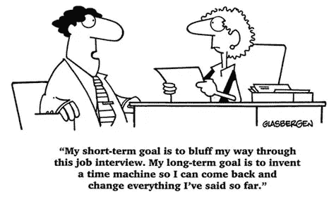
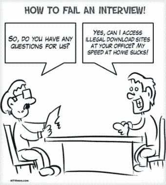
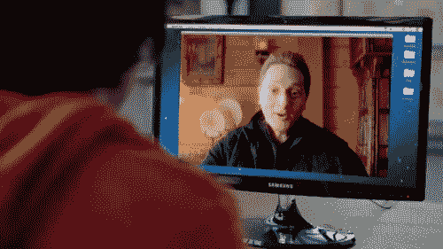

# 如何在你能轻易破解的编码面试中失败？

> 原文：<https://medium.com/hackernoon/how-to-fail-in-a-coding-interview-which-you-can-crack-easily-489a5cac634d>

source: secsinthecity.co.uk

收到邮件的那一天是我无聊工作的常规一天。它来自一家初创公司，他们对我的个人资料很感兴趣。同一天，我已经想了四次辞职，觉得这可能是我的出路。

我参观了这家公司，他们的产品给我留下了深刻的印象。我决定回信。他们有两个职位空缺，我选择了大数据工程师。回应来了:

> 我将与您联系您的应用程序上下文:全栈工程师。
> 在我们继续面试之前(为了节省时间)，我有几个问题要问你。

他们犯了一个小错误，输入了*全栈*，而不是*大数据*。看了职位描述后，我觉得这个职位也同样有趣。所以我还是回答了这个问题。我们安排了一次面试，但是现在我不知道该面试哪个职位。？！我写信澄清此事，收到了回复。

> 不需要特殊准备。任何你觉得舒服的语言都可以。
> 
> 在招聘测试期间，我们不会尝试对您进行全面评估，也不会对大数据进行评估。我们只是寻找“好的工程”。
> 
> 我们会给你一份通用编码作业。如果你想的话，你可以自由地使用因特网，这样你就可以参考技术文档，甚至可以参考 stackoverflow 来寻找解决方案。

我对他们的反应非常满意。公司和员工看起来都很完美。但是 ***`没有特别准备*** `那部分进入了我的潜意识。我完全没有为面试做准备。

因为我的工作需要我整天坐在电脑前。我限制下班后使用互联网和电脑。我的房间也有有限的网络连接。

前一天我已经把操作系统从 Debian 换成了 Manjaro(因为 Debian 在笔记本电脑上很烂),并且没有安装任何软件。那天是我的休息日，我听了一下午的班苏里长笛，耗尽了我的数据。

面试安排在下午 5 点，当我在 5:30 后没有接到电话时，我给他们发了电子邮件。他们发给我一个视频电话的链接，并为延迟道歉。

在看我简历的前 30 分钟，他们问了一些关于我做过的项目的问题，然后我们谈论了他们的公司和他们所做的工作。后来我们为编码任务搬家，现在他们需要看我的屏幕。这就是一切颠倒的地方。

Firefox 或操作系统不支持视频通话服务[网站](https://appear.in/)上的*共享屏幕*选项。我试着安装 Chrome 和 Chrome，但是由于我已经用完了所有的数据，所以上网速度非常慢。我们试过视频聊天，Skype，后来他们给我打电话。他们明白互联网速度慢，放弃了屏幕共享的计划。

任务是基于某些条件解析一个 JSON 文件并无限循环——直到我们到达最深的键并以某种格式打印输出。我有 50 分钟。小菜一碟，对吧？

等等。*崇高*在哪里？我没装？请不要说你没有安装 *ipython* ！

他们分享了 google drive 上一个 JSON 文件的链接，链接到我域名上的一封电子邮件。总之，我可以查看文件，但不能下载。我复制了内容，但它没有解析。我让他们通过电子邮件发送文件。

所有这些花费了大约 30 分钟，这个任务也在一个 17 分钟的视频中进行了解释，我无法观看，因为你知道*——慢速互联网。现在我知道事情正在失控，并试图通过阅读需求来完成任务。*

就在时间快到了的时候，我用不同的格式和代码发送了部分输出。过了一段时间，我再次发送带有代码的输出。(现在时间已过)

第二天早上，我评估了 seen，结果是我完全忘记了格式化，两次输出都不接近。
理解问题后，我花了大约 5 分钟才得到正确的输出。在面试中，我花了一个半小时，发送了两次错误的输出。*为了让我安心，我也发送了第三个输出:P*

**回顾:**在一次你很容易破解的编码面试中失败。

1.  即使他们说面试是必须的，也不要准备。
2.  确保你对他们如何进行面试一无所知，或者让这些东西不起作用:Skype、视频聊天、屏幕共享。
3.  确保你没有准备好任何你喜欢的工具。最好的情况:重新安装操作系统。没有调好的小提琴，即使是最好的小提琴手也无法演奏。
4.  网速慢。看 youtube，耗尽你有限的数据。
5.  不要阅读要求。最好的情况:假设你理解了任务并开始编码。
6.  慌！慌！还有恐慌！

祝失败愉快:)