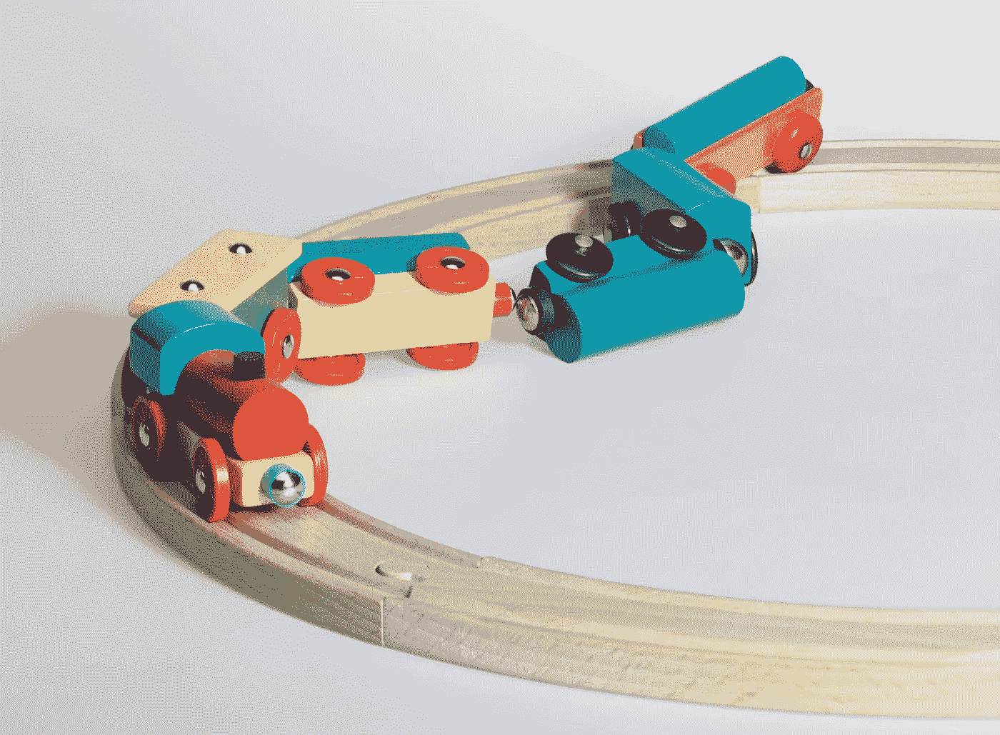
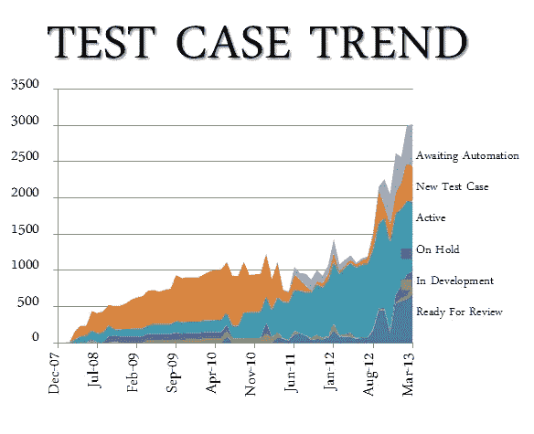
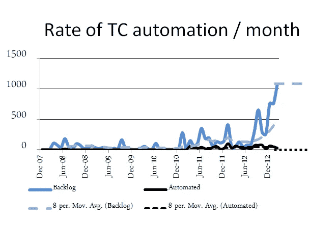
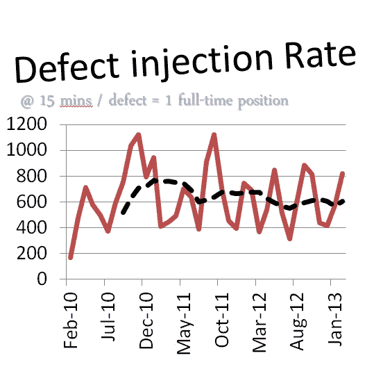
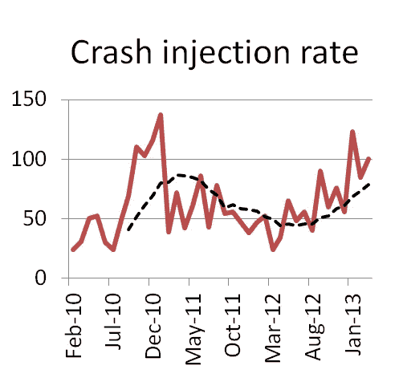
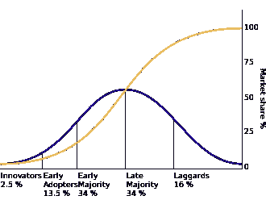

# 如何失败你的 TDD 展示并激怒所有人:一个火车失事的故事

> 原文：<https://medium.com/hackernoon/how-to-fail-your-tdd-rollout-and-piss-everyone-off-a-train-wreck-story-361f40a885>

克里斯·爱德华兹

2013 年，[肖恩](https://twitter.com/SeanDunn10)被聘为我们的第一位[敏捷](https://hackernoon.com/tagged/agile)蔻驰，开始向我们介绍许多新的想法和实践。

在他之前的工作中，Sean 是一个团队的产品负责人，这个团队非常重视技术实践。他会讲述团队领导磨砺 CI 构建以尽可能降低编译时间的故事。他带来了像领域驱动设计这样的新概念，并且他亲眼看到了测试驱动开发(TDD)的好处。

我们对自动化测试并不陌生。我们进行了大量的 UI 测试。我们已经投入了大量时间来构建我们的测试套件，并为它给我们带来的价值感到自豪。

肖恩收集了一些数据来对此提出质疑:

*   自动化测试用例的数量正在稳步增长
*   缺陷和崩溃注入率没有改善
*   按照我们目前的进度，自动化测试用例的积压需要 2.5 年的时间
*   QA 花费 50%-75%的时间维护现有的测试

他用一些实际的图表来说明他的观点:

他告诉我们 TDD 有一个更好的方法:

*   更好的设计和更简洁的代码
*   更少更快地检测到错误
*   无畏重构的满足感

肖恩对 TDD 的热情吸引了我们中的一些人。我们刚刚得到它。我发现这种感觉并不普遍。

我能理解人们对 TDD 的抵触。很难学。事实上，我们没有任何常驻专家，人们很难找到超出基础教学范围的在线资源，这让事情变得更加困难。甚至那些兴奋的人也发现[学习](https://hackernoon.com/tagged/learning)曲线令人望而生畏。

有一件重要的事情我应该注意。这时，我们正在喝消防水管里的水。IHS 刚刚收购了我们，我们正在采用敏捷，我们正在学习实体和设计模式，我们正在重新构建我们的应用程序。我相信我们已经达到了人们所能接受的极限。

然后我们犯了一个最大的错误。我们授权了 TDD。

我们本意是好的。相信我。

我们的逻辑是这样的:TDD 很难。真的。很难。人们只是没有给它足够的时间。

哦，我们错了。

Sean 创建了一个实践研讨会，让人们开始使用 TDD。它让人们熟悉了基本的机制，并帮助他们开始以测试驱动的方式思考。

培训只带我们到目前为止。这对于新代码来说是完美的，但是一旦我们试图向任何现有的代码添加测试，我们就陷入了困境。我们不具备将代码重构为可测试的技能。

我们的希望是，在人们达到学习曲线后，他们将不可能忽视这些好处。Woody Zuill 把它比作学习一种乐器。你不能三天没掌握就放弃。

更有经验的开发者已经看到了时尚的来来去去。对他们来说，这只是另一个。围绕 TDD 的兴奋是没有根据的教条。他们用合理的论据对这些想法提出质疑。热情的拥护者认为他们顽固不化，不愿意尝试新事物。他们以更强烈的热情回应 TDD。我对此也感到内疚。没有人可以谈论这一经历的好处，看起来我们都在喝饮料。

一个团队开始酝酿一场宗教战争。一对年轻的开发人员和一对经验丰富的开发人员发生了冲突。围绕 TDD 的对话缺乏建设性。

我们试图通过建立一个 TDD 社区来缓和争论，在那里人们可以来讨论他们所看到的挑战并分享他们所学到的东西。讨论经常演变成争论，感觉有点像盲人摸象。

## 我们今天在哪里

我很高兴地说，首席敏捷转型坚持下来了。我认为这在很大程度上要归功于我们的敏捷蔻驰 Sean 的经验丰富的指导。当我们受挫时，他在那里提供建议。当我们准备放弃的时候，他给我们讲一些令人安心的故事，让我们坚持下去。

另一方面，TDD 从未达到 100%的采用率。一些团队专门做这件事，其他团队会在感觉合适的时候编写单元测试。尽管有这个命令，有些人甚至从来没有尝试过 TDD。

## 如果我们有时间机器

如果我能再做一次，我会从更好地阐明[为什么](https://www.youtube.com/watch?v=zU3fIEPfctQ)我们关心 TDD 开始。对我来说，最有说服力的理由是鲍勃叔叔在[这篇文章](https://8thlight.com/blog/uncle-bob/2014/04/25/MonogamousTDD.html)中给出的理由:

> “如果你有一个你非常信任的测试套件，以至于你愿意仅仅基于那些通过的测试来部署系统；如果测试套件可以在几秒钟或几分钟内执行，那么您就可以快速轻松地清理代码，而不必担心。”

我还会更多地关注支持者，而不是试图赢得反对派。我们可以学习被称为创新扩散的营销概念。

Source: [https://en.wikipedia.org/wiki/Diffusion_of_innovations](https://en.wikipedia.org/wiki/Diffusion_of_innovations)

我们的创新者是刚刚得到 TDD 的人。他们一听说这件事就打算尝试一下。早期采用者是只需要额外推动力的开发人员。来自高层领导的鼓励话语，即这是一个值得冒的风险，将足以让他们尝试。

一旦 TDD 被证明是成功的，早期的大多数人将会采用它。由于学习曲线，或者主要的挑战应该是帮助人们尽快度过难关。

为此，我会雇佣在 TDD 和重构方面都有丰富经验的人。我会把他们安插在团队中，亲自帮助人们。当人们感到沮丧时，他们可以从经验中说出好处，讲故事给他们希望事情会变得更好。

我也主张从小处着手，在进步之前积累技能。走极端，说我们应该“TDD 一切”可以创建一个沉没或游泳的感觉。从小处着手。学习。尝试更有挑战性的东西。重复一遍。

我相信，如果我们采取了这种方法，怀疑论者最终会加入进来，并且一旦大多数人都在实践 TDD，那么将它强加给“落后者”就容易多了。

Chris 和 Sean 是卡尔加里的敏捷专家。更多信息请点击[这里](http://www.chrisandseanagile.com/)。

*快速感谢 Renee Hemsing、Krystina Edwards、Aaron Hilger 和 Meg Ward 在撰写本文时提供的反馈。*

> [黑客中午](http://bit.ly/Hackernoon)是黑客如何开始他们的下午。我们是 [@AMI](http://bit.ly/atAMIatAMI) 家庭的一员。我们现在[接受投稿](http://bit.ly/hackernoonsubmission)并乐意[讨论广告&赞助](mailto:partners@amipublications.com)机会。
> 
> 如果你喜欢这个故事，我们推荐你阅读我们的[最新科技故事](http://bit.ly/hackernoonlatestt)和[趋势科技故事](https://hackernoon.com/trending)。直到下一次，不要把世界的现实想当然！

