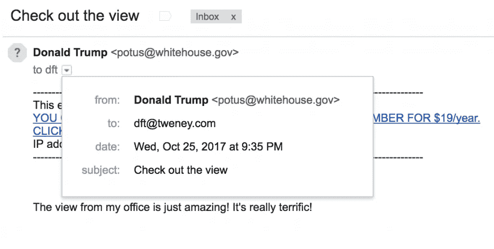

# 如何在 5 分钟内伪造一封来自几乎任何人的邮件

> 原文：<https://medium.com/hackernoon/how-to-fake-an-email-from-almost-anyone-in-under-5-minutes-12169dd44a92>


在我的日常工作中，作为 ValiMail 的通讯人员，我花了很多时间解释使用一个不属于你的电子邮件地址来创建欺诈邮件是多么容易。

一个伪造的“发件人”地址实际上是大多数电子邮件攻击发生的。电子邮件攻击(又名网络钓鱼)是大多数网络攻击的开始(实际上是绝大多数)。因此，伪造邮件是一个主要的弱点。

但是，你会问，当我可以注册一个假的相似域名(比如 company.com)并使用它时，我为什么还要伪造一封来自“company.com”的电子邮件呢？或者创建一个 Gmail 帐户(randomaddress1347356@gmail.com)并给它一个友好的名字，看起来像一个公司的首席执行官？

实际上，伪造一个真实公司的真实地址比注册一个假域名，甚至创建一个废弃的 Gmail 帐户要容易得多。

这很简单。

## **网站邮件**

找一个像 [deadfake](http://deadfake.com/) 这样的网站，它把自己描述为“一个让你向任何你喜欢的人发送免费假邮件的网站。”或者 anonymailer.net。或者 spoofbox.com。有几十个。其中许多是免费的，有些寄邮件要花一点钱。然后:

1.  在“收件人:”字段中输入收件人的电子邮件地址。
2.  在“发件人:”字段中输入您想要的电子邮件地址。
3.  精心制作您的信息，然后立即按下发送键！按钮。

下面是我用特朗普总统的地址发给自己的一条信息。请注意，Gmail 对来源有所怀疑，这就是为什么它在地址旁边放了一个红色的小问号。



## **Unix 命令行**

如果您有一台设置了邮件服务的电脑，或者您可以 telnet 或 SSH 到一台有邮件服务的电脑，您可以用一行字伪造一个发件人地址。只需键入以下内容:

```
mail -aFrom:whatever@anydomain.com
```

这将创建一条消息，在 From 字段中显示“whatever@anydomain.com”。键入主题行和邮件的其余部分，完成后按下 Ctrl-D，邮件就会自动发出。

这并不是在每个版本的 Unix 中都有效，是否有效取决于你的系统是如何设置的(是否连接到 Sendmail 等等。).尽管如此，这是基本的想法，它在许多系统中工作。

## **PHP**

因为我对编程不是很了解，所以当我需要为我的个人网站编写代码时，我会使用 PHP。它快速、简单，被大约 90%的人(像我一样)使用，这些人对编程一无所知，他们只能通过谷歌搜索和窃取各种公共论坛上发布的代码片段来了解编程。(这也是 PHP 经常被指责不安全的原因。)嘿，我用 PHP 搭建了一个完整的网站内容管理系统。如果我能搞清楚，能有多难？

在没有深入 PHP 的所有优缺点的情况下，我会说它非常适合电子邮件。你可以用五行非常简单的 PHP 代码伪造电子邮件:

```
<?php
$to      = 'nobody@example.com';
$subject = 'the subject';
$message = 'hello';
$headers = 'From: webmaster@example.com' . "\r\n";
mail($to, $subject, $message, $headers);
?>
```

注意:这些是 PHP 的 mail()函数的[在线手册中用作示例的实际代码行。我去掉了几行你实际上不需要的。](http://php.net/manual/en/function.mail.php)

还是那句话:配置不同；也许这并不适用于每台服务器上的每一个 PHP 版本。

## **电子邮件是一个非常容易让人信任的地方**

直到最近，电子邮件世界还是一个完全信任的地方。大部分仍然如此。无论我是谁，如果我使用 Unix mail 命令或 PHP mail()，电子邮件就会发送到互联网，互联网会按照我指定的准确标题将它发送给任何人。没有人检查我是否拥有我在 from 字段中使用的地址。没人在乎。

嗯，几乎没有人:正如我上面提到的，Gmail 和其他一些邮件客户端开始标记看起来可疑的邮件，比如我的匿名邮件。不过，这取决于您使用的客户端和/或接收邮件的服务器。

诚然，这些欺骗工具非常简单。如果我想做一些更花哨的格式化，让我的信息看起来更真实，这需要*多做一点*工作。但是基本的伪造就是这么简单。

唯一真正阻止虚假发件人地址的是使用 DMARC 标准的电子邮件认证。但这只有在你试图伪造的域名发布了 DMARC 记录并将其设置为强制策略的情况下才有效。那时，也只有那时，几乎所有接收邮件的电子邮件服务器(Gmail，Yahoo Mail 等。)屏蔽伪造的邮件。

对欺诈者来说幸运的是，大多数互联网域名还没有做到这一点。例如，[只占 4%左右。政府域名保护了自己。](https://blog.valimail.com/federal-agencies-have-80-days-to-fix-their-email)

至于其他 96%？欺诈者可以整天伪造来自这些域的电子邮件，而不会产生任何影响。

像 justice.gov 这样的域名。House.gov。Senate.gov。Whitehouse.gov。

还有像 democrats.org、dnc.org、gop.com、rnc.org 这样的域名。还有 DonaldJTrump.com。

所有这些都很容易被电子邮件骗子伪造，他们可以访问 Unix 命令行或掌握一些基本的 PHP 技能。而且，正如我们所了解的那样，骗子们一直在利用这一弱点。例如，根据一个消息来源，四分之一的电子邮件来自。政府域名欺诈。

这就是为什么我试图传达这个信息:**从大多数来源伪造电子邮件太容易了。**我们需要从今天开始验证我们的电子邮件。

*附注:我很想听听你的想法。如果你对此有想法，请在下面留下评论！*

*最初发表于* [*迪伦·特维尼*](http://dylan.tweney.com/2017/10/25/how-to-fake-an-email-from-almost-anyone-in-under-5-minutes/) *。*