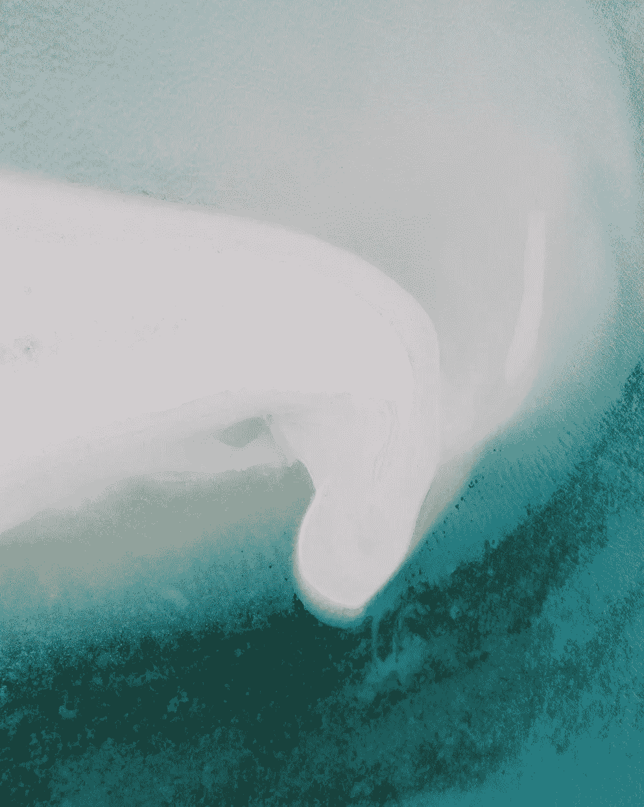

# 如何找到灵感

> 原文：<https://medium.com/hackernoon/how-to-find-inspiration-f8471be903eb>

Photo by Syd Sujuaan on Unsplash

当我开始与一个新客户合作时，在我写下一个字或提供一条建议之前，我会给自己时间去填满油箱。

我消费他们创造的一切。我听他们谈论他们的工作，他们做什么，他们如何做，以及这对他们意味着什么。我不判断，也不分析。我倾听并接受这一切。我让自己沉浸在他们的世界中，有时尝试他们的服务，我把我收集的所有东西装满我的艺术家箱。我都吃光了。

当你创造任何东西时，你是在从一口井里抽水。制作东西需要材料，如想法、图像和经验来构思那个东西。你不能在空罐上工作。

还记得你第一次想出这个主意的时候吗？还记得你是如何观察或陷入一个思路的吗？之所以会发生这种情况，是因为你把水箱灌满了水，直到你抓到了有用的东西。

当你做这个东西的时候，你往罐子里装了更多有用的材料。你用材料和经历填满你的头脑，让你沉浸在那个世界中，并帮助赋予事物形状、深度和定义。

其他时候，你把油箱灌满，却不知道它会有什么用处。它会留下印象，而你甚至没有意识到。几周、几个月或几年后，你把它从水箱里拿出来，投入使用。

你永远不知道坦克里的东西会如何帮助你。最受崇拜的乔斯·韦登是《吸血鬼猎人巴菲》、《萤火虫》和《林中小屋》的创作者，[谈到了](https://www.fastcompany.com/1683167/how-to-be-prolific-guidelines-for-getting-it-done-from-joss-whedon)装满油箱如何帮助他多产:

> *“我读过《杀手天使》。这是一个非常详细的，非常引人注目的关于葛底斯堡战役的叙述，从不同的人的角度来看，它是历史性的。它在历史上是完全准确的，当我放下它的时候，我创作了《萤火虫》，因为我想，‘我需要讲述这个故事。我需要感受这种直接性。“我与那个时代、西方有着千丝万缕的联系，每一个决定都是生死攸关的，有多么艰难，有多么丰富，所有的角色都是如此迷人，”但我应该在千年隼号上。现在，如果我只看科幻片，我会只看千年隼部分，这已经完成了，但找到了历史的纹理，它字面上，我放下书，开始写萤火虫。那是我在巴菲的两周假期。我每年有两周时间，在那段假期里，我在 14 天里读了 10 本书。我妻子和我看了大概九场戏，我们就做了这些。我们刚刚装满了油箱。”*

在工作开始之前，屁股被放在椅子上，有填充罐。油箱是你的燃料。它是你的经验、轶事和想法的集合，你从中汲取灵感来创造你的东西。

在这个时代，我相信对于一个艺术家来说，要填满他们的油箱是很难的。我和其他人一样热爱互联网，但它不断用伪装成有用的东西的干扰来轰炸我们。那句阿齐兹·安萨里的名言是什么？他说互联网就像是“有史以来最糟糕的书，我永远不会停止阅读。”如果你把油箱加满，你就不会觉得饿了。你会感到满足、营养和充实。

保持好奇心和求知欲。带着敬畏和惊奇的心情接近这个世界，因为比你更大更神秘的事物将会提供几乎无穷无尽的燃料。