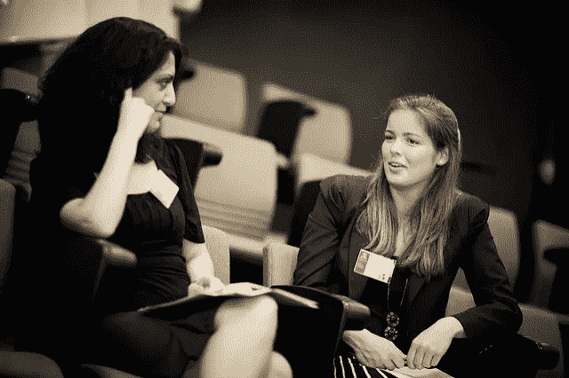

# 如何为科技职业找到导师

> 原文：<https://medium.com/hackernoon/how-to-find-mentors-for-a-career-in-tech-949237eea4e7>

这是我的初级开发人员日记博客系列的第三篇文章。我每周都在写更多的东西，你可以在我的网站 [*上注册收听和阅读以前的帖子。*](https://www.samjarman.co.nz/diaries/)

Mentorship shouldn’t be too formal, keep it casual.

2010 年 12 月，我第一次参加会议。它叫做 iDev，专注于开发 iOS 应用的开发者。这很棒，但我最喜欢的部分之一是在会议的第二天，当时参加活动的每个人(约 100 人)都被要求宣布他们的“需求和愿望”——希望其他与会者能够提供帮助。一些人寻求测试者，一些人寻求营销建议。

轮到我时，我要了一些有点不同的东西。当然，如果你不问，你就得不到。我紧张地举起麦克风说:“你好，我是山姆。我刚刚读完高中，今天满 18 岁了，已经在 app store 上架了几个应用。我寻求的是工作经验——来自任何人、任何地方。”

## 就在那一刻

我想说这是我职业生涯变得更好的时刻。仅在那次声明之后，我就与业内人士进行了几次积极的对话。我进行了两次对话，获得了工作经验，但我进行了更多的对话，找到了一些职业导师。我没有要求导师，我保持随意，我相信这就是诀窍。我认为是导师的人可能甚至不知道他们是我的导师。如果有的话，我现在会把他们都当成朋友。我会说他们感觉很相似。

## 保持随意

寻找导师的问题是，你可能不应该正式要求某人成为你的导师。根据我在另一边的经验，这听起来真的很费力。这听起来像是工作，听起来像是承诺——很多忙碌的人觉得他们没有时间去做的事情。但是偶尔发一封邮件或者喝一杯咖啡并不费事，如果有什么不同的话，那就是相当愉快。所以，现在就通过社交媒体、电子邮件、LinkedIn 或其他方式联系他们……保持随意，说些类似“嘿，X，我在想我们能不能在这星期或下星期一起喝杯咖啡。我看到你一直在做 Y，我很想谈谈你做这件事的经历——因为我想我现在也处于类似的情况。”简单明了的**提问**。重要的是人们知道你想从他们那里得到什么，为什么不能是别人。

就我个人而言，我发现在我的整个职业生涯中，在技术社区中拥有导师或长者是非常重要的。这可能很简单，比如时不时地在 Twitter 上发 DM，或者讨论某些话题的整个午餐。从高中到大学，再到我从事软件工程工作的头两年，它们已经被证明非常有价值，因为它们只是用来试探和讨论我的感受和挣扎。

## 只是说出来

一旦你与你认为是导师的人会面，保持谈话的随意性并首先询问他们的经历是很重要的，在你知道之前，一条金玉良言可能会脱口而出。如果没有，开始解释你的问题，看看他们有什么好主意。但我强调，经常只是听听过去的故事可能是了解你需要什么并将其应用到你自己生活中的一个非常好的方法。

这里的问题是，人们在革命中取得了巨大的进步，而不是渐进的进步，与导师的一次有趣的谈话可以引发革命，让你以一种前所未有的方式看待世界。我曾经就找时间做兼职项目的问题去找一位导师，我解释说我全职工作，找不到任何固定的时间为我正在开发的应用程序写代码。他解释说，当他承诺每天上班前花 30 分钟做一个兼职项目时，他找到了时间——到周末，这个项目大约花了两到三个小时，几周后，就可以发货了。真正影响我的是一个小小的建议，现在对我来说似乎很明显。现在，这是我的工作方式，每天花 30-90 分钟处理与工作无关的事情。包括这个博客！

## 获得多个导师

所以你现在有了一个导师，他们给了你一些建议。太好了。别停下来。你需要多个导师。来自不同的背景。这似乎有点显而易见，但一个人的意见将永远是。你应该总是寻求更多的(至少两到五个)来获得平衡的意见。至此，我将向你们介绍我的导师是谁，以及我和他们一起取得的成就。

## 我的导师

首先是高级软件工程师。这个人有精神信仰，这使他选择不把事业放在生活的首位，但仍然对自我提高和软件工艺充满热情。然而，这不是最重要的。我真的很喜欢这种观点。我经常在工作的时候和他聊天，我在他的家乡新西兰克赖斯特彻奇和他聊天。他帮助我与老板、难缠的同事以及难以理解的反馈进行了微妙的对话。

下一个是商业创始人和软件工程师。这个人得到的反馈可能是更多的业务而不是人们关注的，可能有点像史蒂夫·乔布斯，但他确实得到了结果。他的生意越做越大，非常成功，在国内外赢得了许多奖项。他帮助我了解了软件公司、面向开发者的营销、增长战略、明智的投资以及更多关于商业的知识。当然，要有例子和业务来支持它。

第三个是另一个企业创始人和软件工程师。这个人比我的导师们多干了几年，也有一些成功的生意。这个人教会了我最重要的东西，感性和实用主义。在硅谷、疯狂的估值和投资的世界里，这个人一次又一次地制造出人们想要的产品，造得好，卖得好，然后转向下一件事。有这样一个脚踏实地、脚踏实地的人聊天真好。

最后一个值得一提的人，也许是我的新导师，是一家本地软件公司的前首席开发人员，现在是咨询 CTO/首席开发人员。他将一家公司从非常小的规模发展到拥有大约 50 名工程师的规模，并在他们在公司的整个职业生涯中，通过入职、培训和发展来指导他们每一个人。我问过他一些关于职业发展的见解，他也不时地写博客。他也是 Ruby 编程语言方面的专家，这一点我经常向他请教。

虽然我不认为我的导师在性别或角色设置上是最多样化的，但我确实认为他们很好地补充了我，并相互补充，迄今为止已经帮助了我很多。

## 偿还它，向前偿还它

很自然，有了这些帮助，我觉得有义务以某种方式回报。虽然我不认为你需要或应该付钱给导师(职业教练除外)，但尽你所能偿还是正确的做法。显然，从简单开始，买你正在喝的咖啡/午餐。然后，如果他们在测试他们最新的应用程序或软件时需要帮助，就去帮助他们。为他们做点营销，转发他们或者告诉你的朋友。友善一点，就不会没人注意。

最后，也许是时候你也向前支付了，你可能会被要求在高中或大学/学院指导某人的工作。你认为这会有帮助吗？当然会。去见见他们，喝杯免费咖啡，聊聊你的生活。这个行业和这个社会就是要让它向前发展——所以，请，我求你，参与进来。

需要记住的要点是:

*   问的时候，保持随意
*   做个朋友
*   顿悟将发生在跳跃中，而不是步骤中
*   心存感激，然后偿还
*   让爱传出去

以下博客是从导师和其他经历中学到的经验教训。这是我向前支付。我希望你喜欢它。如果你有，打❤.下面的绿色心脏

这是我的初级开发人员日记博客系列的第三篇文章。我每周都在写更多的东西，你可以在我的网站上注册来听更多的东西并阅读以前的帖子。

> [黑客中午](http://bit.ly/Hackernoon)是黑客如何开始他们的下午。我们是 [@AMI](http://bit.ly/atAMIatAMI) 家庭的一员。我们现在[接受投稿](http://bit.ly/hackernoonsubmission)，并乐意[讨论广告&赞助](mailto:partners@amipublications.com)机会。
> 
> 如果你喜欢这个故事，我们推荐你阅读我们的[最新科技故事](http://bit.ly/hackernoonlatestt)和[趋势科技故事](https://hackernoon.com/trending)。直到下一次，不要把世界的现实想当然！

