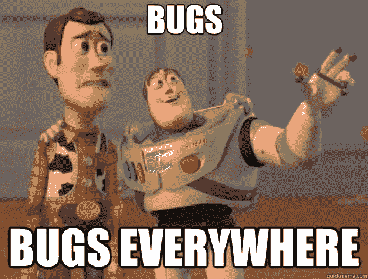

# 如何发现针对 Bug 的最佳解决方案

> 原文：<https://medium.com/hackernoon/how-to-find-the-best-solution-for-a-bug-33818838502>

## 了解根本原因可能是找到最终解决方案的第一步

A design artwork with a bug drawn in the center surrounded by circuits

错误并不局限于[软件](https://hackernoon.com/tagged/software)，它们可以在任何类型的系统中表现出来，导致某种错误、瑕疵、失败或故障，就像常规的[软件错误](https://en.wikipedia.org/wiki/Software_bug)。我甚至可以说，任何一个观察者可以解释为有目的的系统都可能包含某种错误，最终会使系统偏离这个目的。

Buzz Lightyear and Woody from the movie "Toy Story". Buzz is pointing to somewhere far off the screen and Woody has a scared expression towards it. The image caption overlay says "Bugs, bugs everywhere"

我们可以想出几个现实生活中的 bug 的例子:

*   汽车应该可以启动，但它们可能无法启动引擎
*   火车应该准时到达，但它可能会晚点
*   交通应该组织运输，但它可能会导致事故
*   团队应该向公司交付价值，但他们可能做不到

bug 并不局限于代码，它们存在于任何可能发生不好的事情的地方(根据墨菲定律，它们将会发生[)。每当我们想为一个 bug 找到一个](https://en.wikipedia.org/wiki/Murphy%27s_law)[解决方案](https://hackernoon.com/tagged/solution)时，我们需要超越代码本身去思考。

> 任何一个被观察者解释为有目的的系统都可能包含一个“bug ”,这个“bug”最终会使系统偏离这个目的

即使没有防止任何错误发生的灵丹妙药，我们仍然可以寻找在发现错误后做什么的策略。

在一个 bug 被发现之前，我们没有关于它的信息，实际上，它是不存在的。然而，在我们发现 bug 之后，我们就处于有利地位，因为我们将获得一些信息，这些信息可以帮助我们采取更有效的措施来防止特定类型的 bug 再次发生。

我们需要了解一个 bug 的基本方面，而不仅仅是看一下。最大限度地利用我们获得的信息，并想出有效的行动来处理这些信息是至关重要的。然而，我们需要格外小心我们如何做到这一点，因为在前进的道路上有陷阱。

有一种现象叫做“虚幻关联”。当一个人倾向于感知事件之间的关系，而事实上根本没有关系时，就会发生这种情况。在统计学中有一句话叫做[“相关性并不意味着因果关系”](https://en.wikipedia.org/wiki/Correlation_does_not_imply_causation)提醒我们，仅仅因为事件是相关的，并不意味着一个导致了另一个。我们可以用被延误的火车和被撞的汽车来做类比，仅仅因为它们发生得非常接近，并不意味着撞车导致了延误。除非有额外的证据表明这一结论，否则延误与事故完全无关。

A xkcd.com comic with two characters engaged in a conversation. "I used to think correlation implied causation. Then I took a statistics class. Now I don’t", says the one on the right. The one on the left tries to reason about it: "Sounds like the class helped". The one on the right says: "Well, maybe." ([source](https://xkcd.com/552/))

在处理这类问题时，[和](https://en.wikipedia.org/wiki/Proximate_and_ultimate_causation)之间也有区别。近因是最明显的原因，而终极原因不那么明显，但可以抓住事情发生的真正原因(以高层次的形式)。

让我们举一个例子:Jane 发现生产中的一个行为与用户期望系统做的不同。这显然是一个错误，我们需要修复。第一步应该是问**为什么会出现这个 bug？**

1.  第一个原因可以是:**因为生产中发生了意想不到的变化**，很明显。
2.  第二个原因可以是:**因为开发者做了一个改动把它弄坏了**，比上一个强一点。
3.  第三个可能是:**因为系统是在**构建的，这开始离我们真正想要的太远，但仍然是一个有效的因果关系(没有系统，就没有 bug)。

在这种情况下，最合理的最终原因似乎是第二种:**因为开发者做了一个改变，打破了它**。

> 近因是最明显的原因，而终极原因并不那么明显，但能以高层次的形式抓住事情发生的真正原因。

然而，这还不足以找出最终原因。仅仅因为一个开发者做了改变并不意味着开发者**就是 bug 的最终原因。我们需要将我们的孩子融入其中，并开始尽可能多地问[“为什么”](https://en.wikipedia.org/wiki/5_Whys)以更深入地挖掘到底发生了什么。**

1.  **为什么开发人员做了错误的更改？因为没有办法预测副作用。**
2.  为什么没有办法预测副作用？因为系统的代码质量低。
3.  **为什么系统的代码质量低？**因为我们没有付出足够的努力来提高代码质量。
4.  **为什么我们没有付出足够的努力来提高代码质量？**因为团队被期望满足疯狂的截止日期，这使得我们不可能改进代码。

这一系列问题表明，这个 bug 比最初看起来的要复杂得多，最后一个问题可能揭示了它的根本原因。

令人惊讶的是，在上面的例子中，结论与代码无关。

> 我们可以把一个 bug 的高级终极原因称为“直接原因”。我们的想法是尽可能深入地挖掘 bug，直到我们找到可以更有效地采取行动的“根本原因”

在不试图找到根本原因的情况下，“修复”Jane 的 bug 的最天真的方法是要求开发人员将代码更改为用户所期望的，并将其称为“修复”。问题是，根本原因不会被发现，更多的问题将继续发生。然而，一旦我们有了更多的信息，我们就可以直接针对根本原因采取行动。一旦我们解决了这个问题，我们就可以认为这个错误已经被修复了，否则，这只是一个“变通办法”。

我知道这听起来很刺耳。在我们的职业中，我们做了很多这种“幼稚的修正”，然后就收工了，好像这是应该做的事情。然而，这种心态的想法主要是为了提高意识。只要团队明白这并没有真正解决任何问题，那么回头做这个“变通”是可以的。至少现在团队将意识到错误发生的真正原因，并且**如果他们决定走另一条路，这将是一个有意识的决定**。

> 处理直接原因而不了解错误的根本原因不是“修复”，它只是一种“变通方法”

我们通常倾向于关注 bug 的直接原因，这可以引导我们采取更接近高层次近因的措施，而不是迫使我们更深入地研究和分析所有可能导致 bug 的潜在因素，直到我们找到问题的根源。仅仅因为原因是显而易见的，这并不意味着投资足够的努力来解决这个问题将是一个可行的长期解决方案。

[根据 IEEE](http://theinstitute.ieee.org/tech-history/technology-history/did-you-know-edison-coined-the-term-bug) 、*的历史学家 Alexander Magoun 的说法，“bug 不只是针对今天的计算机或软件；100 多年来，它们代表了工程师努力克服的不完美世界的挑战”。*

我认为，为了应对这个不完美的世界，并为所有错误找到最佳解决方案，我们需要关注根本原因，并采取更有效的措施来防止这些错误的发生，否则我们将一次又一次地为应该简单修复的问题寻找解决方法。

下次你看到一个 bug 时，你可能会意识到在它的表面下有更多的东西，有一个非常有效的解决方案渴望被发现。

让我们试着找到他们！

感谢阅读。如果你有一些反馈，请在[推特](https://twitter.com/FagnerBrack)、[脸书](https://www.facebook.com/fagner.brack)或 [Github](http://github.com/FagnerMartinsBrack) 上联系我。