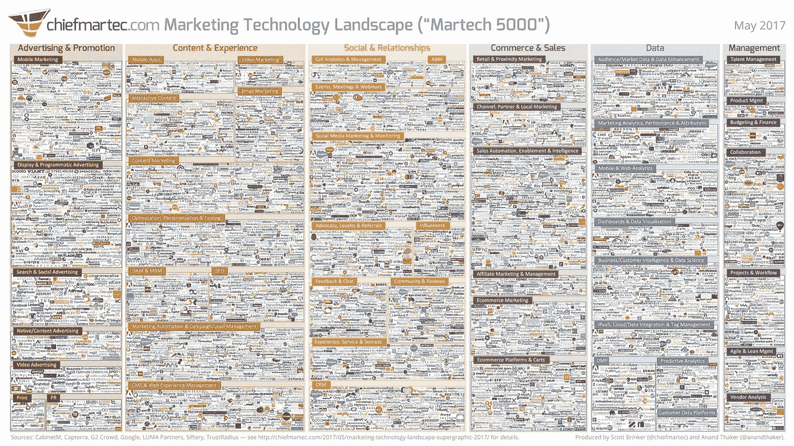
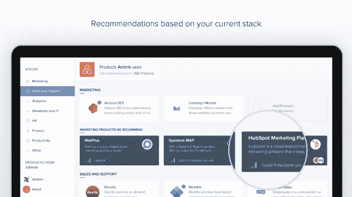
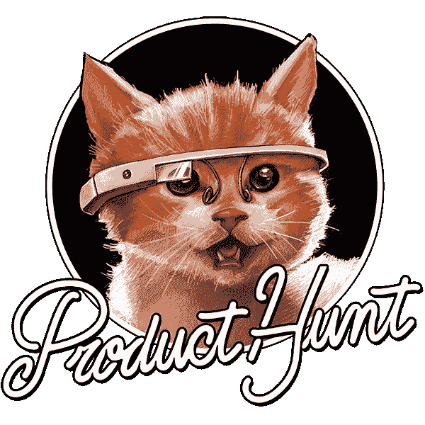
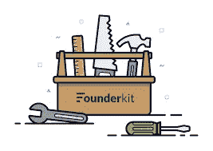
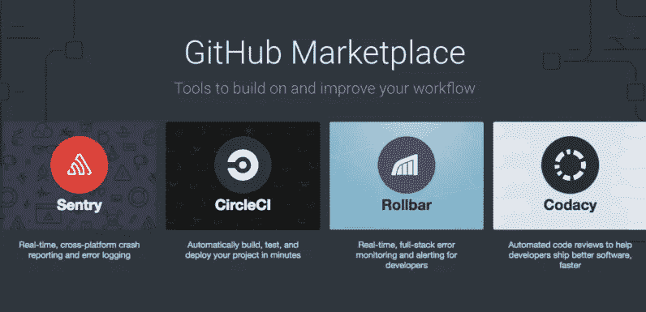

# 如何找到扩大创业规模的工具

> 原文：<https://medium.com/hackernoon/how-to-find-the-tools-to-scale-your-startup-cec80d5e5657>

*大家好，我是* [*乔丹*](http://www.jordangonen.com/) *，我喜欢帮助人们思考&发展他们的产品。希望这有所帮助！你可以在* [*推特*](https://twitter.com/jrdngonen) *:)* 上找到我

[创业真的很难](http://fortune.com/2016/11/18/common-mistakes-young-entrepreneurs/)。当然，你可能会在一些随机的媒体帖子上读到这一点，就像这篇，但是，除非你站在创业战场的战壕里，汗流浃背地忍受痛苦，否则你几乎不可能真正理解创办一家公司的困难。

大约 92%的新公司在 3 年内死亡。剩下的 8%中，只有少数人最终对世界产生了重大影响。

尽管这是一场技巧和目的的游戏，但问问业内任何一位罕见的成功创始人，他们都会告诉你，运气肯定是一个非常有影响力的因素。

虽然你不能直接控制你和你的团队有多幸运，但至少你可以通过积累对你有利的筹码来为自己的成功做准备。

有很多方法可以做到这一点——有些方法比其他方法更成熟。

*   与最优秀的人一起工作
*   在正确的时间筹集正确的资金
*   找到好的导师
*   [**使用正确的工具**](https://hackernoon.com/15-free-tools-for-your-next-product-launch-15d6e5913709)

这篇文章关注的是你如何找出最适合手头工作的工具和资源，这样你就可以更快更有效地建立你的公司。

如果你想在 2017 年建立一家极其成功的公司，我认为它必须是一家科技公司。那是“生活在泡沫中的我在说话吗？”我不这么认为。我坚信，在 2017 年打造一家可扩展的成功公司的最佳方式是利用技术。

准确地找出哪种技术是我们业务不可或缺的一部分可能极具挑战性。外面有成千上万的工具。SAAS(软件即服务)的爆炸式增长让我们许多人在开始寻找改善公司的“下一个重要工具”之前，就开始努力稳定和组织自己。

## 太吓人了！

[Source](http://chiefmartec.com/2017/05/marketing-techniology-landscape-supergraphic-2017/)

我们知道技术，如果使用得当，可以帮助我们更快地建造东西。把事情做大。把事情做得更好。

但是我们并不总是知道在哪里可以找到“正确的”和“最好的”技术来帮助我们做到这一点。

因此，我们花费了大量的时间来搜索和测试，而不是实际工作。*这是低效的。*

幸运的是，具有讽刺意味的是，有专门设计的平台和软件来减少这种摩擦并解决这个问题。

他们是家得宝员工的数字版，总是帮你找到合适的螺丝钉。

它们是将信号从噪音中分离出来的过滤器。

# 这里有一些资源可以找到合适的工具来帮助您的企业成长！

## 1. [Siftery](https://siftery.com/)

Siftery 帮助您发现与您相似的公司最推荐的产品。他们比较在行业或产品上与你相近的公司，寻找相似/不同之处，这样他们就可以提出产品建议。无论您是在寻找营销自动化软件还是开发平台，它们都将帮助您找到行业标准，甚至更多。

## 2.[产品搜寻](https://www.producthunt.com/)

[产品搜索](https://www.producthunt.com/)是每天发布的最佳新产品列表。在那里，您会发现各种各样的工具和玩具，它们将帮助您完成几乎任何事情——从现代白板到自动化软件。他们最近推出了[Ask Product Hunt](https://www.producthunt.com/ask)——这是一个推荐搜索引擎，由来自全球的超级强大和经验丰富的制造商社区提供支持。

## 3. [FounderKit](https://founderkit.com/)

FounderKit 提供了一系列来自经验丰富的创始人的评论和建议，他们可以准确地向您推荐哪些工具适合您的企业。它们通过算法排列市场上最热门和最好的服务，让寻找服务变得容易。他们的评论通常是最新的，因为他们提供了关于流行产品的透明和真实的想法。

## 4. [GitHub 市场](https://github.com/marketplace)

[GitHub](https://github.com/) 最近宣布了他们的[GitHub market place](https://github.com/marketplace)——一个动态的开发工具和资源集合，你可以在此基础上提高工作流程的效率和规模。虽然他们的选择有限，但由于该平台刚刚起步，您可以预计这将成为工程师找到他们下一个喜欢的工具的必去之地。

一旦你找到了合适的工具——组织它们也真的很难。原来我们花了大量的时间筛选我们已经使用的产品。

[*Usejournal*](http://usejournal.com/) *(我和他们没有任何关系)正在努力解决这个问题。注册提前访问。*

希望这些平台中的一个可以帮助你在正确的时间找到正确的工具，帮助你更快、更强、更好地建立你的公司！请随意，我很乐意帮忙。

> 非常感谢你的阅读！我的名字是[乔丹·戈宁](http://www.jordangonen.com/)，我每天都写博客。如果你能:
> 
> **>** [**在推特上关注我**](https://twitter.com/jrdngonen) **<**
> 
> 如果您有任何问题，请发送电子邮件至 gmail dot com！非常感谢！

> [黑客中午](http://bit.ly/Hackernoon)是黑客如何开始他们的下午。我们是这个家庭的一员。我们现在[接受投稿](http://bit.ly/hackernoonsubmission)并乐意[讨论广告&赞助](mailto:partners@amipublications.com)机会。
> 
> 如果你喜欢这个故事，我们推荐你阅读我们的[最新科技故事](http://bit.ly/hackernoonlatestt)和[趋势科技故事](https://hackernoon.com/trending)。直到下一次，不要把世界的现实想当然！

