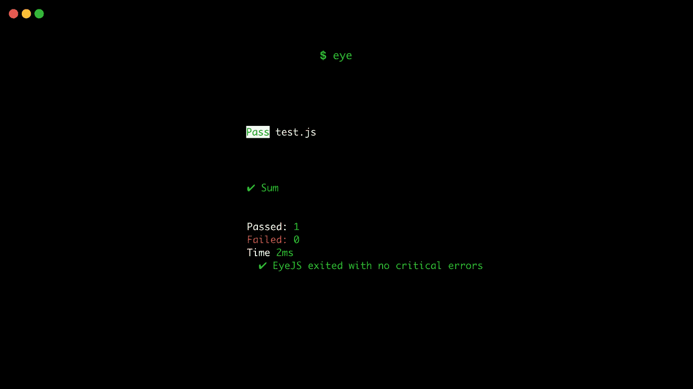

# 如何以正确的方式修复和查找 bug？

> 原文：<https://medium.com/hackernoon/how-to-fix-hunt-bugs-the-right-way-7c0387fe06aa>



有时，你对自己的下一个项目如此兴奋，以至于你不停地添加新功能……却没有意识到你刚刚打破了所有的系统。

一旦你准备好发布，你只要看一看你正在构建的东西，你就会发现它只是**不工作😤。**

你试试*猎杀*那只虫子🐛，但是当您打开控制台时，不会出现任何错误。

现在，你在你的代码和你的浏览器之间来回切换，你只是想找到错误可能来自哪里。

因为你找不到窃听器🐛，你进入你的终端，你只需要输入

```
git log --oneline
```

在你的 [git](https://hackernoon.com/tagged/git) repo 中获得最新的工作[版本](https://hackernoon.com/tagged/version)。你重置你的工作目录

```
git reset --hard <commit>
```

# 问题是

使用这种方法，你没有效率，而且很明显🙄将来可能会犯同样的错误，重新设置你的工作。

而且，你还会失去所有的新功能(即使它们不工作)。

# 解决方案

解决方法是测试你的代码。如果你测试你的代码的每一部分，你就不能破坏一切，因为你会有更多的提示来修复它(相信我，知道它来自哪里是一件大事😊).

**但这怎么可能呢？**

嗯，现在有几种框架，下面是其中的两种:

*   [笑话](https://facebook.github.io/jest/)
*   [EyeJS](http://https;//eye.js.org)

Jest 在非常大的节点项目中会更有用，因为它有很多测试功能，但对于普通项目来说，它有点过头了。脸书将其开发为与他们的环境配合得非常好，这意味着即使它不能在浏览器中进行测试，它也可以使用 React 来模拟真实条件。所以，如果你正在使用 React 或者你正在处理一个巨大的节点项目，这将是一个更好的选择😊。

EyeJS 不一样，它没有目标🎯同样的人。它将完美地适用于几乎所有的项目，因为它可以像 Jest 一样进行基于节点的测试。而且，它是唯一一个具有真正浏览器支持的测试框架，这意味着在同一个命令中，它将能够运行 NodeJS 测试并打开您的浏览器来运行其他自动化测试。

# 结论

他们是非常不同的，我认为🤔你可以两者兼得。你绝对应该两个都试试，看看哪一个对你捕捉虫子最有帮助🐛。

感谢☺️花时间阅读这个故事。