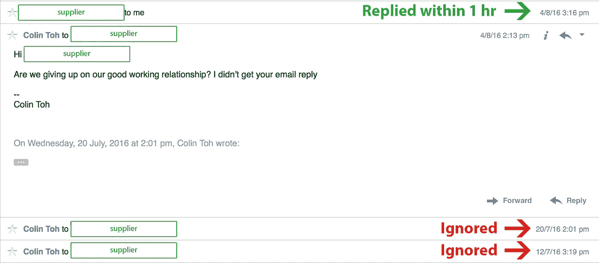
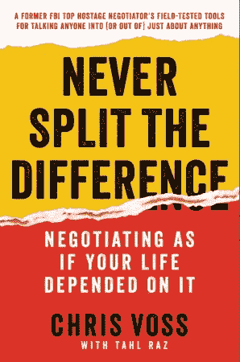

# 如何让无视你的人回复邮件

> 原文：<https://medium.com/hackernoon/how-to-force-an-email-response-from-someone-who-is-ignoring-you-91d8462a4330>

Credit: [https://unsplash.com/search/no?photo=oRhhb0f2Kic](https://unsplash.com/search/no?photo=oRhhb0f2Kic)

厌倦了你的邮件被忽视？试试这个巧妙的技巧。

几个星期以来，你一直在寻找一条潜在的线索，事情正在向你的方向发展。

这种融洽的关系非常牢固，通过一些温和的推动，这一线索可以转化为一个全职付费客户。胜利近在咫尺，你几乎可以尝到它的味道。

> 然后，交流就冷淡了。

你的邮件被忽略了，也没有给出任何理由。你是不是说了一些即兴的话？还是他们私下里对合同条款不满？

没有办法知道。

你被忽视的邮件就像散落在地板上的碎纸。

你还能做什么？

# 问一个“不”导向的问题

我是从一本书上学到这个技巧的——[克里斯·沃斯](https://twitter.com/vossnegotiation)的《[从不分割差异](https://www.amazon.com/gp/product/0062407805/ref=as_li_tl?ie=UTF8&camp=1789&creative=9325&creativeASIN=0062407805&linkCode=as2&tag=colintohblog-20&linkId=82891144b4e43f2b610724e091f47c69)》。

克里斯是一名成功的人质谈判专家，他建议，不要像我们经常做的那样，以“是”为导向的问题来寻求回答，而是尝试做相反的事情。

问一个以“不”为导向的问题，暗示你准备离开。

我将简要解释这背后的心理，但要获得它的全部要旨，我强烈推荐购买这本书。

# 诱饵

> "你已经放弃偿还剩余的项目了吗？"

当人们不同意说“不”时，这给他们提供了一种安全和控制的错觉。他们觉得受到的威胁更少，更多的是在驾驶座上。上面的问题对他们来说就像一个诱饵。

最重要的是，你按照自己的方式走开的潜在概念，利用了你的对手对损失的厌恶。

为了减少他们的损失，并重新获得在这种情况下的自信，他们变得更倾向于立即回答不同意。

老实说，当我第一次读到这种技术时，我并不是很感兴趣。这听起来有点噱头，我的电子邮件很难被忽视。所以我无法预见我会很快从这项技术中获益。

# 我如何获得第二次机会

我正在和我的供应商就他们开始生产所需的最小订单量进行谈判。我们拿着不同的报价来来回回，突然交流陷入了死寂。

我的 Skype 消息无人回复，电子邮件也被忽略。我一定是用我强硬的立场把交易推下了悬崖。我仔细考虑了一下，得出的结论是不会有幸福的结局。

过了几天，我想起了克里斯书里问“不”导向问题的技巧。既然已经是一个失败的事业，尝试一下又有什么害处呢？

所以我精心制作了我的信息，并点击了“发送”。

一个小时后，我得到了他们的回复。

What sorcery is this???

我不会展示他们的回答，但基本上这是对我的问题的不同意见，整个谈判再次开始。最后，一丝希望！

# 结论

如果你的邮件被忽视了，那就问一个“不”字为主的问题。对你来说这可能听起来很粗鲁，但实际上并非如此。你会给人一种直来直去的感觉。

你知道什么是粗鲁吗？忽视邮件是不礼貌的。

*更新:* [*有人试出了手法*](https://www.reddit.com/r/Entrepreneur/comments/4w82k9/how_to_force_an_email_response_from_someone_who/d653pnn?st=irhhk1o9&sh=b3553d74) *果然奏效！*

**支持本书作者:**

> [永远不要分割分歧:谈判就像你的生命取决于此一样](https://www.amazon.com/gp/product/0062407805/ref=as_li_tl?ie=UTF8&camp=1789&creative=9325&creativeASIN=0062407805&linkCode=as2&tag=colintohblog-20&linkId=9b5445de4c92c943caa587096ec7d2cd)

还有，**按“♥︎”**帮我把这篇文章推广给他人。

如果你喜欢这篇文章，你可能会喜欢

*   如何让失败的谈判重回正轨？

> [黑客中午](http://bit.ly/Hackernoon)是黑客如何开始他们的下午。我们是 AMI 家庭的一员。我们现在[接受投稿](http://bit.ly/hackernoonsubmission)并乐意[讨论广告&赞助](mailto:partners@amipublications.com)机会。
> 
> 如果你喜欢这个故事，我们推荐你阅读我们的[最新科技故事](http://bit.ly/hackernoonlatestt)和[趋势科技故事](https://hackernoon.com/trending)。直到下一次，不要把世界的现实想当然！

