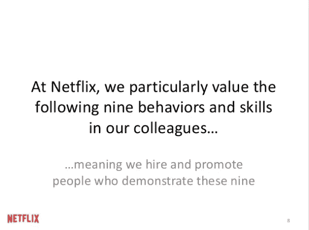

# 如何培养健康的公司文化，避免导致你的创业失败的冲突

> 原文：<https://medium.com/hackernoon/how-to-foster-healthy-company-culture-and-avoid-conflict-that-will-cause-your-start-up-to-fail-7e0eac41636e>

向前辈们学习。

说你想说的，但是网飞在谈到公司文化时抓住了它。他们按照自己实际的[公司](https://hackernoon.com/tagged/company)价值观发展和生活，而不仅仅是嘴上说说。谁被雇佣、奖励、提升或解雇，这一点得到了强化。

那些花时间去真正理解他们的价值观，把它们写下来，并在每一个决定中实践它们的公司，是那些拥有最好的品牌，最忠诚，和最一致的积极反馈的公司。

我们已经看到像优步这样的大公司搞砸了很多事情，因为他们没有考虑到他们的公司价值观是如何实时实现的。

 [## 优步工程师回应性别歧视丑闻:“这是每个人的问题”

### 震动优步的性别歧视丑闻不是该公司独有的，而是每个人的问题，一名优步工程师说。

www.businessinsider.com](http://www.businessinsider.com/uber-engineer-aimee-lucido-sexism-scandal-2017-2) 

打造一个好的工作场所，从第一天开始就考虑技能、工作资格、多样性、包容性以及一家公司如何践行其价值观。

一家[初创企业的首席执行官需要了解人力资源的绝对最小值系列:](https://hackernoon.com/tagged/startup)

更多关于 [**的系列文章，一个初创公司的 CEO 需要了解的人力资源知识绝对最少**](/@JasmineRamratan/the-absolute-minimum-a-start-up-ceo-needs-to-know-about-hr-c43234a95542)

1.  [**如何找到优秀的候选人进行聘用**](/@JasmineRamratan/how-to-find-good-candidates-to-hire-for-your-start-up-6114fab0845d)

**2。** [**如何聘用和入职员工**](/@JasmineRamratan/how-to-hire-and-onboard-an-employee-at-a-new-start-up-bad1a588f199)

**3。** [**如何激励、奖励和管理员工的绩效**](/@JasmineRamratan/how-to-motivate-incentivize-and-manage-the-performance-of-an-employee-at-a-start-up-f0fde9a4865b)

**4。** [**如何培养健康的公司文化，避免导致公司失败的冲突**](/@JasmineRamratan/how-to-foster-healthy-company-culture-and-avoid-conflict-that-will-cause-your-start-up-to-fail-7e0eac41636e)

**5。** [**如何解雇表现不佳的员工**](/@JasmineRamratan/how-to-fire-an-underperforming-employee-at-a-start-up-b84a5e010a89)

> [黑客中午](http://bit.ly/Hackernoon)是黑客如何开始他们的下午。我们是 [@AMI](http://bit.ly/atAMIatAMI) 家庭的一员。我们现在[接受投稿](http://bit.ly/hackernoonsubmission)并乐意[讨论广告&赞助](mailto:partners@amipublications.com)机会。
> 
> 如果你喜欢这个故事，我们推荐你阅读我们的[最新科技故事](http://bit.ly/hackernoonlatestt)和[趋势科技故事](https://hackernoon.com/trending)。直到下一次，不要把世界的现实想当然！

