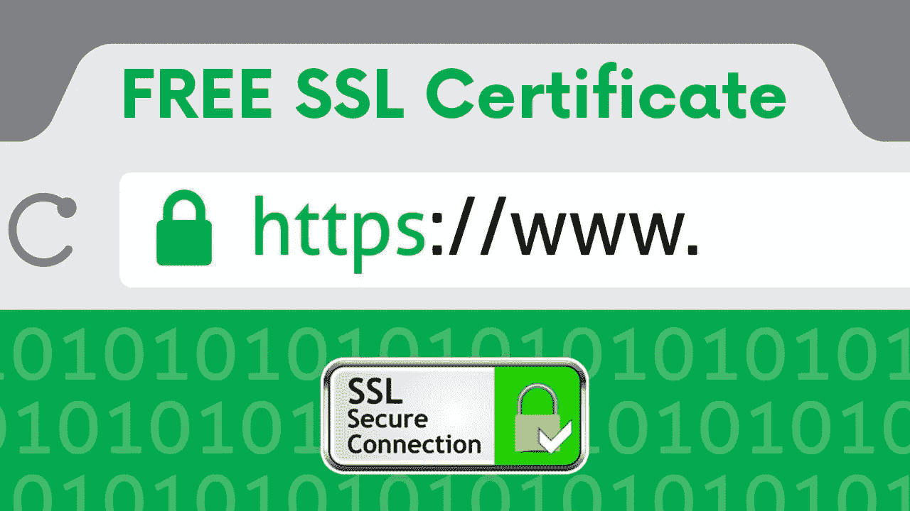

# 如何为你的域名获得一个免费的“HTTPS ”!(使用自动气象站)

> 原文：<https://medium.com/hackernoon/how-to-get-a-free-https-for-your-domain-using-aws-68140d176efb>

**先决条件:**
1。一个域(Example.com)，通过 Godaddy、BigRock 等从外部购买
2。AWS 弹性豆茎服务器。如果你没有弹性的 beanstalk 服务器，使用[链接](http://docs.aws.amazon.com/elasticbeanstalk/latest/dg/using-features.environments.html)创建一个

**步骤 1:** 转到 AWS 证书管理器