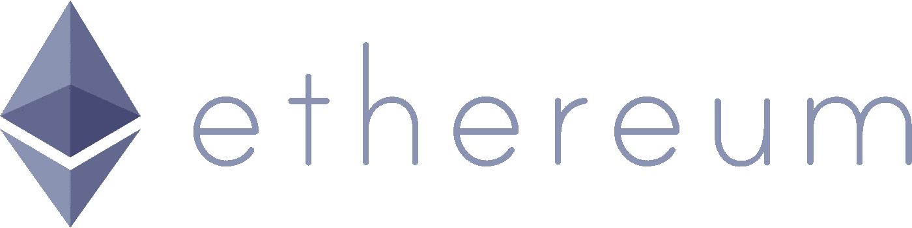

# 如何进入以太坊开发

> 原文：<https://medium.com/hackernoon/how-to-get-into-ethereum-development-e137eb052131>

我一直想进入以太坊开发有一段时间了，现在每个人都不能停止谈论价格，我想其他程序员也有兴趣。不幸的是，我的经验是，互联网上充斥着不完整的建议和过时的指示。因此，经过几个小时的努力，我总结出了一个如何让您的本地开发环境启动并运行的方法。如果你想跳过使用这个的理由，直接跳到说明，[点击这个链接](https://gist.github.com/gititGoro/64884a6084b050c3d021805ace472275)。如果你有一个 github 账号，并且欣赏其中的要旨，请善待明星。

## 在阅读本文之前，你需要知道的是

你应该明白什么是区块链，以太坊和比特币的区别，以及“testnet”和“full node”这两个词的意思。你还应该知道什么是天然气，以及它如何通过天然气价格与乙醚相关联。

## 为什么使用这个，当你可以按照 Ethereum.org 教程？

以太坊的主要网站上有一些非常好的例子，可以帮助你开始一个新的旅程。问题是，编写和测试任何智能契约都需要您首先下载 wallet，Mist，然后使用 testnet 或真实的区块链运行一个完整的节点。光是测试网就非常非常大，我的 Ubuntu 分区空间不足。同步的时间也非常长。我花了几个小时在网上寻找如何在本地建立我自己的 testnet。没有一个好的教程，所以在经过多次 stackoverflow 跳跃之后，我最终汇编了这篇文章中链接的食谱。我开始启动我自己的私人节点，不到一分钟就开采了 390 个以太。假的，本地以太显然，但足够好的开发者的需求。

## 警告

我在我的南非同事的 Linux 发行版、**、Ubuntu、**中做到了这一点，我建议你也这样做。但是这些指令应该可以在所有的操作系统中运行(对于 windows 稍作调整)。

有些事情我认为是理所当然的，但这只是因为快速的谷歌搜索就可以做到这一点。

希望这有所帮助！请记住明星和推荐，以及所有那些传播爱的社交媒体，通过算法。愿 Vitalik 对你微笑，愿 Satoshi 把你藏起来。

[这是要点，以防你跳过了上面的](https://gist.github.com/gititGoro/64884a6084b050c3d021805ace472275)。

> [黑客中午](http://bit.ly/Hackernoon)是黑客如何开始他们的下午。我们是 [@AMI](http://bit.ly/atAMIatAMI) 家庭的一员。我们现在[接受投稿](http://bit.ly/hackernoonsubmission)，并乐意[讨论广告&赞助](mailto:partners@amipublications.com)机会。
> 
> 如果你喜欢这个故事，我们推荐你阅读我们的[最新科技故事](http://bit.ly/hackernoonlatestt)和[趋势科技故事](https://hackernoon.com/trending)。直到下一次，不要把世界的现实想当然！

