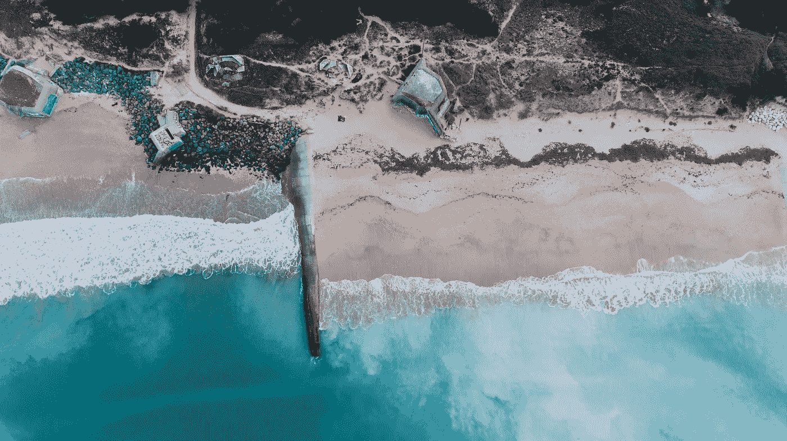

# 如何参与令人兴奋的项目

> 原文：<https://medium.com/hackernoon/how-to-get-involved-in-exciting-projects-394faae81b99>

## 采访[康纳·林](https://twitter.com/c0nn0rlin?lang=en)

独立思考说起来容易做起来难。社会充满了如此多的噪音和如此多的社会压力，以至于我们经常屈服于社会影响。

有时候，你只需要相信你的直觉。

在这次采访中，康纳分享了他在学生时代下大赌注和了解未来的故事。超级有意思！

# 嘿康纳！感谢您花时间分享。

# 介绍一下自己！告诉我们你在哪里上学，在哪里工作，现在在做什么。

我是 [**康纳林**](http://linkedin.com/in/connorlin) ，即将升入大二的 [**哥大**](http://www.columbia.edu/) 。我是 [**莱利**](https://getrileynow.com/) (YC W17)的创始团队成员。在此之前，我联合创办了一个叫 Flutter 的 app，在 [**面条教育**](https://www.noodle.com/) 做营销，给各个公司做营销咨询。这些天来，我的重点一直是加密货币和区块链技术。我已经开始对协议令牌进行投资，但展望未来，我更感兴趣的是试图找到/创造一个能够让区块链成为主流的“杀手级应用”。

# 你在学校学什么？有没有在现实世界中有帮助的课？如果不是，你从哪里学到了在工作中最有帮助的东西？

> 某些课程确实提高了你的写作和沟通技巧，我发现这非常有帮助。

我还不确定。我在考虑做哲学。某些课程，虽然不直接适用于我正在做的事情，但确实提高了你的写作和沟通技巧，我发现这非常有帮助。就学习而言，互联网和书籍是我最好的朋友。书籍的美妙之处在于，每当我拿起一本书时，我都有一个明确的意图，想从中获得一些可操作的东西，并在完成后成为一个更好的人。

# 你高中时搬到了纽约市。那是什么感觉？你学到了什么？

是的，我 17 岁时搬到那里。我立刻爱上了纽约。一开始，我觉得自己有点年轻，因为我主要是和在城市工作的大学高年级学生在一起，但这无疑让我变得成熟。我学到的主要东西是，世界上有太多我不知道的事情。这是一个非常重要的认识。

# 你如何看待职业生涯中的冒险，你有自己使用的框架吗？

> ***【Memori mento】:记住你会死***

对我个人来说，我基本上每天都对自己说的一句话是“memori mento”:记住你会死，用拉丁语说。这有点令人沮丧，但有了这个想法，就像有一天你死了，这一切都不重要了，所以我不想后悔没有承担任何风险，因为生命短暂。另一个我非常喜欢的想法是宇宙是一个模拟。一般来说，更有趣的事情源于更大的风险，所以你也可以试着娱乐一下模拟器。

# 告诉我们一点关于你正在用 crypto 做什么！如今你最激动的是什么？

目前，我把大量时间花在个人投资研究上，因为我相当乐观地认为，这个领域将会有少数大赢家。除此之外，我还创办了一份 ICO 研究时事通讯，并正在洽谈加入一些与区块链相关的公司和一家加密对冲基金。

# 对于没有区块链/加密背景的人，你建议他们从哪里开始？最大的参与机会在哪里？

开始读吧。白皮书很棒。Reddit 很棒。Bitcointalk 很棒。只是大量阅读而已。

[**https://block geeks . com/guides/what-is-区块链-科技/**](https://blockgeeks.com/guides/what-is-blockchain-technology/)

[**https://github.com/ethereum/wiki/wiki/White-Paper**](https://github.com/ethereum/wiki/wiki/White-Paper)

[**https://www.reddit.com/r/icocrypto/**](https://www.reddit.com/r/icocrypto/)

# 你认为明年这个领域会有什么变化？5 年？10?现在是开始的时候吗？

我认为，现在，我们正看到为“互联网 3.0”建立许多协议令牌和基础设施。我不认为这项技术已经为任何真正的大型消费者应用做好了准备，而这正是我感兴趣的。生态系统真正成熟还需要一段时间，当它成熟时，企业家将会来建造各种很酷的东西。

# 你有导师吗？你是在哪里找到他们的？

莱利公司的首席执行官丹尼尔·艾哈迈迪扎德和面条公司的首席执行官约翰·卡兹曼都教会了我很多东西。还有很多其他人花时间帮助我，我无法一一列举。我通常通过我正在做的工作、个人关系或者有时甚至是冷冰冰的电子邮件来找到导师。

**—**

# 人们在哪里可以找到你，你在寻找什么机会？(Twitter、linkedin、个人网站、媒体等)。

推特:[T3【twitter.com/c0nn0rlin】T5](http://twitter.com/c0nn0rlin)

领英:[**linkedin.com/in/connorlin**](http://linkedin.com/in/connorlin)