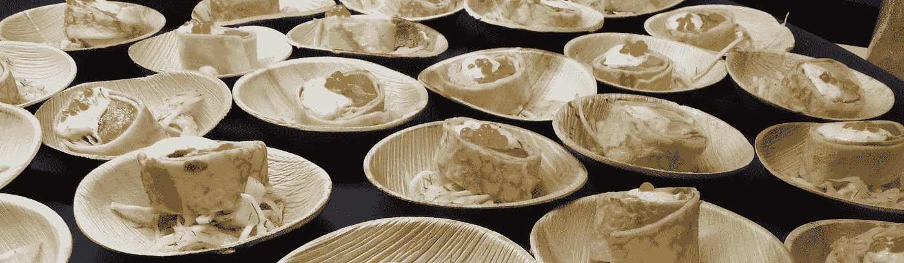

# 如何在旧金山获得超过 200 美元的免费食物

> 原文：<https://medium.com/hackernoon/how-to-get-over-200-of-free-food-in-sf-3076cf22b4f1>

## 利用食品配送战

随着风险投资公司将资金投入竞争激烈的硅谷食品配送初创公司，消费者可以真正受益于免费餐饮折扣和推荐代码的涌入。

该列表包含了旧金山地区所有的**熟食配送服务。它*不*包括像蓝色围裙或电镀这样的服务，这涉及到烹饪(我的目标是以后为这些做一个单独的指南)。如果你使用所有这些代码，你可以得到价值超过 200 美元的食品信贷。声明:本文中的参考代码是我自己的。**

Source: [http://www.deplifestylemagazine.com/?p=456](http://www.deplifestylemagazine.com/?p=456)

## 美食— [推广链接](http://munchery.com/invite/ATJHB3A6)

有机/本地，20 美元信用

## Caviar — [促销链接](https://www.trycaviar.com/r/hwkkam?s=web)

前两个订单优惠 10 美元

## 酱汁— [推广链接](http://get.saucey.com/yc7e/ClzN6L9PmD)

小吃/酒，价值 25 美元

## 优步吃饭— [链接](http://ubr.to/EatsGiveGet)，带代码

第一次订购优惠 15 美元，你可以使用任何人的代码，这是我的代码:eats-25inu

## 亚马逊交付— [促销链接](https://www.amazon.com/restaurants)

首次订购优惠 10 美元(无需推荐)

## DoorDash — [促销链接](http://drd.sh/tuSxRU/)

7 美元信用

## Delivery.com—[促销链接](http://www.delivery.com/share?code=scognetta1)

7 美元信用

## Grubhub — [促销链接](https://refer.grubhub.com/s/wjujf)

第一笔订单优惠 7 美元，总金额必须达到或超过 15 美元

## Eat24 — [推广链接](http://eat24hours.com)，带代码

与 code seabass 的订单相差 2 美元

## Postmates — [促销链接](http://springboard.postmates.com/cvAe/rYyueJrQmD)

100 美元的送货积分(您仍需支付实际购买的费用)

# 更多免费食物

获得更多免费食物的三个额外建议:

*   你可以随时通过使用不同的电子邮件将自己推荐给一家食品配送初创公司。
*   如果你是集体订购，先检查一下是否有人已经注册了你考虑使用的服务。如果有人没有，你可以推荐他们获得全团折扣。
*   在你订购任何东西之前，总是谷歌“___ 促销代码”，大多数创业公司都有季节性折扣。

如果您觉得这很有帮助，请单击💚下面，并在上面注册我的简讯！

> [黑客中午](http://bit.ly/Hackernoon)是黑客如何开始他们的下午。我们是 [@AMI](http://bit.ly/atAMIatAMI) 家庭的一员。我们现在[接受投稿](http://bit.ly/hackernoonsubmission)，并乐意[讨论广告&赞助](mailto:partners@amipublications.com)机会。
> 
> 如果你喜欢这个故事，我们推荐你阅读我们的[最新科技故事](http://bit.ly/hackernoonlatestt)和[趋势科技故事](https://hackernoon.com/trending)。直到下一次，不要把世界的现实想当然！

