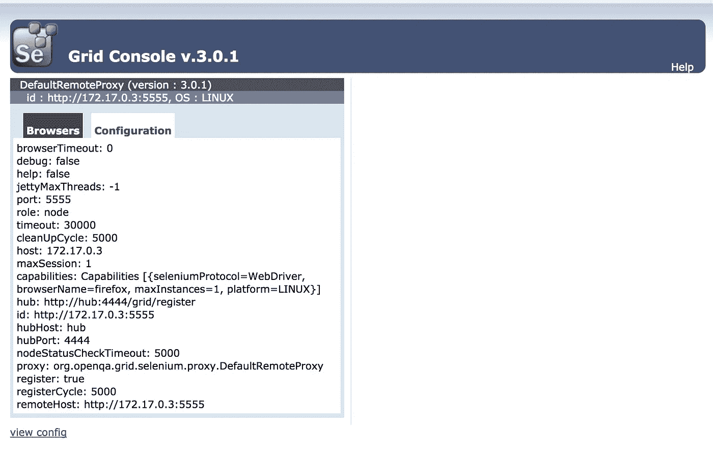

# 如何让 Selenium 3 在不到 10 分钟内运行起来？

> 原文：<https://medium.com/hackernoon/how-to-get-selenium-3-running-in-less-than-10-minutes-54d0dd6ba7a9>

在持续部署的环境中手工测试你的网站是疯狂的表现。如果你正在手工测试你的网站，它会很快让你发疯，如果它还没有的话。网站测试对于建立和维护高质量的网站是必要的，但是许多人认为这是一个乏味的任务。

除了最小的网络应用程序之外，手动点击每一个可能的路径变得不可行。幸运的是，有工具可以自动化这些重复的测试步骤。测试工具有很多，但是我想重点介绍一下 [Selenium](https://hackernoon.com/tagged/selenium) 系列测试工具。特别是 Selenium 3，它是 Selenium 自动化测试工具的最新版本。

Selenium 3 是一个基于 Java 的应用程序，安装它会附带所有作为 Java 应用程序安装的东西。当你在服务器上安装 Selenium 3 时，你必须安装一个 Java 运行时、Selenium Java、浏览器和任何其他依赖项。安装一切都需要时间，但有一个更快的方法来安装硒 3。

让 Selenium 3 启动并运行的最快方法是使用 [Docker](https://hackernoon.com/tagged/docker) compose。如果你有一个快速的互联网连接，这些步骤需要几分钟。我们这个解决方案有三个部分，Selenium 3 本身，Docker，最后是 Docker Compose 来管理和运行应用程序。

# 码头工人

Docker 是一个应用程序，它通过将 Linux 应用程序放在软件容器中来自动部署它们。Docker 容器用一个完整的文件系统和它需要运行的所有东西包装了你的应用程序。

Docker 网站包含了更多的信息，我可以在这篇文章中深入探讨。如果你不熟悉 Docker 和 Docker compose，你应该花点时间在这里阅读一下【https://www.docker.com/[】。](https://www.docker.com/)

在大多数现代版本的 Linux 上安装 Docker 和 Docker Compose 非常简单。

Docker 映像是文件系统的自包含映像，其中安装了所有东西。我们需要一个包含 Selenium 和所有支持文件的 docker 映像。Seleniumhq 为 hub 节点、worker 节点和独立版本提供了这样的预构建映像。

# 硒

Selenium 是一个软件测试框架，它通过自动化浏览器来测试 web 应用程序。Selenium 还有一个 IDE (Selenium IDE ),它允许您记录和回放测试会话来编写测试，而不用用测试脚本语言写出测试。

“Selenium Grid”是一个设置，它提供了一个 hub，允许在任意数量的节点上同时运行多个 Selenium 测试。在本例中，我们将运行一个双节点“Selenium Grid”，一个集线器和一个单节点。

Seleniumhq.org 所做的是建立任何人都可以使用的 Docker 图像。有 Docker 图像可以与 Firefox 和 Chrome 浏览器、Selenium 3 的独立版本以及 Selenium hub 一起测试。Docker Compose 将自动下载我们在合成文件中指定的任何预建图像的最新版本。

# Docker 撰写

Docker Compose 是一款将所有内容整合在一起的工具。它是一个定义和运行多容器 Docker 应用程序的工具。您可以在一个名为 docker-compose.yml 的文件中定义组成应用程序的服务

Docker compose 使用该文件创建并启动所有定义的服务。在下面的 docker compose 文件中，我们定义了两个 Selenium 3 容器(一个 hub 和一个 worker 节点)如何交互和协同工作。

# 把所有的放在一起

现在我们已经把所有的部分都准备好了，启动 Selinium 3 网格只需要运行一个 docker-compose 命令。

`docker-compose up -d`

Docker Compose 将下载最新的映像，进行配置，并开始运行它们。第一次构建时，这可能需要几分钟时间。

在 web 浏览器中导航到 http:// <ipaddress>:4444/grid/console，将<ipaddress>替换为运行网格的机器的地址。如果您在本地机器上运行，您可以使用 127.0.0.1。您应该看到 Selenium 网格控制台，对于一个只有一个节点的 hub 来说应该是这样的。</ipaddress></ipaddress>

***这个帖子有趣吗？*** *如果是这样，请点击下面的❤让我知道，它确实有帮助。格雷格·科尔曼是马里兰州安纳波利斯的一名自由职业开发人员，他正计划去东南亚某个未公开的地方寻找完美的 Unagi 卷。可以在这里联系我*[*https://Gregory Coleman . github . io*](https://gregorycoleman.github.io)

> [黑客中午](http://bit.ly/Hackernoon)是黑客如何开始他们的下午。我们是 AMI 家庭的一员。我们现在[接受投稿](http://bit.ly/hackernoonsubmission)并乐意[讨论广告&赞助](mailto:partners@amipublications.com)机会。
> 
> 如果你喜欢这个故事，我们推荐你阅读我们的[最新科技故事](http://bit.ly/hackernoonlatestt)和[趋势科技故事](https://hackernoon.com/trending)。直到下一次，不要把世界的现实想当然！

