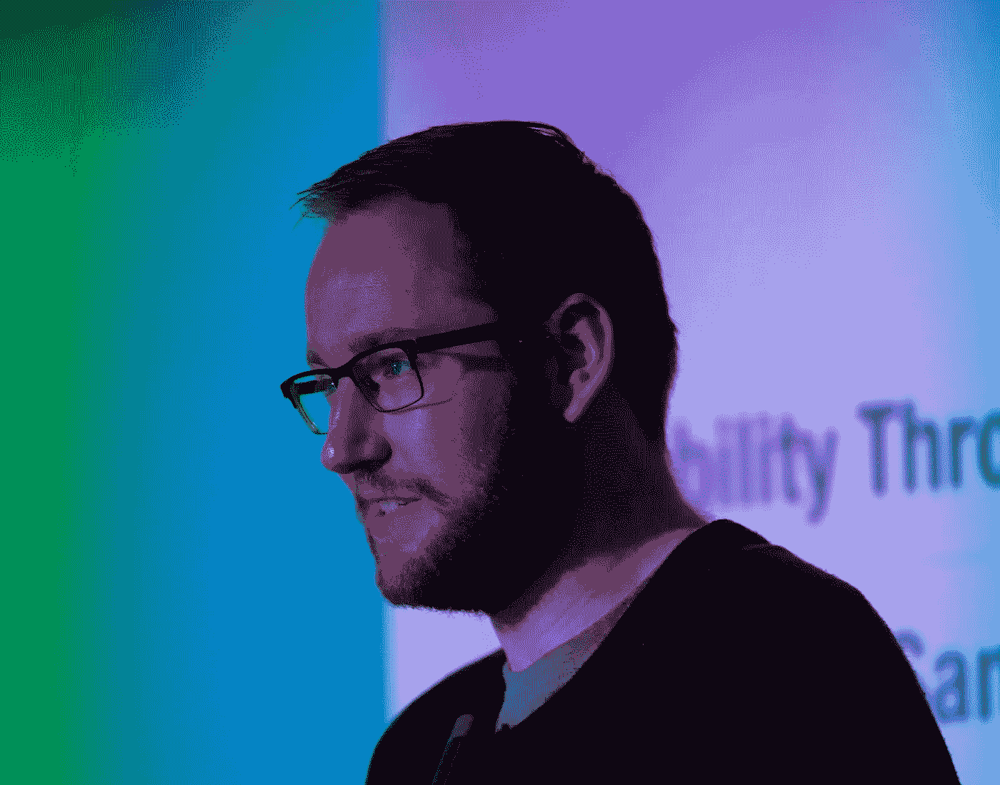

# 如何获得演讲机会

> 原文：<https://medium.com/hackernoon/how-to-get-speaking-engagements-c7fdebf8416d>

Femke 问道:*作为一个想更积极地演讲的人，我想知道你是如何得到演讲机会的？你会接触他们并推销你的演讲吗？你是怎么开始涉足这个的？*

Me speaking at at Dev World 2017 in Melbourne, Australia. [http://2017.devworld.com.au/](http://2017.devworld.com.au/)

很棒的问题！答案是运气。但我创造了自己的运气。那我该怎么做呢？有几个与演讲演出相关的创造“运气”的关键方法，让我们开始吧！

# 随便问！

你可能没有意识到，许多内部会议、聚会、外部会议等*的组织者实际上想要演讲者*。这些人最大的恐惧之一是没有人想在他们的会议上发言，然后没有人参加。组织一次会议会涉及数千美元(如果不是更多的话),因此申请发言或在会议上做简短发言会让组织者会心一笑。所以伸出手，说“我有一个演讲的想法，因为我最近做了 xyz”。:)

之后，就是数字游戏了。你看，申请每一个该死的 CFP，你为一次谈话提出建议的过程(那是有意义的)。一些更实用的建议——我听说一个很受欢迎的网站是[回电女性](http://www.callbackwomen.com/)——这个网站每周发一封电子邮件，你可以申请参加会议(主要是科技)。它深入到旅行和住宿帮助等信息，有时还包括儿童保育。在大多数“x 技术会议”社区中，还有很多很多在线文章值得订阅和关注。

# 网络——了解组织者

我在(Dev World 和 MS Ignite)上演讲过的最喜欢的会议之一，实际上我是通过纯网络参加的。在这两种情况下，我之前都是在一次会议上通过朋友或普通关系网认识了组委会的某个人。有时，这将有所帮助。其他时候，会议可能会使用双盲程序来选择发言人，这没有用。但对我来说，情况并非如此，这很有帮助。所以，在那件事上，一定要和那个人说话——你永远不知道他们可能是谁！记住:不是**你认识什么**，而是**你认识谁**。

# 完成你的最后一次演讲

他们说音乐家只和他们上一场音乐会一样好——对演讲者来说也是如此。认真对待每一次演讲，就像世界会议组织委员会在房间里一样，这是作为一名公共演讲者取得成功的关键。这需要努力。最近，我被邀请在一个新型的会议上发言(我对此非常兴奋)，当我询问我的名字是如何出现在帽子里的时候，他们提到了我的 ITx 演讲。回想起来，我在那个演讲上花了很长时间。在写这本书之前，我思考了大约 6 个月。我花了大约 4 个周末在我的办公桌上写剧本和幻灯片。我找了一个设计师(我的好搭档，Amy)来做幻灯片和创建自定义图像。然后我一遍又一遍地练习演讲。仅仅 30 分钟就要工作 40-50 个小时。当我到房间的时候，它看起来很小，可能最多只有 100 人。老实说，我有点失望。演讲结束后，我意识到房间里有一名记者，还有其他几位非常重要/有影响力的人。门打开了，因为我已经把工作做好了。从那以后，我再也没说过一句不中听的话。后来我又做了两次演讲，并出现在新西兰的 ITX 博客上。

所以综上所述。这是要求的勇气，举起你的手。这是建立关系网并把自己放在外面的勇气。最后，投入工作，不要轻视前 50 个约定，建立一个一贯优秀的演讲者的声誉。

祝你好运！

PS:迷茫？以下是你应该开始公开演讲的原因。

*这是我的* [*初级开发者日记*](https://www.samjarman.co.nz/diaries) *博客系列中的一篇帖子。我每周都在写更多，你可以在我的网站* [*上注册多听多看以前的帖子。如果你喜欢这个，请给我一两下掌声！我真的很感激。*](https://www.samjarman.co.nz/diaries/)