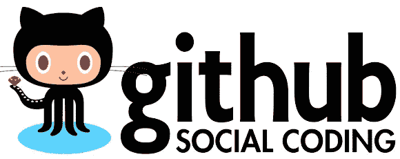

# 如何开始使用开源软件

> 原文：<https://medium.com/hackernoon/how-to-get-started-with-open-source-2b705e726fea>

*这是我的* [*初级开发者日记*](https://www.samjarman.co.nz/diaries) *博客系列的第 6 篇帖子。我每周都在写更多，你可以在我的网站* [*上注册收听更多并阅读以前的帖子。*](https://www.samjarman.co.nz/diaries/)

GitHub is great! Go learn about it :)

作为一个雇主，甚至是一个开发者，我想看到你对这个行业的热情。最好的方法之一是让我和其他人公开一些你最喜欢的项目的代码。

# 什么是开源？

开源是一个术语，指任何人都可以查看和建议编辑的代码库。对于我们的行业来说，最引人注目的是 GitHub 网站，它托管了几乎所有的开源项目。

开源项目是参与社区的一个很好的方式——它让你与其他开发人员互动，让你更好地学习编码，甚至可以帮助你熟悉大型代码库，这对于初级开发人员来说通常是非常令人畏惧的。

# 你如何开始？

但是如何开始呢？首先，我会尝试一些非常非常简单的方法。去找一个你喜欢的项目，也许是你最喜欢的 ruby gem 或者 npm 包，然后开始阅读代码。我们不是在这里寻找逻辑缺陷，我们是在寻找错别字。是的。错别字。评论中的错别字。你对开源的第一个拉请求将是一个打字错误的更正。您将把*returns*改为 *returns* 。你就把*他*改成*他们*。你会改变任何你能找到的琐碎而安全的东西。

但是变化并不重要。重要的是你如何提出改变。环顾四周，你很可能会找到一个[投稿指南](https://github.com/CocoaPods/CocoaPods/blob/master/CONTRIBUTING.md)或者“读我”中的一个部分。这些部分将告诉您如何对代码库进行更改。你如何检查代码，运行它，分支命名惯例，公关惯例等。你可能也想看看上周的 Code Reviews 博客，看看如何创建一个好的公关。这也是与项目维护者互动的好时机，随着 PRs 强度的增加，开始这种关系将会有所帮助。

既然您已经了解了派生和创建拉式请求的工作方式，那么是时候对自己的东西进行开源了。但是什么萨姆？你有来自 Uni 或 bootcamp 的项目吗？你某个周末写的搞笑剧本怎么样？你为黑客马拉松写的代码怎么样？

代码不一定要很好(不管那是什么意思？！)网上弄就行了。不一定要完成。我们只是想看看你做了些什么。是的，你不需要想入非非，写一个像上面那样的投稿指南，但是一个简单而有效的自述文件会很有帮助。

## 多棒的自述啊

那么，好的自述文件应该包含哪些内容呢？

1.  项目的描述。它是做什么的？它解决什么问题？
2.  将代码安装到您自己的计算机上，或者如何在您的计算机上运行它
3.  常见的(琐碎的)用法示例
4.  关于如何投稿的评论？这可[简单](https://github.com/samjarman/DogeKit#pull-requests)
5.  更多信息、文档或支持的链接
6.  已知缺陷、限制和/或待完成功能列表。虽然这些也应该是 GitHub 回购中的问题
7.  可选地，在他们的内部使用这个代码的人的列表(在插件等的情况下)或者顶级贡献者
8.  如果没有 LICENSE.md，代码的许可指示(MIT、Apache 等)。使用[选择许可](https://choosealicense.com/)来确定这一点

## 多么棒的回购啊

这是一个很好的开源自述文件。一个伟大的回购还应该有什么(除了代码)？(是的，我知道，我的一些项目没有所有这些)

1.  自述文件
2.  一个[特约导游](https://github.com/blog/1184-contributing-guidelines)
3.  一个问题[模板](https://github.com/blog/2111-issue-and-pull-request-templates)
4.  公关[模板](https://github.com/blog/2111-issue-and-pull-request-templates)
5.  一张[牌照](https://choosealicense.com/)
6.  一份[行为准则](#)

所以继续，建立你的 GitHub 账户(他们是免费的)。学习[基础](https://guides.github.com/)开始吧！看你走了！开源是参与这个社区的一个非常好的方式，它将真正帮助你作为一个开发者提高你的技术技能。祝你好运！

*这是我的* [*初级开发者日记*](https://www.samjarman.co.nz/diaries) *博客系列的第 6 篇帖子。我每周都在写更多，你可以在我的网站* [*上注册多听多看以前的帖子。*](https://www.samjarman.co.nz/diaries/)

> [黑客中午](http://bit.ly/Hackernoon)是黑客如何开始他们的下午。我们是 [@AMI](http://bit.ly/atAMIatAMI) 家庭的一员。我们现在[接受投稿](http://bit.ly/hackernoonsubmission)，并乐意[讨论广告&赞助](mailto:partners@amipublications.com)机会。
> 
> 如果你喜欢这个故事，我们推荐你阅读我们的[最新科技故事](http://bit.ly/hackernoonlatestt)和[趋势科技故事](https://hackernoon.com/trending)。直到下一次，不要把世界的现实想当然！

