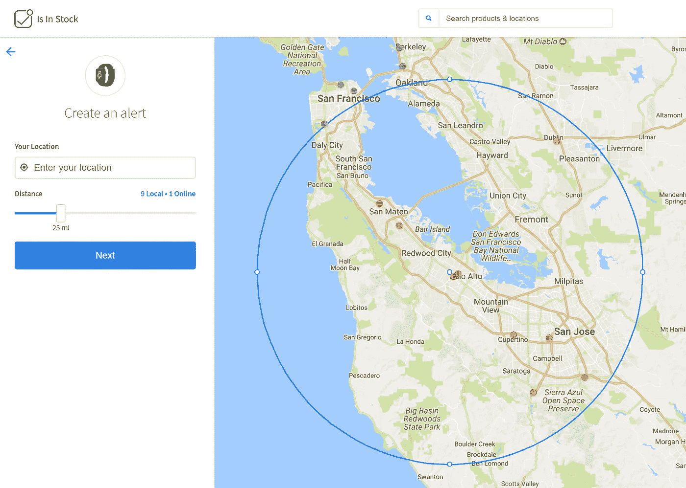
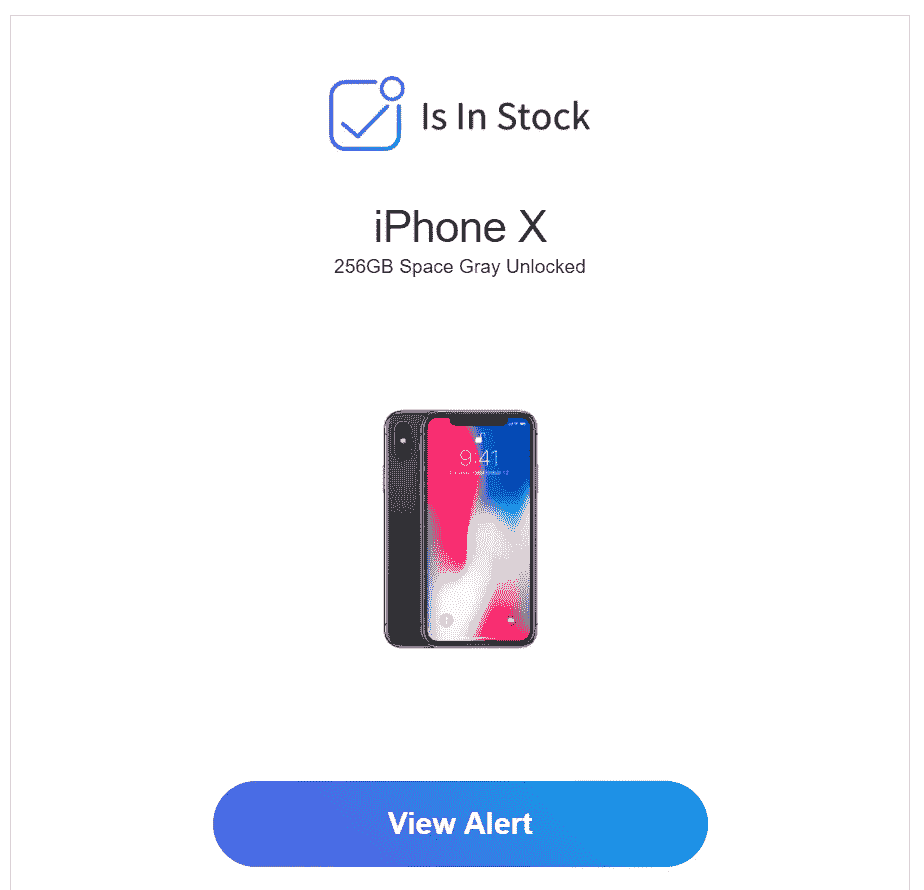
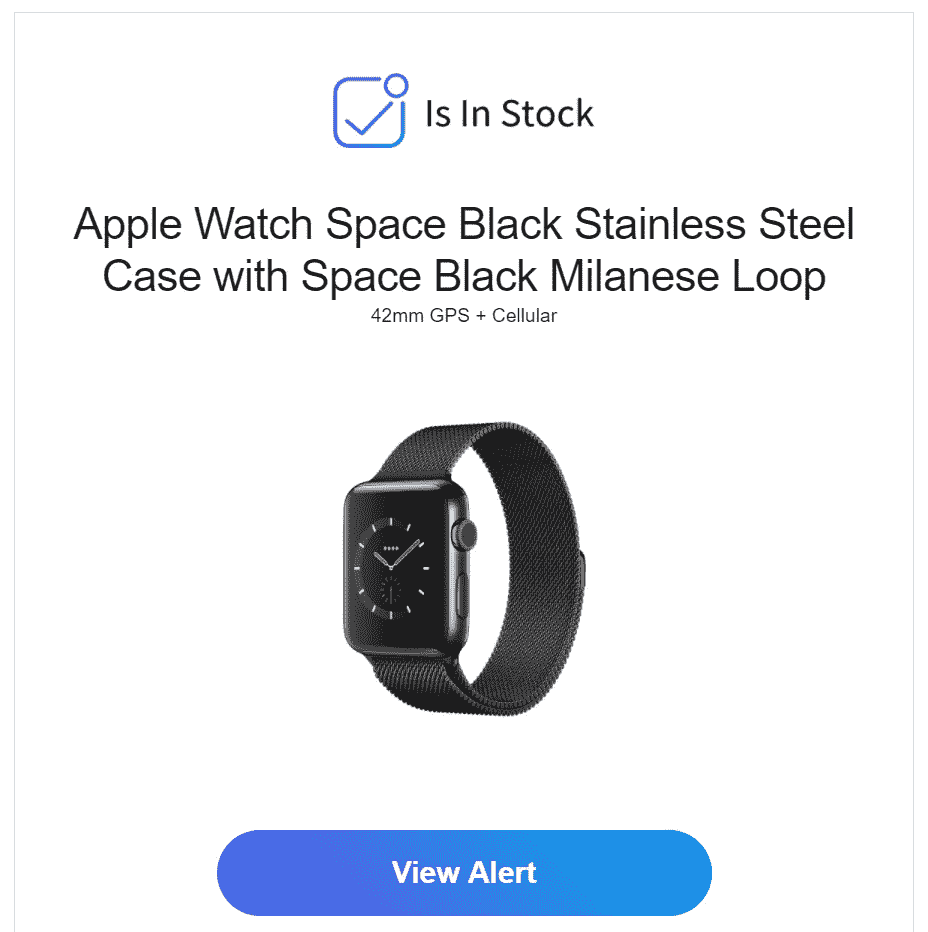

# 如何在发布当天获得您的 iPhone X 256GB 和 Apple Watch Series 3 蜂窝电话

> 原文：<https://medium.com/hackernoon/how-to-get-your-iphone-x-256gb-and-apple-watch-series-3-cellular-on-the-release-day-2bd06245ef03>

好久没写另一篇关于媒体的文章了。

几个月前，我写了一个故事“你如何不用等 6 个星期就把 AirPods 卖完了”并谈论了我是如何得到我的 ai rpods 的。

 [## 你如何不用等 6 个星期就把 AirPods 卖完

### 这个世界上只有两种人——知道如何得到它的人和不知道的人。

hackernoon.com](https://hackernoon.com/airpods-isinstock-e86d39817e15) 

我是许多想购买全球无锁版 iPhone X 256GB 和/或[苹果](https://hackernoon.com/tagged/apple)Watch Series 3 Cellular……的人之一，但我没有一个病人在发售当天在苹果商店前等待(安营扎寨)，或者等待预购在发售日 2-4 周后送达。

我依靠 [IsInStock](https://www.isinstock.com/) 在发布日及时通知我，我可以在那里订购 iPhone X 和手表。

 [## 有货

### 当难以找到的产品在当地和在线零售商处重新上架时，您可以获得即时的文本和电子邮件通知…

www.isinstock.com](https://www.isinstock.com/) 

设置通知非常容易，而且是免费的。你只需进入并为你想要得到通知的项目设置一个通知。

那你就可以走了。

iPhone X Notification

AppleWatch Notification

当附近的商店有货时，我应该会收到通知。

好吧，我不能保证我们能在那天得到我们想要的，但是它确实增加了机会。对我来说，它对 AirPod 有效，希望它对即将推出的产品也有效。

> 如果你成功了，请通过评论让我知道。

祝你(和我)好运！！

谢谢，大头钉

推荐阅读: [**AirPods“听得见”——物联网计算的未来**](https://goo.gl/lkG8UY)

** [## AirPods“听得见”——物联网计算的未来

### AirPods 的计算能力比第一代 iPhone 更强

hackernoon.com](https://hackernoon.com/hearables-a7c6dc616bff) 

# <update as="" of=""></update>

**我现在有了 AppleWatch 蜂窝+ GPS。**

这不是因为 IsInStock 通知，而是我刚刚在 9 月 22 日早上去了苹果商店，就在那里买了它。

取票的人要排队(预订的人)，预订的人也要排队。我早上预定的，下午一点回来取。

到今天为止，我还没有收到任何来自 IsInStock 的通知——非常令人失望的结果…** 

**至于苹果手表，我不太喜欢它…**

**我可能对手表抱有过高的期望。**

**我以为手表会改变我的日常活动——不再有未接电话、电子邮件、通知、闲聊等。驾驶时更好的导航，鼓励我做更多的锻炼或活动，如跑步、[游泳](https://hackernoon.com/tagged/swimming)。**

**尽管这很有帮助，但上面提到的所有这些功能都比我预期的要有限得多。(你只得到提到的松弛消息等。)**

**此外，由于本周末美国电话电报公司的一些技术问题，我无法测试手机的连接性。**

**我想，我可能没有手表也很好(就像我以前一样)，只是需要一部更好的智能手机——毕竟是 iPhone X。**