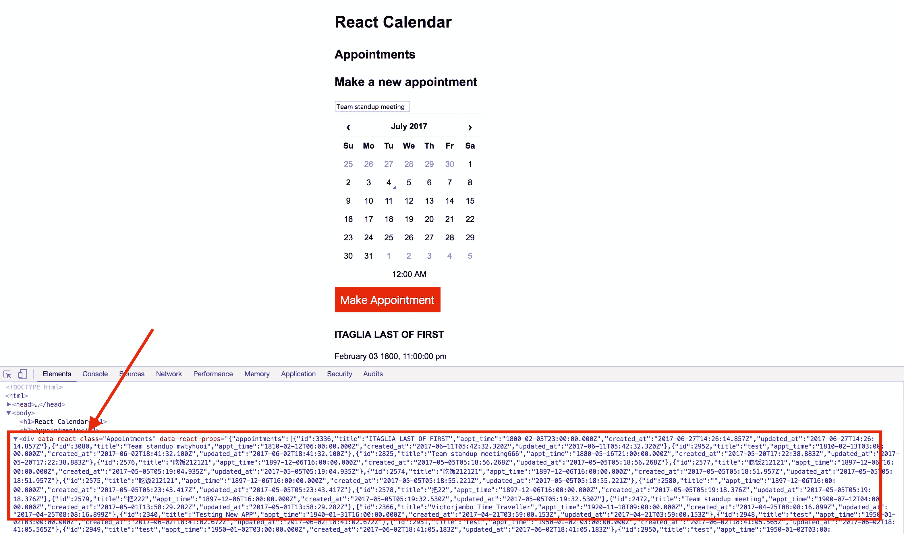

# 如何使用 webpacker 将 Rails 数据放入 React 组件

> 原文：<https://medium.com/hackernoon/how-to-get-your-rails-data-into-your-react-component-with-webpacker-647dc63706c9>


[Photo credit](https://www.flickr.com/photos/brown_family_album/4607229964/in/photolist-828fXo-6Ro25k-6jbEiu-nm9pLx-59ieDH-9vcZmd-59nsGs-9JSwsa-5Xt5Eu-4x6QvY-4fVVgX-59ieRR-4TB9fW-4W7vXa-5c5VNi-6oYjp5-5c5ZHx-7YGrbH-4pJ6Vy-7ogiPd-6oYdVj-4YANTt-QJYLeN-9pBwXx-8YtnEy-3SBgZp-4VQ87M-4fVV7M-4okqZN-ajDUJ7-4s2BwV-5P8zYT-6oUcfz-7ocpZt-b99uck-ka1ELz-4pJ68Y-4xLDHU-ka1aY6-4pE3kH-4pJ7DQ-3ehSBX-ka1KYD-4pEaxP-4pE1Zv-4pE762-4pE4Ei-95BihD-4pE1Kx-ka1CbV)

[**webpacker gem**](https://github.com/rails/webpacker) 给了我们一个简单的方法来使用 [JavaScript](https://hackernoon.com/tagged/javascript) 库，包括 React，在 Rails 内部使用原生 JS [工具](https://hackernoon.com/tagged/tools)如 yarn 和 Webpack。

如果您使用的是 Rails 5.1 或更高版本，只需运行以下命令，您就可以直接创建一个带有 React 支持的新应用程序:

```
$ rails new myapp --webpack=react
```

如果您使用的是旧版本的 Rails (4.2+)，您可以安装 webpacker gem，然后运行

```
$ ./bin/rails webpacker:install$ ./bin/rails webpacker:install:react
```

然后，您只需将 React 组件放在新创建的 app/javascript/packs 目录中，并在视图中将它们与 javascript_pack_tag 辅助方法一起使用。

但是如果你以前使用过 [**react-rails**](https://github.com/reactjs/react-rails) 或[**react _ on _ rails**](https://github.com/shakacode/react_on_rails)gem，你可能会想知道如何用 webpacker 将你的 Rails 模型数据放入 React 组件。

react-rails 和 react_on_rails 都提供了一个名为 react_component 的助手方法，您可以在视图中使用它来呈现一个组件并将数据作为道具传递给它。

如果我们仔细观察一下，react_component 方法将 Rails 数据放在页面上 div 的数据属性中:

```
react_component(‘Appointments’, appointments: @appointments)
```

如果您检查页面的源代码，您可以看到在一个 div 中加载的数据，数据属性为 react-class 和 react-props:



然后，在页面加载时，使用一些 JavaScript 代码(react_ujs)来解析数据，并将其传递给 react 组件:

默认情况下，webpacker 不提供任何这样的便利方法。

所以我们必须编写自己的代码来做同样的事情。

首先，让我们将数据作为 JSON 放入视图中一个 div 的 data 属性中，我们希望在该视图中呈现 React 组件:

```
<%= content_tag :div,
  id: "appointments_data",
  data: [@appointments](http://twitter.com/appointments).to_json do %>
<% end %>
```

如果你使用 HAML，你可以简单地做:

```
#appointments_data{data: @appointments.to_json}
```

然后，在加载完所有 DOM 内容后解析数据，并将其传递给约会组件:

```
document.addEventListener('DOMContentLoaded', () => {
  const node = document.getElementById('appointments_data')
  const data = JSON.parse(node.getAttribute('data')) ReactDOM.render(
    <Appointments appointments={data} />,
    document.body.appendChild(document.createElement('div')),
  )
})
```

仅此而已！您的数据现在将被传递到 React 组件。

如果你不想这么做，你也可以使用 webpacker-react gem ，它提供了一个 react_component 辅助方法。

在 Github 上查看该示例应用程序的完整代码:

[](https://github.com/learnetto/calreact/tree/lesson-4.5) [## learnetto/calreact

### calreact - React 和 Rails 5 日历约会应用

github.com](https://github.com/learnetto/calreact/tree/lesson-4.5) 

*如果你想免费学习如何使用 React with Rails，请查看 Learnetto* *上的* [***免费 React on Rails 教程。***](https://learnetto.com)

您可能也会喜欢这些文章:

[](/react-on-rails/3-ways-to-use-react-with-ruby-on-rails-5-1e49171f8eb6) [## 使用 React with Ruby on Rails 5 的 3 种方式

### 重要更新(2017 年 7 月 6 日):随着 Rails 5.1 的发布，Rails 现在通过…

medium.com](/react-on-rails/3-ways-to-use-react-with-ruby-on-rails-5-1e49171f8eb6) [](https://medium.freecodecamp.org/every-time-you-build-a-to-do-list-app-a-puppy-dies-505b54637a5d) [## ✅每次你建立一个待办事项应用程序，一只小狗🐕死亡😢

### 你知道当你试图学习一些新的东西，但对构建默认的示例应用程序感到厌倦的时候？

medium.freecodecamp.org](https://medium.freecodecamp.org/every-time-you-build-a-to-do-list-app-a-puppy-dies-505b54637a5d) 

*原载于*[*learnetto.com*](https://learnetto.com/blog/how-to-get-your-rails-data-into-your-react-component-with-webpacker)*。*

[](http://bit.ly/HackernoonFB)[](https://goo.gl/k7XYbx)[](https://goo.gl/4ofytp)

> [黑客中午](http://bit.ly/Hackernoon)是黑客如何开始他们的下午。我们是 T21 家庭的一员。我们现在[接受投稿](http://bit.ly/hackernoonsubmission)并乐意[讨论广告&赞助](mailto:partners@amipublications.com)机会。
> 
> 如果你喜欢这个故事，我们推荐你阅读我们的[最新科技故事](http://bit.ly/hackernoonlatestt)和[趋势科技故事](https://hackernoon.com/trending)。直到下一次，不要把世界的现实想当然！

