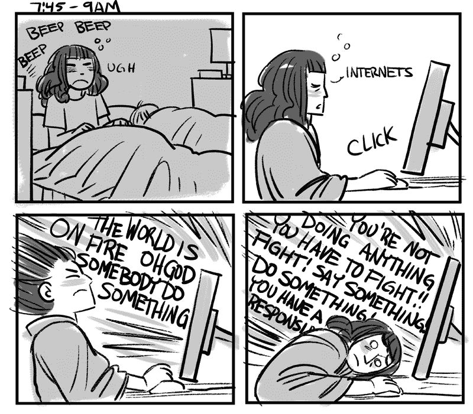
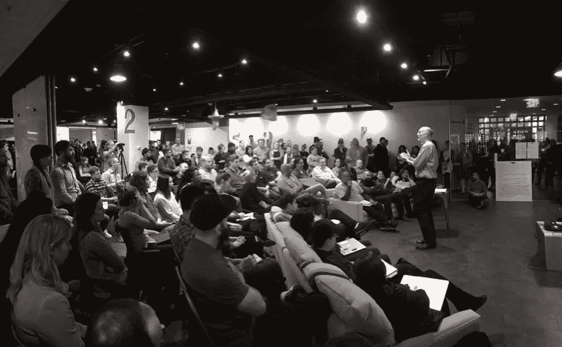

# 如何在世界着火的时候还在乎你的工作

> 原文：<https://medium.com/hackernoon/how-to-give-a-shit-about-your-work-while-the-world-is-on-fire-c1bab61ba382>

我不知道你们所有人的情况，但最近世界上发生的事件(尤其是那些与我们的新总统有关的事件)已经在我心中留下了黑色的印记。这是一个有毒的、渗出的黑色标记，我发现自己和其他人无论去哪里都带着它:杂货店、加油站、工作场所，甚至星巴克。没有地方是安全的…

我有一个可怕的习惯，早上醒来第一件事就是看手机。查看我的工作[邮件](https://hackernoon.com/tagged/email)，我的个人邮件，Instagram，Twitter 和 2017 年可怕的政治斗争，[脸书](https://hackernoon.com/tagged/facebook)。然后我打开今日秀。我看着马特·劳厄尔和霍达·库普特毫不畏惧、汗流浃背地发布最新的爆炸性新闻。(我知道他们只是内心在垂死挣扎……)

[*Photo credit: Everything Is Comics*](http://faitherinhicks.tumblr.com/post/156691506575/today-is-hourly-comics-day-and-i-decided-to)

然后我去上班，想着*“今天我要处理什么琐碎的任务？我需要优化多少个 SVG？我参加了多少不该参加的会议？我要如何增加一些重要的商业价值？”这句话的卑微部分:我不想那样想。我不想认为我现在做的事情是卑微的，没有目的的。世界上确实有儿童在死亡，因为我们的总统决定不允许他们获得医疗保健和基本医疗需求的资金。*

然后我来到我们的办公室。局势高度紧张，士气低落。我们尽量在 Slack 上和对方开玩笑，让对方感觉好一点。*但是孩子们！* ***记住这个该死的孩子！！***

Photo credit: Oen Hammonds

我们的总经理今天和我们一起举行了一次篝火晚会。这是必要的，也很受欢迎。作为一个设计社区和一个家庭单位，我们需要听到一些事情。

# 为了实现改变和进步，我们需要做的不仅仅是疯狂—菲尔·吉尔伯特

没有比这更真实的陈述了。我们将脸书和推特上的愤怒文章分享给我们的自由主义回音室。我们看到其他家庭成员和我们认为是感同身受的朋友的人喜欢并分享来自福克斯新闻频道和布莱巴特的文章。我们作为一个自由的、愤怒的、愤怒的、害怕的(我还可以继续)团体(包括我自己)都在苦苦思索*“我们如何展示和表达同理心。我怎样才能有所作为？?"*

那么，我们如何将愤怒转化为行动呢？

嗯，我的计划是这样的。我还有工作，而且是一份非常好的工作。一个是我爱的，一个是我认为是我家人的人。

1.  我会更加努力地向那些和我一起工作的人展示我对他们和他们所做的工作的感激。我可怜的经理最近成了我不知不觉的愤怒的受害者……可怜的家伙。他是我遇到过的最好的经理，他不值得我每天抱怨按钮颜色、语义 html，以及他是否在会议邀请中加入了该死的会议代码(顺便说一句，这是每天都要面对的问题。)
2.  我会回到我的瑜伽根源，做我最擅长的事情——用善意杀人。
3.  我要更好地管理我的时间。现在一切都很疯狂。SXSW 就在眼前，哦，我有没有提到世界在燃烧？认真。确保我完成我的 sprint 工作，平衡我的 SXSW 项目——我的日常目标。
4.  我要提升我周围那些正在做惊人事情的人。我刚刚让两个女性朋友出版了奥莱利的书([莎拉·德拉斯纳](http://shop.oreilly.com/product/0636920045335.do) & [凯瑟琳·麦克罗伊](https://www.amazon.com/Prototyping-Designers-Developing-Physical-Products/dp/1491954086))。神圣的香蕉，蝙蝠侠，这是一个惊人的成就。而这只是冰山一角…庆祝和鼓舞那些正在杀戮的人们。是的，那是必然的。让我们多做那件事。
5.  我要更好地照顾自己。我 30 多岁的时候就像一列该死的货车一样撞上了我。这是什么？不再有新陈代谢了？是啊，这可不酷。让我们在其中加入一些自动免疫功能。我需要把锻炼和健康饮食放在首位。还有瑜伽——很多瑜伽。

**那么，这个世界着火了🔥:**是时候制定行动计划了。我关心的事情越来越多了。蠢龙。我的计划——解决我作为一名居住在德克萨斯州奥斯汀的大型科技公司的白人女性开发人员/设计师可能会产生影响的问题:

*   塑造女性设计师和开发人员的未来
*   妇女权利
*   科学和教育(STEM)
*   反对那堵该死的边境墙(我住在得克萨斯州…我的税收$$$都给了那个愚蠢、白痴的东西)
*   为美国公民自由联盟(ACLU)和计划生育组织(T2)设立月度捐款
*   给我的参议员/众议员打电话
*   最大的问题是:学会同情那些与我处境/心态不同的人。

就像我说的，有很多很多很多更多的问题我可以关注，也有更多的事情我可以做。从今天开始，2017 年 2 月 2 日，这是我将集中精力灭火的地方。

# **这是不正常的。**

我会不断提醒自己。每天。因为事关重大。我希望我的侄女在成长过程中知道她们的阿姨尽了一切努力让世界变得更美好。我希望下一代年轻的女性设计师和开发人员在工作场所获得平等的薪酬和更大的赞赏。我希望我生活和工作的社区像我们生活的世界一样多样化。

我会继续在我的脸书日历上增加“给你的参议员写明信片”活动和在州府的游行。我将有充满缝合和抱怨的女士之夜，因为上帝知道我现在需要我的部落(我们需要发泄，你们所有人)。

我请求你也这样做。要善良，要聪明，要有效。管理你的时间和精力。照顾好自己和身边的人。热爱你的工作，热爱你所做的事情。尽你所能学习一切。变得更见多识广，更有教养。你正在优化的那些 SVG？你知道怎么做。教别人怎么做。抛开卑微，找到热爱你所做的事情的优雅。

正如我的一个朋友约瑟芬前几天说的:

> 未来是棕色的，是女性，醒来时像地狱一样。保持坚强。

> [黑客中午](http://bit.ly/Hackernoon)是黑客如何开始他们的下午。我们是 [@AMI](http://bit.ly/atAMIatAMI) 家庭的一员。我们现在[接受投稿](http://bit.ly/hackernoonsubmission)，并乐意[讨论广告&赞助](mailto:partners@amipublications.com)机会。
> 
> 如果你喜欢这个故事，我们推荐你阅读我们的[最新科技故事](http://bit.ly/hackernoonlatestt)和[趋势科技故事](https://hackernoon.com/trending)。直到下一次，不要把世界的现实想当然！

