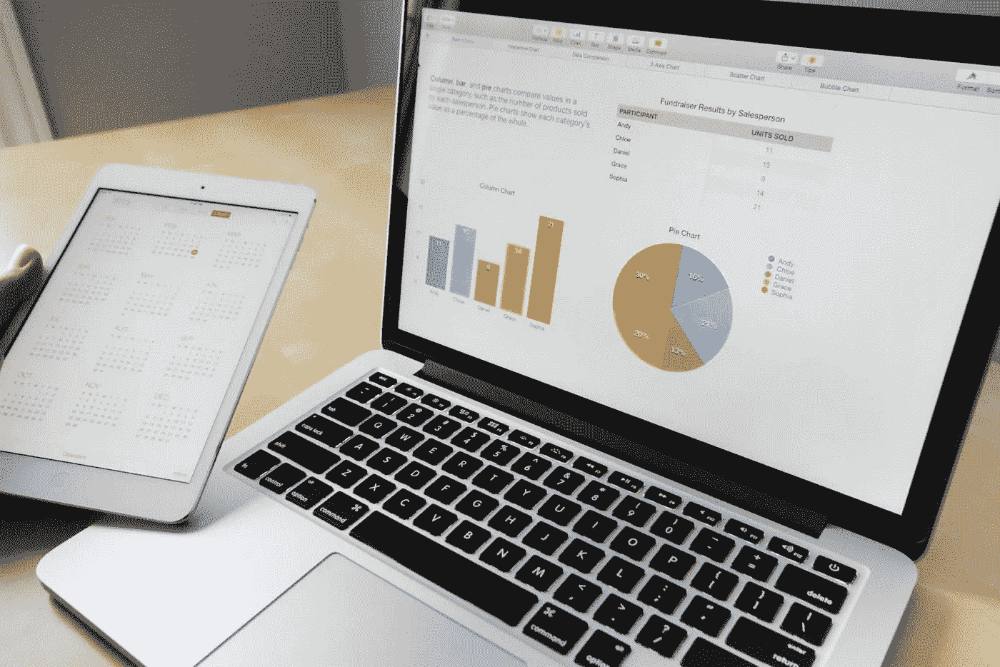
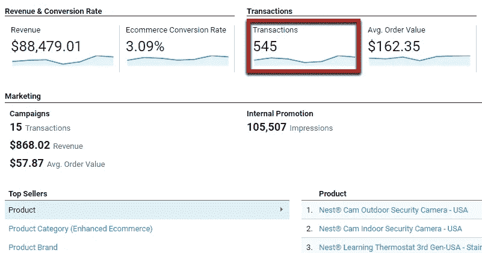
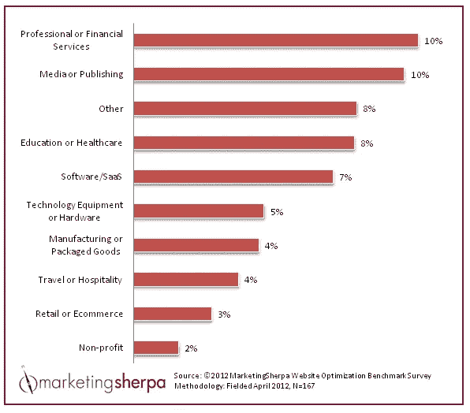
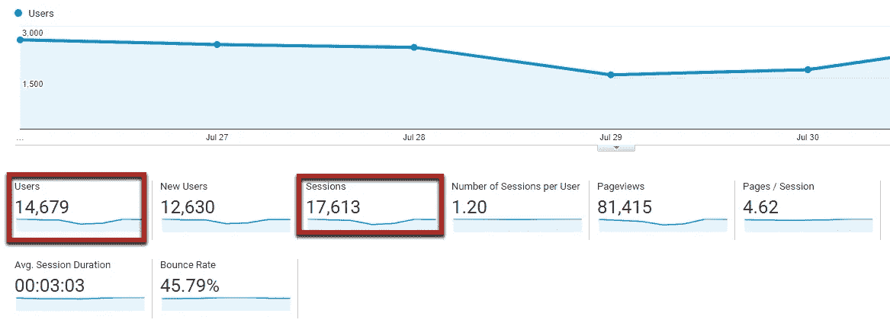
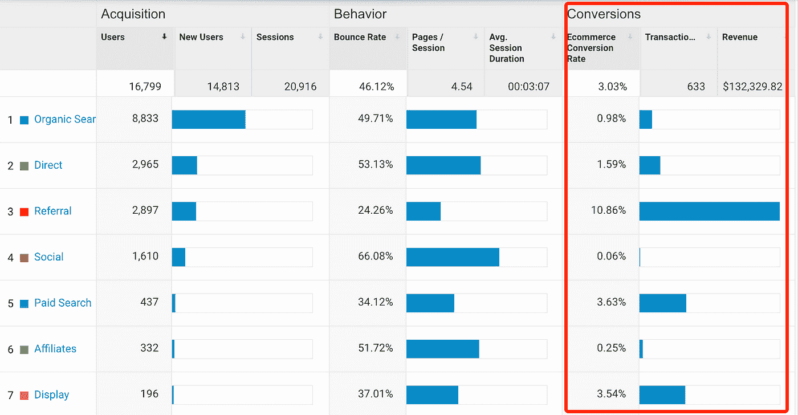
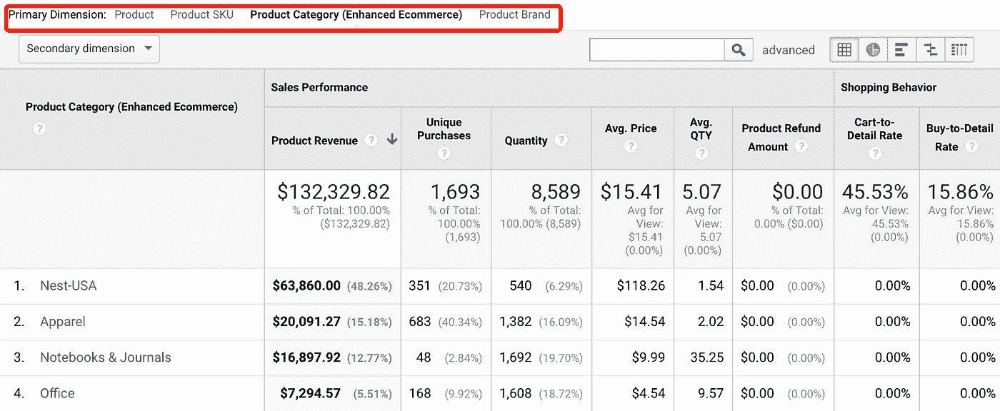
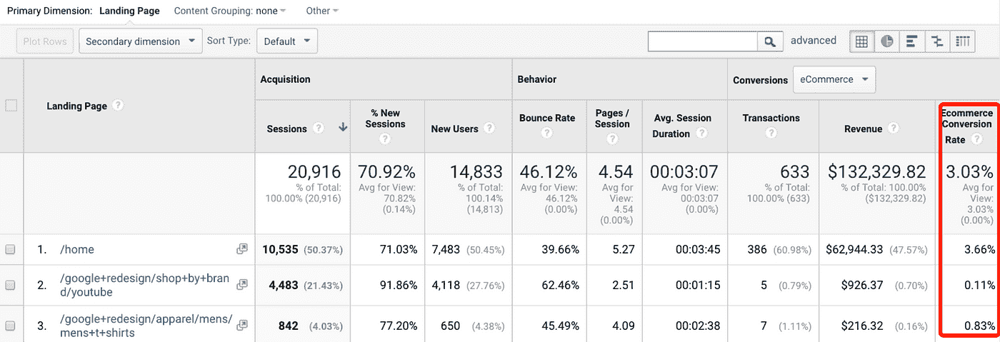
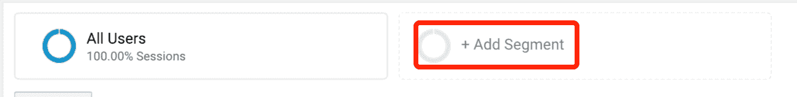
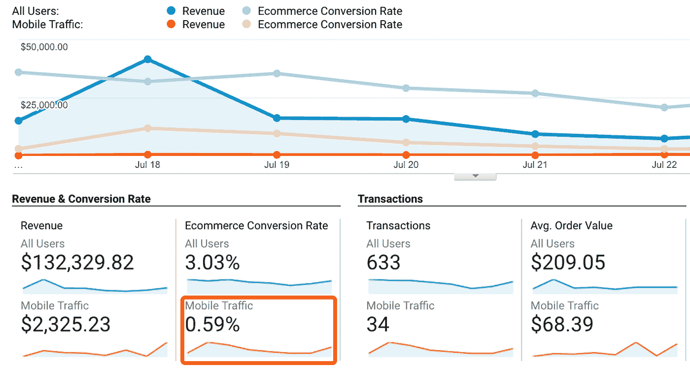

# 如何用数据驱动的方法发展电子商务

> 原文：<https://medium.com/hackernoon/how-to-grow-an-e-commerce-with-a-data-driven-approach-de37ac6a8cba>

# 离不开的 15 个标准

在过去的 10 年里，我一直在电子商务领域担任产品经理，包括在一家收入数十亿美元的公司工作了 5 年多。我的职位意味着我的主要职责是改善公司的经营状况。

在过去的几个月里，我一直在帮助其他人提高他们网上商店的业绩。但是我发现大部分的帮助是需要的，实际上是了解当前的状态，以及他们需要看到什么信息来做出正确的决定。

他们中的一些人只是不知道他们应该查看什么指标。他们在跟踪访客和交易，但无法更详细地了解销售额上升或下降时的情况。其他人被如此多的可用数据所淹没，无法确定哪些数据是真正重要的，以便做出正确的决策。

所以我想我可以把我的一些经验放在一起，写一篇文章，介绍一些关键指标，以及你可以根据这些指标得出的结果做出的决定。

> 如果你想下载它，以便以后阅读或进一步参考，我创建了一个[指南，其中有 15 个电子商务衡量标准，可以帮助你发展电子商务](https://www.getdrip.com/forms/989230189/submissions/new)。

注意:本文基于 Google Analytics，因为它是使用最广泛的工具，对于大多数电子商务商店构建者来说，如 Shopify、BigCommerce、WooCommerce、Magento 等，它是现成可用的(因为如果您没有任何工具，并且需要立即开始使用，它是免费的)。但是，如果你使用任何其他分析工具，所解释的概念和决策将使它们同样有价值。

# 基础

有一些指标你应该每天分析，这些指标将提供关于你的电子商务的性能和健康的最基本的信息。

## 交易、转换率、平均订单价值

该核心指标将告知您在一段时间内收到的交易总数、与此期间的会话相关的转换率，以及考虑所有已购买商品的平均订单价值。

*   **去哪里找**

***“转化”——“电子商务”——“概述”***

*   我们可以做出什么决定？
*   ***交易:*** 仅根据交易数量很难做出决策，但这一简单指标的上升或下降可能会提醒您关注其他指标，如产品或营销活动的特定表现。
*   ***转化率*** :它确实有更直接的作用，我们应该考虑。第一个问题通常是:*是*我的*转化率* *好的*？在网上找到平均转换率来比较你和其他电子商务的表现是相对容易的。找到一个与你的站点的类别和位置尽可能相似的基准*是很重要的。该值因行业、地理区域甚至设备的不同而有很大差异。*

(An outdated example of different industries conversion rates)

*   ***平均订单值:*** 类似于交易，这个 KPI 上升或者下降都可以触发告警。这也是一个需要长期遵循的重要指标。如果您正在进行追加销售或捆绑销售，您应该会看到这个数字会随着时间的推移而增长。你可以做出诸如推广“第二单元八折”的决策，并评估这个值增加了多少。

## 用户、会话、页面浏览量、流量来源

这些指标是指有多少人访问了我的网站，他们看到了多少。流量来源是指他们通过什么渠道到达网站。

如果我转化率好但是用户少，我的电商无论如何也不会成功。

*   **去哪里找**

这些信息可以在 ***【观众——概述】*** 中找到。

除了用户和会话，我们还可以看到多少是新用户，多少是经常性用户，页面浏览量，平均会话持续时间和跳出率(没有进行任何交互就离开网站的会话数量)。

应该每天监控这些信息，但是为了做出决策，我们通常需要更高层次的细节。

此 KPI 最重要的辅助分析之一是流量来源。有多少用户来自我们的营销活动？有多少来自我们的社交网络？有多少来自注册用户群的邮件？

*   这些信息可以在 ***【采集】—【概述】*** 中找到。

在这个仪表板中，我们可以清楚地看到每个渠道获得了多少用户，以及每个用户在我们电子商务中的重要性。

该报告的第二个重要部分是每个渠道的转换率:

*   我们可以做出什么决定？

通过查看每个渠道的访问量和转换率，我们可以做出如下决策:

*   我有低付费流量但有很好的转化吗？也许我可以提高付费预算。
*   我有很多直接流量但是跳出率很高吗？我可能需要改善主页上显示的信息。
*   我没有电子邮件流量？我应该开始为我现有的用户群制作时事通讯。

# 高级转换

通过前面的部分，我们涵盖了任何拥有电子商务的人应该每天关注的第一瞥。但要做出伟大的决策，并真正管理一个成功的网站或应用程序，还是太基础了。

如前所述，一个关键指标是转化率。让我们对它进行更深入的分析。

# 按“{division}”的转换率

对任何类型进行更深入分析的一个最常见也是最重要的方法是根据某个特征对会话进行分组，并分析这些用户的特定转化率。

## 按流量来源的转换率

这就是上一节提到的分析。将通过特定渠道访问网站的所有会话分组，并检查每个会话的转换率如何变化。识别付费、社交网络、电子邮件或任何其他来源之间的转换效果最好，这是做出关键决定的关键，即在哪里投入更多精力来获取流量。

## 转换产品类别、品牌

另一个可能有趣的分析是查看我们销售的每种产品的性能。相对于某个特定产品的交易，有多少个会话正在查看该产品？

*   **去哪里找**

***“转化”——“电子商务”——“产品性能”。***

该报告的最后一列显示了每种产品的购买量除以该项目的详细信息页面的查看次数。

例如，您可以在第 5 个位置看到，每 100 个看到其详细信息的用户只有 4 次购买。

在此视图中，我们按最高收入对产品进行排序，但是如果按最后一列*(购买明细比率)*升序排序，我们将看到在此维度中表现最差的产品。

通过将*“主要维度”*更改为产品类别或品牌，可以看到相同的报告。如果你有一个有很多品类的零售商，看看这些价值如何随品类而变化可能是有用的。如果你有一家手机店，品牌差异是决定推广什么产品的一个很好的标准。

*(Although in this view lose conversion)*

*   我们可以做出什么决定？

假设我们卖冰箱。也许整体转化不错，但是出现在我们搜索结果页面的第一项，访问量很大，没人买。或许从我们的目录中移除**该物品可以提高整体转化率。**

## 登录页面的转换率

登录页面是用户进入我们网站时看到的第一个页面。很多时候，我们开展营销活动，让用户访问特定的促销页面或被引导到产品详情页面。看转化率如何根据用户第一次登陆的页面而变化是非常有用的。

*   **去哪里找**

***“行为”——“网站内容”——“登陆页面”。***

*   我们可以做出什么决定？

在最后一栏中，我们看到通过主页的流量有 3.66%的转化率(高于整个网站 3.03%的平均水平)，一些特定产品的登录页面有更低的价值(如最后一款“男装 t 恤”为 0.83%)。

这些信息对于决定付费流量、社交网络或电子邮件使用什么登陆页面非常有用。

## 按部门的转换率

查看转换率的另一种方式是细分市场，这使我们能够灵活地进行几乎任何我们想做的分析。

*   **去哪里找**

点击任何报告顶部的“添加细分市场”按钮，我们可以根据 Google Analytics 跟踪的任何属性创建细分市场:

*   **用户属性**:年龄、性别、国家、移动 vs 桌面
*   **产品属性**:类别、品牌、SKU
*   **行为**:会话数量、新用户与重复用户、访问特定页面的用户

以及任何你能想到的变量。谷歌分析有大量的内置变量，你可以从中选择来创建一个特定的细分市场，其中包含所有符合该标准的会话或用户。

创建细分市场后，您可以返回到**“转换”—“电子商务”—“概述”**，并对该细分市场的所有会议和会议进行比较:

*   收入、转换、交易和其他与比较相关的信息。

*(example with mobile traffic)*

*   我们可以做出什么决定？

有了这个功能，我们可以进行无穷无尽的分析。

按照上面的例子，如果我们做了一个移动用户的细分，看到转化率比整体用户差很多，你可以决定要么停止投资移动流量，要么改善你的商店在移动设备上的展示方式。

我们还可以按类别分析转化率(如冰箱与洗衣机)，看看哪一个应该促销，或者在哪个类别中，我的表现更差，我需要购买更好的产品。

**第一部分到此为止！**在第二部分，我们将介绍更多高级指标，如多渠道归因、购买时间和其他非常有用的绩效指标，以及您可以根据结果做出的决策。

> 您现在可以[下载包含所有 15 个指标的指南](https://www.getdrip.com/forms/989230189/submissions/new)，作为包含第一篇和第二篇文章所有指标的参考资料

*最初发表于*[*【leanexperimentation.com】*](http://leanexperimentation.com/optimizing-an-e-commerce-with-15-key-metrics/)*。如果您喜欢它，并希望获得更多工具&提示来改进您的产品，您可以* [***订阅此处***](https://www.getdrip.com/forms/245370375/submissions/new)**并加入数百名读者的行列！**