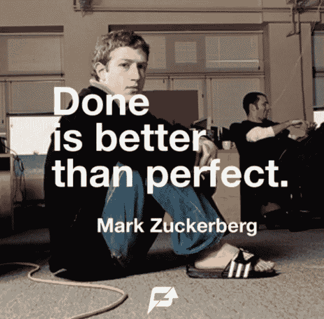
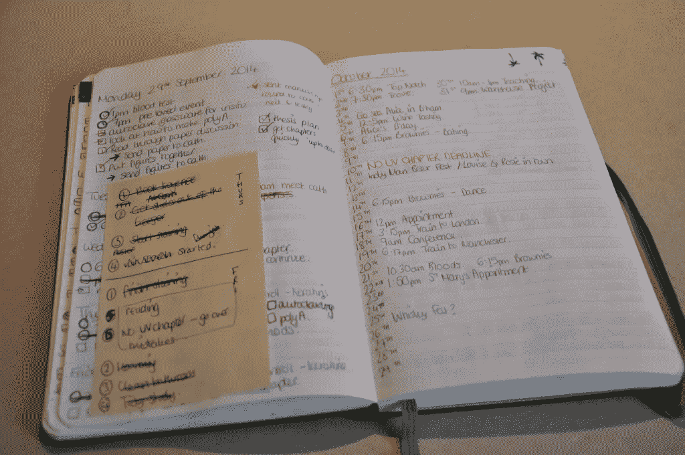
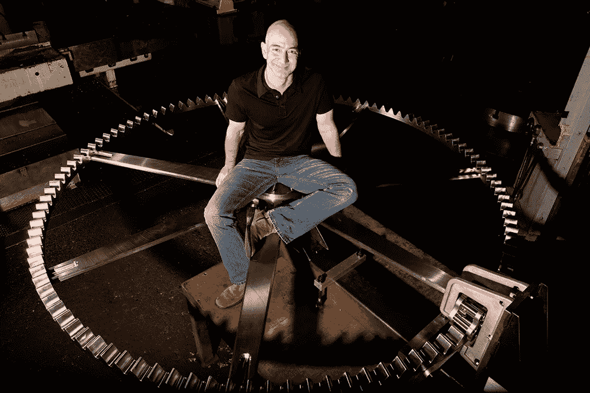

# 如何消磨时间

> 原文：<https://medium.com/hackernoon/how-to-hack-the-time-d96497c2b0c6>

# 了解您的目标，并根据其价值和优先级进行组织。

## 目标对时间管理至关重要。你有多少目标？

也许你有太多的目标。如果是，请**组织他们。**您需要为生活的每个主要领域设定目标:**为您的工作/业务/健康/朋友/家庭等设定目标..**

> 但是…

# 安排每天的计划和思考时间。

安排时间每天计划你的项目和任务，晚上或早上上班前。当您将计划时间与任务执行分开时，您可以更快地完成更多任务。

# 将大目标转化为小的日常任务。

一旦你设定了一个目标，就要算出**需要什么来实现你的目标**。然后，将这些步骤转化为项目和任务。为每个项目设定截止日期，并创建小的日常任务，以便快速完成每个项目。

# 优先顺序:专注于一项重要任务，并在今天完成。

你创造了目标。然而，你不能“做”一个目标。您只能**做能够实现您目标的任务**。决定你的最高价值目标，今天就为这个目标完成一项重要的任务。

如果可以的话，在做任何事情之前先完成这项任务。假设您今天最有价值的目标是改善健康。你最重要的任务是锻炼。**早点完成。**许多健身房开门很早，所以您可以在上班前完成锻炼。

# 没有什么是完美的。只需完成它。你在那一刻的最佳状态是好的。

你想做到最好。然而，完美主义浪费时间。没有什么是完美的。如果你倾向于完美主义，要意识到这一点，并强迫自己放手。

> 我用来提高工作效率的一些工具:

*   [安排邮件稍后发送](http://www.boomeranggmail.com/)—[boomeranggmail.com](http://www.boomeranggmail.com/)
*   [跟踪邮件开通及回复率，点击](http://www.yesware.com/)—[yesware.com](http://www.yesware.com/)
*   [跟踪应用程序和网站花费的时间](https://www.rescuetime.com/)—[rescuetime.com](https://www.rescuetime.com/)
*   [Instant 会自动跟踪您的所有日常活动](http://instantapp.today/) — [instantapp.today](http://instantapp.today/)
*   [一款针对团队的消息应用](https://slack.com/)——【slack.com 
*   来自谷歌的电子邮件解决方案——[gmail.com](http://gmail.com)
*   [谷歌的日历解决方案](https://calendar.google.com)——[calendar.google.com](https://calendar.google.com)
*   [快速轻松地创建新便笺](http://icloud.com/#notes)——[icloud.com/#notes](https://www.icloud.com/#notes)
*   Moleskine [专业笔记本](https://store.moleskine.com/rou/en-gb/notebooks/notebooks/professional-notebook/p797?ic=Ck0Xqg%3D%3D)——[store.moleskine.com/](https://store.moleskine.com/rou/en-gb/notebooks/notebooks/professional-notebook/p797?ic=Ck0Xqg%3D%3D)

我的灵感来自这个来源:[http://www . life hack . org/articles/productivity/10-essential-hacks-for-time-management . html](http://www.lifehack.org/articles/productivity/10-essential-hacks-for-time-management.html)

> [黑客中午](http://bit.ly/Hackernoon)是黑客如何开始他们的下午。我们是这个家庭的一员。我们现在[接受投稿](http://bit.ly/hackernoonsubmission)并乐意[讨论广告&赞助](mailto:partners@amipublications.com)机会。
> 
> 如果你喜欢这个故事，我们推荐你阅读我们的[最新科技故事](http://bit.ly/hackernoonlatestt)和[趋势科技故事](https://hackernoon.com/trending)。直到下一次，不要把世界的现实想当然！

