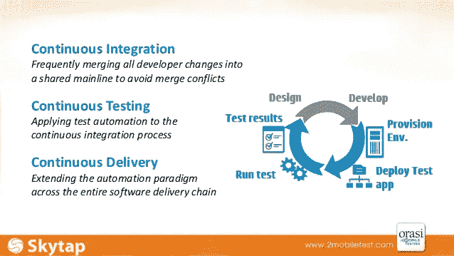
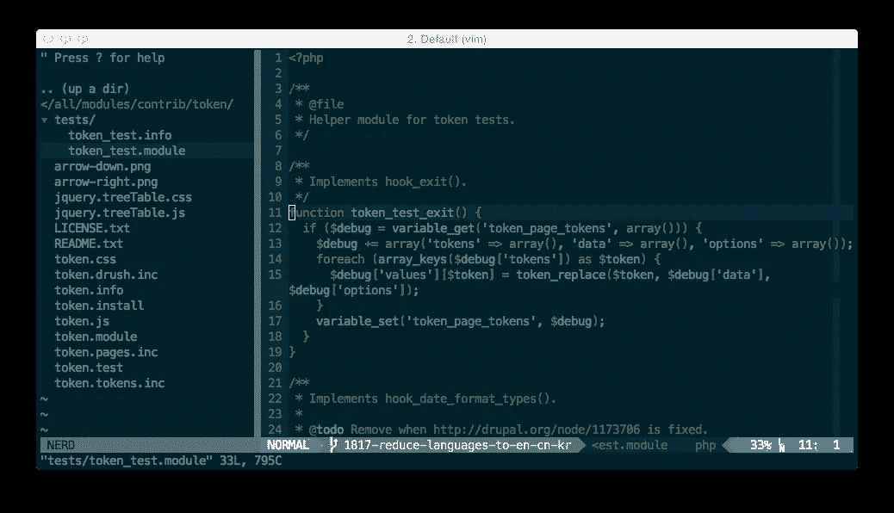

# 如何成为一名高效的工程师

> 原文：<https://medium.com/hackernoon/how-to-hack-your-way-to-being-a-super-productive-engineer-ba97e2c5d1f6>

Image Credits : ngcenter.com

工程师在产品开发的每个阶段都扮演着至关重要的角色。

他们的精力、动机和生产力水平极大地决定了项目的交付情况。

我们在 Indiez 和来自世界各地的一些优秀工程师一起工作，他们曾在 T2、谷歌、微软、苹果等公司工作过。

他们的工作方式有些不同寻常。

**他们知道如何高效运作，保持高生产力水平！**

这是真正让他们与众不同的地方。这是他们能够取得优异成绩的原因！

Image Credits : Quantstart.com

让我们面对现实吧——每个工程师都会经历这些缺乏生产力的阶段。

这需要时间和大量的学习来变得更好，并开始发挥你的全部潜力。有时候，这真的很令人沮丧。

你可能也去过那里！

你是否有过这样的感觉，觉得自己做得不够？你觉得没有生产力，自我感觉很差？每一天？

如果你没有，我可以告诉你，很痛。疼得厉害！

> **“有一段时间我超级不思进取。一整天过去了，我会觉得自己几乎什么也没做。尽管努力了一整天，我还是没有达到自己的期望。**
> 
> 在一天结束时没有成就感，只会让人沮丧。而且，当您远程工作时，它会放大 10 倍。
> 
> 在我受够了这种没有效率的状态后，我进入了我的黑客状态，并决定以黑客的方式达到最终的效率。
> 
> 我研究并阅读了 100 多篇文章和几本书。而且，我学到了很多！
> 
> 做完那次练习后，我变了一个人。我现在是更好的程序员了，我及时完成了我的交付，最重要的是，我在每一天结束时都感到快乐和成就感。

*—我们的社区成员之一，以前是谷歌的工程师 T21。*

*那么，是什么改变了他和其他有类似经历的人呢？我们花时间与他们交谈，增进我们的了解。*

*以下是我们优秀的社区成员分享的一些宝贵经验。应用它们已经帮助他们提高了，这让我很高兴与你分享。*

# *1.独立解决挑战*

**

*Credit : [www.functionalimperative.com](http://www.functionalimperative.com/2016/06/22/how-to-hire-a-good-developer.html)*

*每当你停下来思考时，工作流程就会中断。*

*每当你在谷歌上快速搜索你不知道的东西时，它就会坏掉。当您在堆栈溢出上找到查询的答案时，它就中断了。*

*如果你经常这样做，信不信由你，这是你作为工程师最大的罪行！*

*为什么？*

*因为你工作的深流状态才是你应该保留的。进入这种状态需要大量的精力和注意力，而且保持这种状态对你有好处，除非绝对有必要脱离它。*

> *“我知道有疑虑是很正常的。有时，你可能会遇到棘手的情况。但是，不要急着去网上找答案，去查阅文档吧。”— **阿姆罗斯，** [**Indiez**](https://goo.gl/C8j4J4) 的联合创始人兼首席技术官*

*虽然开始时这似乎会让你慢下来，但随着时间的推移，当你把它作为一种习惯时，你会发现它为你创造了奇迹。*

*你将获得更深入的知识，你将保留。当你试图找到一个问题的答案时，你不会被你在网上看到的其他东西分散注意力。*

*最重要的是，这将成为你工作流程的一部分。*

# *2.键入 Smart。快打字！*

**

*Image Credit : AndroidAuthority.com*

*有很多关于打字速度对程序员来说是否重要的讨论。*

***知道触摸打字很重要吗？这真的有多大区别？***

> *“这是我的看法——如果你想成为一名伟大的程序员，首先要成为一名伟大的打字员！*
> 
> *对于程序员来说，打字速度如此重要的根本原因是——**当你是一个快速、高效的打字员时，你在思考和用代码表达之间花费的时间更少。"
> —** 我们的社区成员之一，以前是微软的工程师。*

*这是保持深入工作流状态的一个好方法。*

*当你所有的有意识的想法都进入代码，而不是进入计算机程序，你的大脑需要执行的步骤就少了一步。所以是的，它确实提高了你的整体效率。*

*如果键盘是你主要的交流方式**，你就不应该考虑它**(更不用说看它了)，就像你在说母语的时候不应该考虑发音一样。*

*有资源和[小技巧](https://www.ratatype.com/learn/)学习触摸打字。例如，你可以使用 Typing.io 来开始。*

# *3.使自动化*

*与键盘使用同样重要的是尽可能自动化的方法。*

*计算机的建立是为了快速自动化简单、重复的任务，让我们的生活变得轻松。如果我们不把它们用在那上面，那就是一种浪费！*

*偶尔退后一步，反思一下你一整天都在做哪些任务和行动，哪些是可以自动化和改进的。*

*这可能是启动应用程序，使用鼠标菜单而不是快捷方式，手动应用相同的操作或再次键入相同的命令，多次键入长 shell 命令而不是使用别名，等等。*

*在这里尽量偷懒；在这种情况下，这是一件好事。*

**

*随着系统变得越来越大，工程师们倾向于花更多的时间来修复错误。最终他们会变得一点效率都没有。通过持续集成(CI)，您可以在许多错误发生时就捕捉到它们。*

*自动化测试以避免手工断言和手工重复测试。*

# *4.使用终端和 Vim*

*Vim 是一个非常强大的文本编辑器，当与其他工具结合使用时，它可以成为一个完全成熟的IDE *、**、*，例如:*

*   ***端子多路复用器**:例如 [tmux](http://tmux.sourceforge.net/) + [vimux](https://github.com/benmills/vimux) 。这使得执行文件、将选择的文本发送到控制台、运行测试等变得容易。不用离开候机楼。*
*   ***特定于语言和框架的插件**:例如 rails.vim ( [vim-rails](https://github.com/tpope/vim-rails) )。这为文件导航、重构和 Rake/Ruby on Rails 脚本提供了特定于框架的命令。*
*   ***版本控制插件**:如:逃犯. vim([vim-逃犯](https://github.com/tpope/vim-fugitive))。允许在 Vim 中执行任何 Git 命令。*

**

*vim 的力量是巨大的。很少有人知道如何使用它。*

*我肯定不是其中之一。*

*参考approach 博客的生产力黑客列表*

*我最喜欢的是:*

## *将大写锁定键重新映射到控件*

**为什么？*因为*控制键*位置极不方便，而*锁帽*就在你的小指下。一直都是。*

*如何？遵循本指南。*

## *使用 Vim 跳转*

**为什么？很多时候你需要在两个地方之间来回跳跃，或者去你一分钟前去过的地方。一大堆人又找到了那行/文件。这是浪费时间。**

*如何？*

*   *Ctrl-o 和 Ctrl-i 转到您跳到的上一个/下一个位置。*
*   *` `(两个勾号)—跳回到你在的地方。*
*   *gi-转到上次插入文本的位置。*

## *使用适当的 Vim 导航*

**为什么？多次键入 l(向右移动一个符号)或类似的字符是浪费时间。**

**如何？**

*   *{和} —来回跳转*段*。*
*   *Ctrl-F/B —前后移动一个*屏幕*。*
*   *Ctrl-E/Y — *滚动*屏幕。*
*   **(星号)—搜索光标下的单词，然后按 n/p 跳到下一个/上一个。*
*   *将 imap jj <esc>添加到您的。vimrc 并且不要再用 Esc 了。</esc>*

## *改变大小写和重复命令*

**为什么？因为很多事情可以做得更有效率。**

**如何？**

*   *~(波浪号)—切换字母/所选内容的大小写(大写/小写)。*
*   *。(点)-重复最后一组命令(与搜索结合使用，如*和 jumps)。*

## *临时映射您运行的命令*

**为什么？*因为你不想一遍又一遍的输入同一个命令。*

**如何？*一个例子是 nmap < leader > s:！bundle exec rspec %—color—focus<Cr>。这将在您按下 s(在我的例子中)时运行当前的规范文件。*

***经验法则**:如果您在 Vim 之外的终端中执行某项操作超过两次，请使用 nmap 进行映射。不要切换窗口，*不要失去你的上下文*。*

# *为了终端生产率，*

## *使用 iTerm2*

**为什么？至少因为你可以在不丢失上下文的情况下拆分窗口。**

**如何？从[iterm2.com](http://www.iterm2.com/)站点安装它(或者甚至使用 tmux！).**

*使用 Ctrl-D/Ctrl-Shift-D(在 Vim 或任何 iTerm 选项卡/窗口中)来拆分当前的终端窗口，打开一个新的 shell，但仍然能够看到您当前正在处理的内容。*

## *用！！(双击)或向上箭头*

**为什么？*因为它重复了您应该在 Vim 中映射但没有映射的前一个命令。*

**如何？*就打！！它将执行最后一个命令。这很简单，但奇怪的是，我可以看到人们实际上是在重新输入命令。*

## *在 bash 中启用 Vim 模式*

**为什么？因为你也在终端导航。而 Vim 模式让它无缝衔接。**

**如何*？[创建一个 inputrc 文件](http://linuxart.com/log/archives/2005/10/13/super-useful-inputrc/)并在其中添加设置编辑模式 vi。*

# *6.从一开始就消除决策疲劳*

**

*有时候问题是“*我不知道从什么代码开始写*”*

*你有没有陷入过这种决策疲劳的状态？你似乎无法决定应该先写哪段代码？*

*当你手头有一个大项目时，就会发生这种情况。*

*最简单的解决方案是将您的大应用程序分解成一组小应用程序或用户故事。这里的想法是建立一个完整的作品，然后继续下一个。*

*尽可能地编写代码，从简单的类或函数开始。*

*例如，如果你需要编写一个 YouTube 应用程序，从视频播放器开始。把它想象成一个连续交付的练习——首先编写实际上制造出一个*产品*的代码，不管这个产品有多傻或多小。没有任何其他 UI 的视频播放器是一个做一些有用的事情(播放视频)的产品，即使它还不是一个*完整的*产品。*

*我们相信，运用这些简单的技巧将帮助你提高生产力水平。*

# *在 Indiez，我们总是在寻找超级棒的人才。*

*向 Indiez 申请加入远程工作文化，在这里我们保证你的自由和成就感，你帮助我们实现令人惊叹的结果。继续，我们的 [**填写我们的申请表**](http://apply.indiez.io/index.html?utm_source=Blog&utm_medium=medium_bottom_applyinline_link&utm_campaign=developer_productivity_hacks) 。*

**

*在 Indiez，我们努力培养和管理来自谷歌、脸书、优步、Spotify、Booking.com 等公司的 1%顶尖科技人才。*

*加入 100 多位与 [Indiez](http://www.indiez.io?utm_source=Blog&utm_medium=medium_bottom_inline_link&utm_campaign=8%20steps%20to%20become%20a%20successful%20non-tech%C2%A0founder.&utm_content=non_tech) 一起打造成功产品的了不起的创始人。*

## *[在这里了解我们更多— Indiez.io](http://www.indiez.io?utm_source=Blog&utm_medium=medium_bottom_inline_link&utm_campaign=developer_productivity_hacks)*