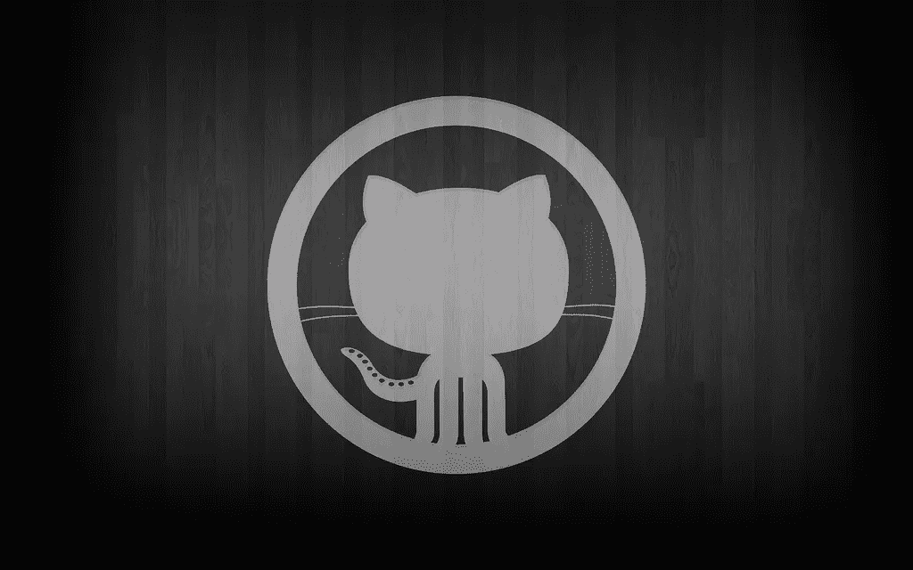
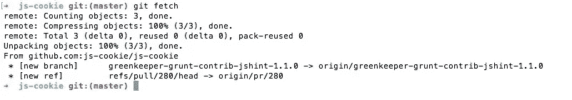

# 如何像老板一样处理 Github 拉取请求

> 原文：<https://medium.com/hackernoon/how-to-handle-github-pull-requests-like-a-boss-8693f4c57974>

## 从 Github 轻松获取 Pull 请求的“古老而珍贵”的技巧



A dark wallpaper with the Github logo's silhouette in the center

在 [Github](https://hackernoon.com/tagged/github) 上托管的受欢迎的[开源](https://hackernoon.com/tagged/open-source)项目中，有一个广泛使用的实践来有效地接收贡献。贡献者创建一个代表单个特性的小分支，当这个分支被推到贡献者的分支时，他们创建一个拉请求。在之前的一篇名为 [One Pull Request 的文章中，我已经详细阐述了如何做到这一点的最佳实践。一个问题。](/@fagnerbrack/one-pull-request-one-concern-e84a27dfe9f1)

从撰写本文时起，jQuery 在其贡献者中广泛使用这种模型。他们在他们的[提交和拉取请求](https://contribute.jquery.org/commits-and-pull-requests/)指南中记录模型，并将其作为新贡献的需求。他们已经用了好几年了。

> 开源项目中的一个常见做法是请求贡献者派生项目，创建一个临时分支，并从该分支创建一个代表[单个关注点](/@fagnerbrack/one-pull-request-one-concern-e84a27dfe9f1)的拉请求。

有些公司也使用这种模式来管理他们的发展。拉请求允许开发人员频繁地集成他们的更改，这减少了代码冲突的机会，并使及早发现 bug 成为可能。这是早期反馈，是[持续集成](https://www.thoughtworks.com/pt/continuous-integration)的核心原则之一。

不过，我们可以用一个技巧来管理拉请求。

当使用 Github 时，有权合并主分支请求的每个人都有两种选择:

1.  使用 [Github Pull 请求 UI 将提交合并到](https://help.github.com/articles/merging-a-pull-request/)主分支。
2.  在命令行中使用 [git](https://git-scm.com/) 添加对拉请求分支的引用，作为本地的远程请求(`git remote add <contributor's fork url>`)，从该远程请求获取拉请求分支，然后将提交合并到主分支。

**第一个选项**是最常见也是最简单的一个。任何有权限的人都可以到 Github 上的 Pull 请求页面，点击“合并”按钮。

**第二个选项**最常用于合并拉请求的人想要完全控制主服务器上的提交。这是为什么呢？嗯，有些工作流可能需要在 master 上提交 git 信息，Github 不会通过它们的 Pull Request Web UI 来设置这些信息。Linus [过去抱怨过这个问题](https://github.com/torvalds/linux/pull/17#issuecomment-5654674)，这就是为什么他甚至不接受 Linux 内核中的 Github Pull 请求。

第二个选项的问题是，您需要为每个 Pull 请求添加一个 remote，以便在 master 上提交。许多拉请求可以有不同的贡献者和不同的分支。添加它们会变得很麻烦，因为你最终会在项目的本地副本中拥有大量的遥控器。

[Bert Belder](https://github.com/piscisaureus)4 年前发表了一个[有趣的技巧](https://gist.github.com/piscisaureus/3342247)，允许某人用一个`git fetch`命令从本地的一个存储库中下载所有的拉请求。

诀窍是将下面一行添加到位于您想要更改的项目的根目录下的`.git/config`文件中:

```
fetch = +refs/pull/*/head:refs/remotes/origin/pr/*
```

写着`origin`的部分可以不同。它只是表示远程的名称，该远程具有对您想要从中获取拉请求的存储库的引用。当我们使用命令`git clone <path to the repository>`时，它是 git 创建的遥控器的默认名称。

当使用这个技巧运行`git fetch`命令时，git 将获取所有针对该遥控器打开的 Pull 请求:



The output of the "git fetch" command when the Pull Request fetching technique is applied. It's fetching the refs from a copy of the [js-cookie](http://github.com/js-cookie/js-cookie) project.

注意`[new ref] refs/pull/280/head -> origin/pr/280`部分，这是从遥控器获取拉请求的时候。使用`git checkout origin/pr/280`可以检查它们。

好了，现在可以使用相同的命令行技巧将更改推送到拉请求了吗？

根据 [Github 文档](https://help.github.com/articles/checking-out-pull-requests-locally/)不能。Github 不允许推送到隐藏的 ref:

> 远程`refs/pull/`名称空间是*只读的*
> 
> ——Github 的“[在本地检查拉取请求](https://help.github.com/articles/checking-out-pull-requests-locally/)”文档

任何推至 ref 的尝试都会出现以下错误:

```
! [remote rejected] HEAD -> refs/pull/1/head (deny updating a hidden ref)
```

更新 Pull 请求的唯一方法是添加一个新的 remote，该 remote 引用创建它的 contributor 的 fork。如果您有权限在他们的分支中进行写操作，那么您可以将任何更改推送到远程的 Pull Request 分支，它将在 Github Pull Request Web UI 上自动更新。

> 使用多拉请求获取技巧来改变拉请求是不可能的，因为 Github 将隐藏的引用设为只读

当处理拉请求时，这个拉请求获取技巧将使您的工作流更加方便。这是非常简单的事情之一，但仍然会根据您的工作流程带来很多好处。

我已经在使用第二个选项的项目中使用了很长时间。

你呢？

感谢阅读。如果您有任何反馈，请通过 [Twitter](https://twitter.com/FagnerBrack) 、[脸书](https://www.facebook.com/fagner.brack)或 [Github](http://github.com/FagnerMartinsBrack) 联系我。