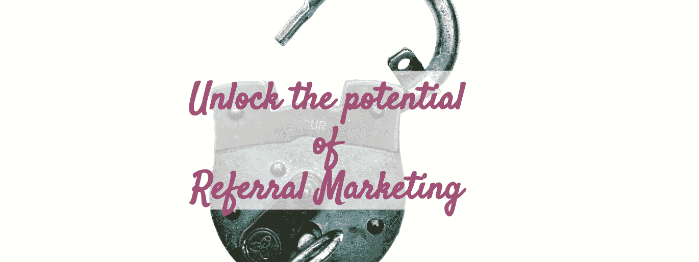
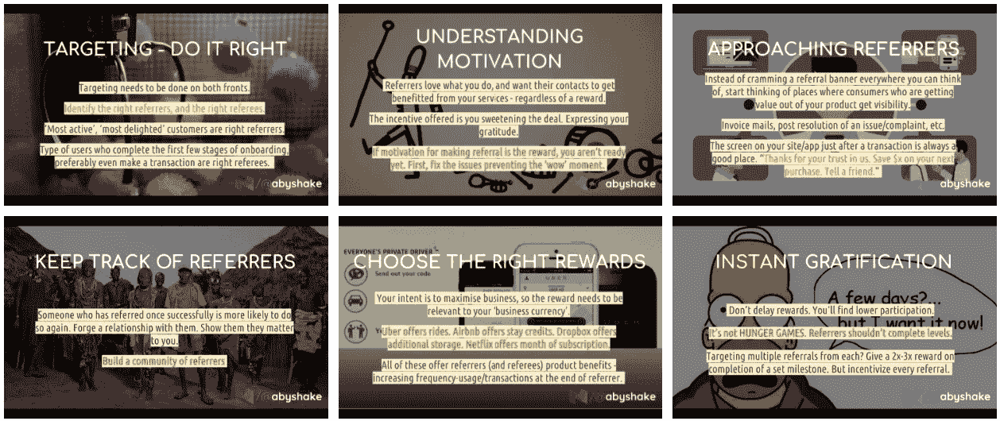
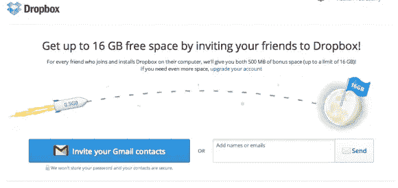
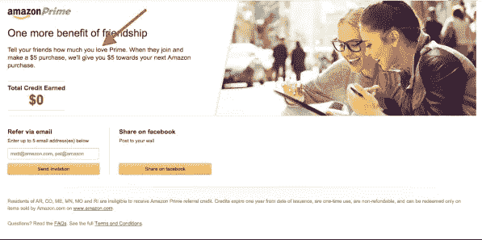

# 如何有一个牛逼的推荐计划？(带幻灯片)

> 原文：<https://medium.com/hackernoon/how-to-have-a-kickass-referral-program-e65ecaca02b4>

## 不到 25 张幻灯片就能分解所有内容

[https://unsplash.com/photos/qbY9S2bQ-J8](https://unsplash.com/photos/qbY9S2bQ-J8)

> 我一直想谈论推荐营销有一段时间了。我想是时候收拾好自己的烂摊子，把事情做完了，所以今天我做了一个幻灯片，详细介绍了一些事情。一些幻灯片:

# 为什么推荐营销？

好吧。除了围绕这一事实的显而易见的答案，即它是最有效的投资回报增长工具，通过这一渠道获得的客户是最有价值的，以及其他许多问题，我还有一个额外的原因。

> 让我着迷！

当我谈论营销时，我总是谈论 Dropbox。不管我是为你制定营销战略提供建议，还是帮助你为你的企业确定正确的营销渠道，或者只是帮助设置正确的跟踪指标，Dropbox 总能悄悄进入讨论。不管我把聚光灯从哪个方向照过来，我总是照在他们的客户推荐项目上。

> Dropbox 应该已经关闭了，而且很可能已经关闭了——如果他们没有部署推荐程序的话。

最初，dropbox 通过搜索广告和联盟渠道获得客户，平均 CAC 约为 350 美元。他们向顾客收取多少服务费？99 美元/年。数学不合理，也没有任何商业意义。就在那时，他们决定效仿 Paypal 的推荐计划，推出了他们著名的“获得高达 16GB 的免费空间”计划。

Both you and your friend received 500MB bonus space.

是啊。他们不是第一个使用双向奖励系统的人，但他们实际上引起了轰动。

*   在不到 15 个月的时间里，他们的注册用户群从仅仅 10 万猛增至 400 万
*   超过三分之一的每日新注册用户可以归功于他们的推荐项目

现在，这被称为打破互联网。

在 Dropbox 取得惊人的成功后，事情很快失去了控制，像“给 10 美元，得到 10 美元”这样的计划被你周围所有其他企业采用。

优步和 Airbnb 见证了他们惊人的成功，这归功于一个类似的推荐项目，尽管我必须承认他们做得更多，结果更令人惊讶。

`**Airbnb first deployed a successful referral pilot, and then improved it even more.**`

Airbnb 推出的第一个推荐计划与 Dropbox 推出的类似。用户可以在下次入住时给他们的朋友一个打折的礼物，每次成功入住，推荐人将获得 25 美元的积分。该试验在一个由几千名用户组成的严密控制的小组中进行了测试，结果显示病毒增长系数为 1。

> 你可以称之为——每个人都带了一个。

因此，Airbnb 决定提高赌注，拿出 100 美元让推荐人去抢。

*   当朋友住在 Airbnb 时，将会支付 25 美元
*   当他在 Airbnb 上列出自己的位置并成功招待一位客人时，他将获得 75 美元。

呜-呼！

Airbnb 刚刚一石二鸟。需求，供应宝贝！

优步也做了类似的事情，尽管方式不同。它为顾客和司机提供推荐积分，尽管他们实际上是相互隔离的。

尽管如此，这些项目对两家公司都产生了惊人的效果。今天，他们是全球最有价值的科技创业公司之一。

从那以后，有无数的企业以不同的方式使用推荐营销来为他们的产品创造巨大的价值。

无论是亚马逊、Hulu、网飞、Evernote，还是你能想到的任何成功的企业，在他们成功的背后，站在阴影中的某个地方，你会发现他们的推荐计划的士兵。

# 你必须永远记住的一条规则

当你启动一个推荐计划时，有许多事情你应该考虑和记住，但其中大多数是可选的。

然而，有一个人不是。这是所有规则中的圣杯，是你必须遵守的规则。

## 永远不要指望消费者会因为‘奖励’而参考。回报是你回报他们的感激。如果你想让你的消费者推荐他们的朋友，最好确保你值得那些高赞。

看看亚马逊。众所周知，Prime 是亚马逊的一个重点。Prime 消费者的 LTV 比普通亚马逊顾客高得多，也更忠诚。

亚马逊非常努力地确保他们的主要消费者永远不会感到失望。以至于你可以从他们的推荐项目中感受到他们对自己主要产品的信心。

> 告诉你的朋友你有多爱 Prime。

这就是它的工作方式。只有当我已经爱上了某个产品，我才会全力推荐它。我不会为了 5 美元而冒险让自己的脸陷入泥沼。

除非你确定你已经达到了让你的客户满意的程度，否则我会坚持推荐计划的启动日期。

# 这组幻灯片总共包含 23 张幻灯片(包括您之前看到的 6 张幻灯片的缩略图)。如果你想得到完整的甲板，加入俱乐部。我会和下一个邮件人分享。

Click here to join the mailing list.

# 今天到此为止；明天见。

