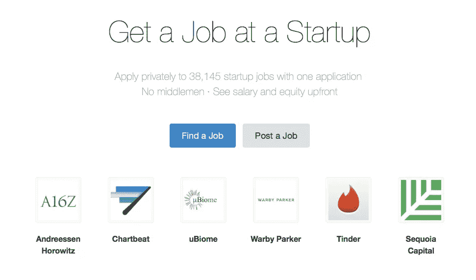

# 如何在 AngelList 上招聘

> 原文：<https://medium.com/hackernoon/how-to-hire-on-angellist-e517721d49b3>

## 来自他们人才团队的建议

招聘是大多数公司的首要需求，也是最大的困难，但是 AngelList 可以让你的生活变得更容易。西海岸已经采用 [AngelList](https://hackernoon.com/tagged/angellist) 进行招聘，Slack、Tinder 和 Quora 等公司的创始人对此赞不绝口。波士顿也该这么做了。

上周，[我们接待了来自 AngelList 人才团队的](https://events.attend.com/#/register/1383772066/0) Dave Zohrob 和 Amit Matani，他们谈论了使用他们的平台招聘优秀人才的策略。

他们的外卖在下面的幻灯片中。

> [黑客中午](http://bit.ly/Hackernoon)是黑客如何开始他们的下午。我们是 [@AMI](http://bit.ly/atAMIatAMI) 家庭的一员。我们现在[接受投稿](http://bit.ly/hackernoonsubmission)并乐意[讨论广告&赞助](mailto:partners@amipublications.com)机会。
> 
> 如果你喜欢这个故事，我们推荐你阅读我们的[最新科技故事](http://bit.ly/hackernoonlatestt)和[趋势科技故事](https://hackernoon.com/trending)。直到下一次，不要把世界的现实想当然！

