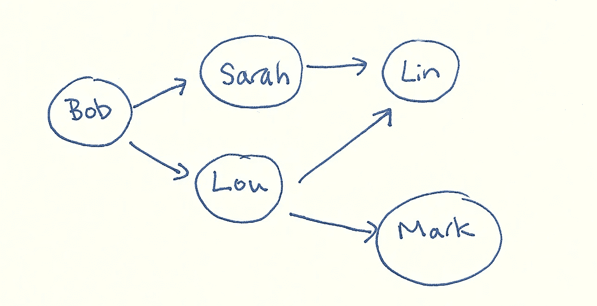
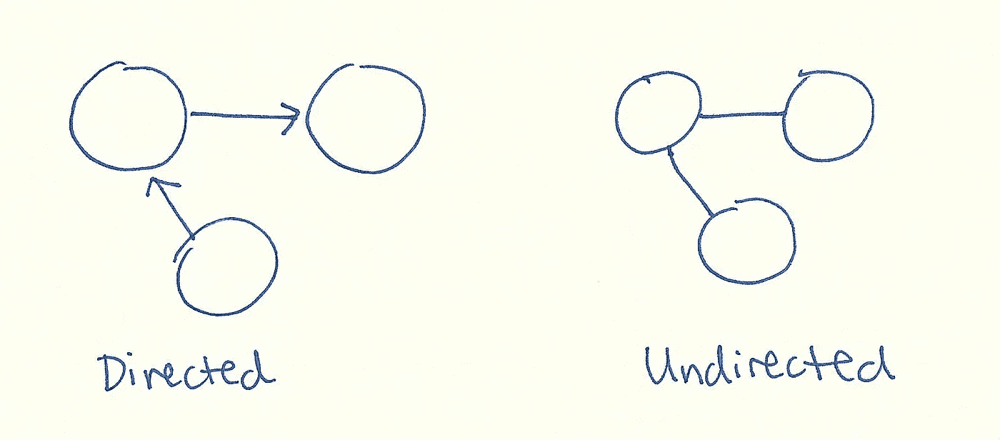
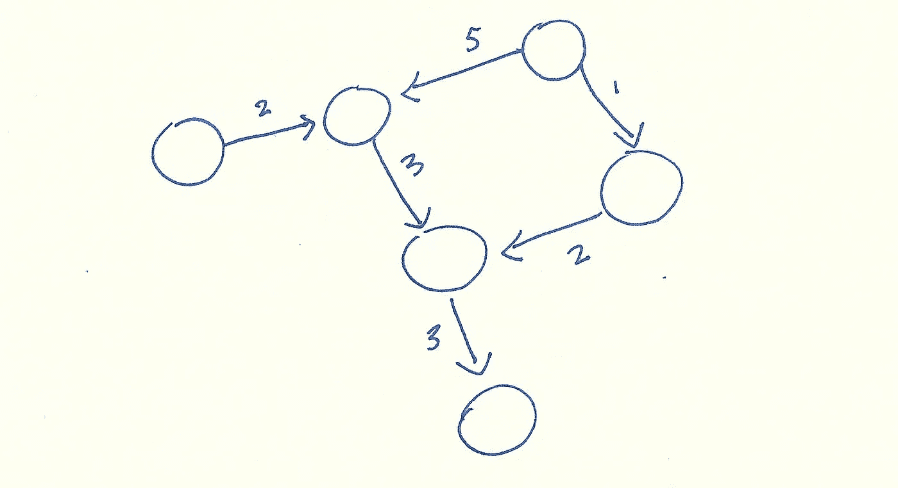
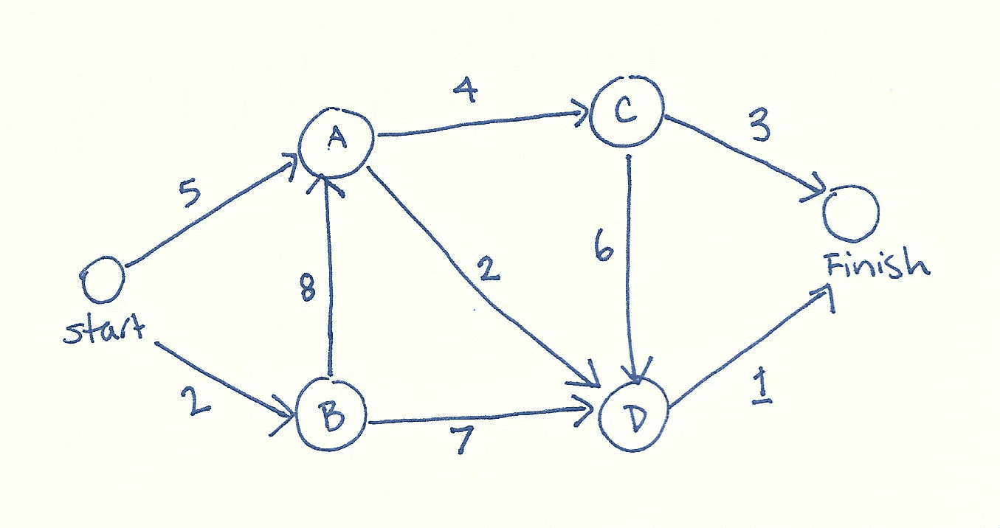

# 如何用 JavaScript 实现 Dijkstra 的算法

> 原文：<https://medium.com/hackernoon/how-to-implement-dijkstras-algorithm-in-javascript-abdfd1702d04>

我一直在读 [Grokking Algorithms](https://www.manning.com/books/grokking-algorithms) ，我推荐给任何算法新手。基本上就是我几个月前就希望有的介绍了！书中的例子都是用 [Python](https://hackernoon.com/tagged/python) 写的，所以我想分享一个 [JavaScript](https://hackernoon.com/tagged/javascript) 版本的 [Dijkstra 的算法](https://en.wikipedia.org/wiki/Dijkstra%27s_algorithm)。该算法使用有向加权图来确定到达一个节点的“最便宜”路径。

我将把每个部分分成几个步骤，并提供一些背景信息。如果你喜欢只看代码，这里有[要点的链接。](https://gist.github.com/stella-yc/49a7b96679ab3bf06e26421fc81b5636)

# 背景:什么是图？

图形是一种抽象数据类型，用于对一组连接进行建模。例如，假设 Bob 在 Twitter 上关注 Sarah 和 Lou。莎拉跟着林。楼跟着林和马克。我们可以用图表来表示这些联系。



This graph illustrates a very basic Twitter network.

每个人是一个*节点*，每个连接是一条*边。*每个节点可以连接到许多其他节点。图表可以*定向*，这样每个连接都是单向的，就像这个 Twitter 示例中一样——Bob 关注 Sarah，但是 Sarah 不关注 Bob。图形也可以是*无向的*，这样连接是双向的。



图中的边也可以*加权。*例如，在下图中，每个权重代表从一点到另一点的成本。



# 挑战

假设你正试图找出到达目的地的最便宜的方式，如下图所示。“开始”和“结束”之间的节点是你可以走的桥和路，权重是指你必须支付的通行费/汽油费。



Our problem we are trying to solve

乍一看，这看起来像事情会变得毛骨悚然！有许多不同的可能途径可供评估和比较。而且这个图相对简单——如果我们遇到一个更复杂的问题，有更多的节点和可能的路径呢？

但是 Dijkstra 的算法采用这个令人生畏的问题，并将其分解，使用几个简单的步骤来达到最终的解决方案。Dijkstra 的算法也非常适合这个特殊的用例。用于表示可能路径的图是有向的和非循环的(意味着没有循环)。

# 方法

## ***实施图***

让我们弄清楚如何在我们的程序中实现这个图。我将使用嵌套的 JavaScript 对象:

```
const graph = {
  start: {A: 5, B: 2},
  A: {C: 4, D: 2},
  B: {A: 8, D: 7},
  C: {D: 6, finish: 3},
  D: {finish: 1},
  finish: {}
};
```

每个节点由图形对象中的键表示。每个键都有一个对象作为其值，表示直接邻居和到达该邻居的开销。

例如，节点 **A** 连接到节点 **C** 和 **D** 。节点 **A** 是节点 **C** 和 **D、**的“父节点”,它们是节点 **A.** 的“子节点”

## **理解算法**

现在让我们概述一下 Dijkstra 算法的主要步骤。

1.  找到“最便宜”的节点。
2.  更新此节点的直接邻居的开销。
3.  重复步骤 1 和 2，直到对每个节点都完成了这一步。
4.  返回到达该节点的最低成本，以及到达该节点的最佳路径。

因此，如果我们从 **start** 开始，我们拥有的前两个节点是 **A** 成本为 5，以及 **B** 成本为 2。 **B** 是最便宜的节点。除了完成，这些是我们目前所知的唯一节点。由于我们还不知道**结束**的成本，我们将它设为无穷大。

已经有很多东西需要跟踪了，而且我们只从第一个节点开始！为什么我们不用一种新的数据结构来记录到达每个节点的最低成本？

我们将使用一个对象来跟踪它。到目前为止，它看起来像这样:

```
const costs = {
  A: 5,
  B: 2,
  finish: Infinity
};
```

但我们不只是想知道到达终点节点需要多少成本。我们想知道我们需要走哪条路才能到达那里！这需要使用另一种数据结构来保持**对每个节点的父节点的跟踪。当一个节点有许多可能的父节点时，我们将只保留成本最低的父节点。**

这就是我们如何从起点到终点回溯最便宜的路径。

```
const parents = {
  A: 'start', 
  B: 'start', 
  finish: null
};
```

现在我们还不知道到达**完成**节点的完整路径，因为我们没有**完成的父节点。**

我们也不想浪费时间一遍又一遍地检查相同的节点。**我们想要跟踪哪些节点已经被“处理”“已处理”意味着我们已经计算了到达每个节点子节点的成本。**

为此我们可以简单地使用一个数组。处理完一个节点后，我们会将其推送到数组中。

```
const processed = [“start”, “A”, “B”];
```

好的，这是我们再次使用的图表。


我们希望继续寻找最便宜的节点，并更新该节点子节点的开销。最便宜的节点是 B，其子节点是 A(开销为 8)和 D(开销为 7)。我们将这些添加到我们的成本对象中，现在看起来像这样:

```
console.log(costs)
// returns something like
  { A: 5,
    B: 2,
    D: 9
    finish: Infinity
  };
```

我们不更新 **A** 的成本，因为 5 比 8 便宜。我们加上值为 9 的 **D** ，因为到达 **B** 的开销是 2，从 **B** 到达 **D** 的开销是 7，所以 7 + 2 = 9。

我们还更新了我们的**处理过的**和**父**数据结构。我们将重复上述步骤，直到处理完所有节点。

# 实现算法

如果这还不清楚，不要担心，我们即将进入代码。

首先，我们将定义一个函数，给定**成本**和**已处理的**节点，将返回尚未处理的最便宜的节点。

```
const lowestCostNode = (costs, processed) => {
  return Object.keys(costs).reduce((lowest, node) => {
    if (lowest === null || costs[node] < costs[lowest]) {
      if (!processed.includes(node)) {
        lowest = node;
      }
    }
    return lowest;
  }, null);
};
```

然后我们将定义主函数， **dijkstra** ，它将初始图形作为参数。我们将从创建**成本**、**父数据**和**已处理数据**开始。

```
const dijkstra = (graph) => { const costs = Object.assign({finish: Infinity}, graph.start); const parents = {finish: null}; for (let child in graph.start) {  // add children of start node
    parents[child] = 'start';
  } const processed = [];...
```

接下来，我们将使用 **lowestCostNode** 函数设置正在处理的节点的初始值。然后，我们将开始一个 **while** 循环，它将不断寻找最便宜的节点。

```
 let node = lowestCostNode(costs, processed);
  while (node) { let cost = costs[node]; let children = graph[node]; for (let n in children) {
      let newCost = cost + children[n];
      if (!costs[n]) {
        costs[n] = newCost;
        parents[n] = node;
      }
      if (costs[n] > newCost) {
        costs[n] = newCost;
        parents[n] = node;
      }
    } processed.push(node); node = lowestCostNode(costs, processed); }
```

以下是对上述情况的更详细描述:

1.  获取当前节点的成本
2.  获取当前节点的所有邻居(又名“子节点”)。
3.  遍历每个子节点，并计算到达该子节点的开销。我们将在**成本**对象中更新该节点的成本，如果它是最便宜的或者是唯一可用的成本。
4.  我们还将更新 parents 数据结构，以便我们最终可以追溯我们的步骤。
5.  一旦节点被完全处理，我们将把它推到我们处理过的数据结构中。
6.  将当前节点的值重置为最便宜的、未处理的节点，然后重复。

最后，一旦 while 循环完成，我们到达**结束**节点的成本将会最低。我们现在想要获得到那个节点的路径，这可以通过使用 **parents** 对象回溯我们的步骤来实现。

```
 let optimalPath = ['finish']; let parent = parents.finish; while (parent) {
    optimalPath.push(parent);
    parent = parents[parent];
  }

  optimalPath.reverse();  // reverse array to get correct order const results = {
    distance: costs.finish,
    path: optimalPath
  }; return results;}; *//end of function*
```

我们最终的结果应该是这样的！

```
{ distance: 8, path: [ 'start', 'A', 'D', 'finish' ] }
```

要查看完整的解决方案，请查看[要点。](https://gist.github.com/stella-yc/49a7b96679ab3bf06e26421fc81b5636)

如果你仍然有问题，我建议在你的机器上运行代码，并修改程序的部分内容。我发现调整和摆弄代码确实有助于我更深入地理解正在发生的事情。

我希望你喜欢这个解释。感谢您花时间阅读这篇文章！

**更新:为了更加清晰，我重新审视了我的原始解决方案，并加入了反馈和更清晰的变量名，以及一些日志记录来帮助理解正在发生的事情。这里可以找到[。](https://repl.it/@stella_sighs/dijkstramedium)

—
*如果你喜欢这首曲子，请点击绿心💚所以其他人也可能偶然发现它！欢迎在* [*Github*](https://github.com/stella-yc) *或*[*Twitter*](https://twitter.com/stellasometimes)*上关注我。*