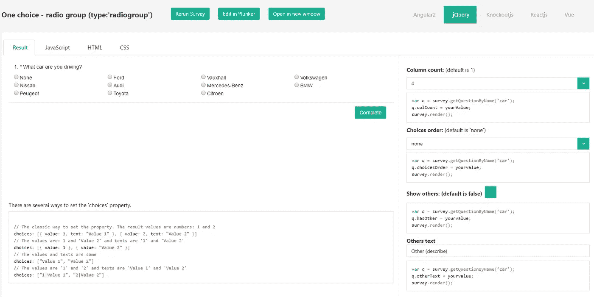

# 如何改进 JavaScript 库的示例

> 原文：<https://medium.com/hackernoon/how-to-improve-examples-for-javascript-library-b050f8158d19>

[*SurveyJS*](http://surveyjs.org/) 为我馆发布了新版[例题](http://surveyjs.org/examples/jquery/questiontype-text/)，愿与大家分享经验。

以下是最重要的几点:

*   互动实例
*   即时应用参数和结果的示例
*   完整的源代码
*   能够在操场上打开任何例子(plnkr，jsfiddle，codepen 等)

SurveyJS examples

# 互动实例

程序员写代码，最重要的是看到代码执行的结果。看一个例子，一个用户希望看到它的运行，但没有显示在图片中。在 SurveyJS 中，您可以运行一个调查来处理代码并查看结果。

# 即时应用参数的示例

好，现在，我们的用户感兴趣了。可能出现的一些问题:一套房产呢？如果由真变假呢？

是的，我们知道客户有描述。但是，他们要不要去深究呢？大概，他们描述的很清楚。所以，出路很简单。SurveyJS 中的示例允许用户微调属性。他们可以更改基本设置并立即看到结果。

# 完整的源代码

以前，我们提供了与应用功能一起工作的源代码的一部分，但是它不包含完整的环境——外部库、样式和其他资源。因此，我们遇到了与特定环境相关的问题。我们详细描述了问题发生的环境，但是由于环境不同，我们无法重现。

在这一点上，我们得出了以下结论:

*   提供完整的源代码
*   提供在操场上运行每个样本的能力——我们使用 [plunker](http://plnkr.co)

现在，用户可以从相应的选项卡(JS、CSS、HTML)中复制并粘贴代码以及整个环境、依赖项和样式。所有必要的信息都包括在内！

由于这种新的方法，用户对提供的代码感觉更舒服，并可以把我们的例子作为现成的样板。

# 游戏场地中的开放示例

现在，网站访问者成为了您的产品用户。他们可以玩真实的例子，尝试不同的设置，并…找到一个错误！是的，一个 bug 在你的聪明才智和测试库中 100%覆盖！现在您的用户想要创建一个错误报告。他们应该尽可能详细地解释当前的行为，重现和说明代码的必要步骤。

有了“打开”按钮，这一切都变得简单了。用户现在可以在操场上打开任何一个例子，修改它，并为开发者提供一个链接。这使得解决问题更容易，有助于你与其他人分享你的发现，或者帮助 StackOverflow 上的某个人。

# 作为游乐场的扑通声

由于我们没有找到关于如何在 Plunker 中打开您的示例的详细解释，我们决定告诉您这个平台。

为什么是普兰克？

我们选择这个平台是因为每个 Plunker 示例都是一个完整的项目，包含一组文件和文件夹，您可以通过现成的网站下载。

例如:

为了向 Plunker API 发送请求，我们正在创建一个隐藏的表单，其中包含输入字段以及关于标签、plunk 隐私和示例描述的信息。我们还为 plunk 文件的内容(JS、CSS、HTML)添加输入元素。这就是我们如何开始一个匿名的 plunk，它可以被保存并在将来重用。

**UPD(2017 年 8 月 24 日)**:我们在[可视化编辑器](https://surveyjs.io/Editor/)中增加了“在编辑器中打开”按钮，用于打开示例。例如:[https://localhost:44388/Examples/Library/question type-radio group/jQuery](https://localhost:44388/Examples/Library/questiontype-radiogroup/jQuery)

你可以在我们的 [github 库](https://github.com/surveyjs/site/blob/master/_layouts/example.html)中找到这个文件的完整代码。

感谢您的关注，SurveyJS 团队

> [黑客中午](http://bit.ly/Hackernoon)是黑客如何开始他们的下午。我们是 [@AMI](http://bit.ly/atAMIatAMI) 家庭的一员。我们现在[接受投稿](http://bit.ly/hackernoonsubmission)并乐意[讨论广告&赞助](mailto:partners@amipublications.com)机会。
> 
> 如果你喜欢这个故事，我们推荐你阅读我们的[最新科技故事](http://bit.ly/hackernoonlatestt)和[趋势科技故事](https://hackernoon.com/trending)。直到下一次，不要把世界的现实想当然！

