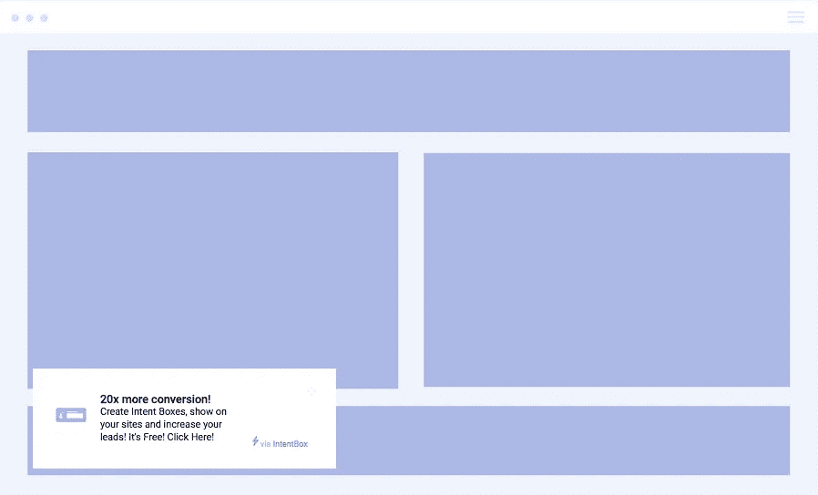
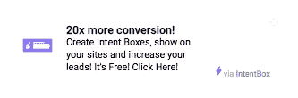
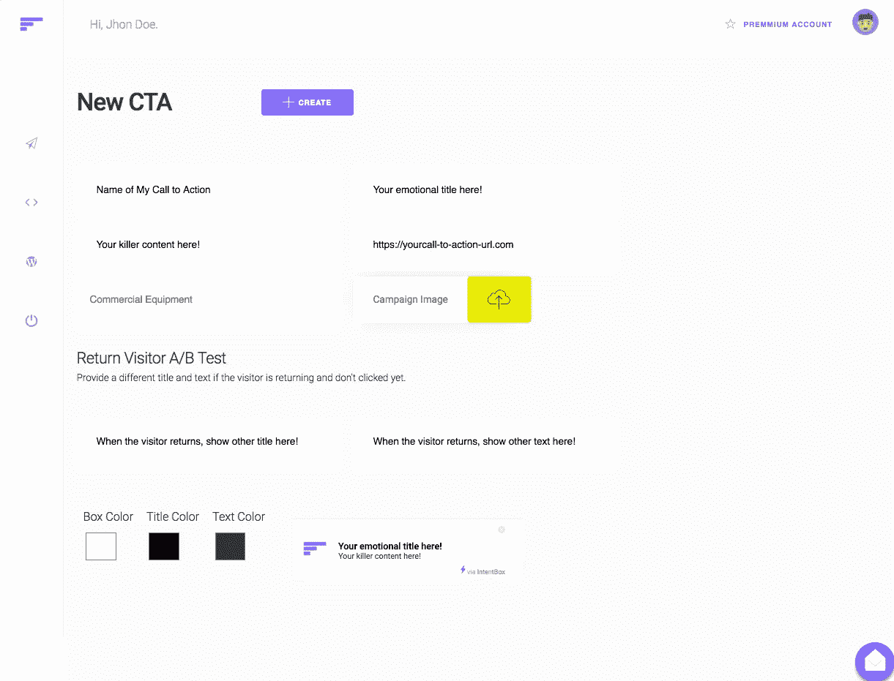

# 如何在没有预算的情况下提高自己的转化率？

> 原文：<https://medium.com/hackernoon/how-to-increase-conversion-rate-for-free-38b392bf97b7>

## 在正确的时间，用正确的行动号召来转化你的访问者！

首先，我们想告诉你做好准备。这篇文章是关于如何免费提高你的转化率，并获得更多的线索。你会惊讶的。我们走吧！

# 什么是行动号召？

行动号召(又称 CTA)可以是一个盒子内容、一幅图像或一行文本，以提示您的客户采取行动。基本上，你可以吸引用户的注意力，并影响他们采取你想要的行动。

行动号召非常有力。在正确的时间，用正确的内容给你的用户提供他们需要的东西，你会惊讶地发现:你会立刻得到更多的线索。

# 我如何创建杀手 CTA？

1.  **人性化布局:**想想，你会点击一个 CTA 觉得它显得很丑？认为设计与登陆页面/电子商务设计不一致？大概不会。
2.  **告诉你的访问者为什么他们应该采取行动:**这个理由需要有说服力。想象一下，你正在提供一个产品的 20%的折扣，而你给一个 CTA 展示了同样的折扣…没有意义。但是想象一下:你正在看产品，如果你现在购买，你会看到一个 CTA 上写着“70 折”。听起来不错，不是吗？
3.  **害怕错过:**这是很强大的，因为当你的访客认为他们可能会错过一个可能不会再来的机会时，他们会很快跟上潮流。让它对你有利！
4.  使用正确的词语:词语会激起你的访问者的很多情绪。你可以用你的行动号召来激发热情和情绪，而且会非常有效。你可以在这里看到很多单词和它们对你的访问者产生的情绪。

有了这篇文章中的提示，你就可以开始准备提高你的转换率，并获得更多的线索。你知道 CTA 是什么，如何构建强大的 CTA，现在你可以将它付诸实践。

# 我怎样才能提高我的转化率，免费？

让我给你展示一下 [*意向框*](https://www.intentbox.me) *。*这是一个营销工具，你可以免费创建你的 CTA，并通过 [*意向框插件*](https://wordpress.org/plugins/intent-box/) 显示在你的网站、电子商务、登陆页面和 Wordpress 页面上。

您可以跟踪您的 CTA，查看您的 CTA 有多少独特的视图和独特的点击，以及每个 CTA 的转换率。意向框的 CTA 具有用户友好的非侵入式设计，您的用户会喜欢看到它。

# 准备好开始增加你的快感了吗？

你需要做的就是注册并创建你的第一个行动号召。您将设置一个标题(记住可以激起情绪的词)，设置您的 CTA 的文本内容，一个图像和一个 URL，当您的访问者单击您的 CTA 时，他们将会进入。

只需 30 秒，您就可以创建您的行动号召，并在您的网站和博客上展示。这非常有效，我们的客户将你的转化率提高了 336%，很棒吧？

# 行动号召

我们邀请你自己来证明这个营销工具。完全免费！

 [## 在正确的时间，通过正确的行动号召来转化您的访问者

### 产生销售线索的强大方法。用户友好的行动号召将增加您的转化率并让您获得更多…

www.intentbox.me](https://www.intentbox.me) 

给我你的反馈！让我知道你对意见箱的体验。