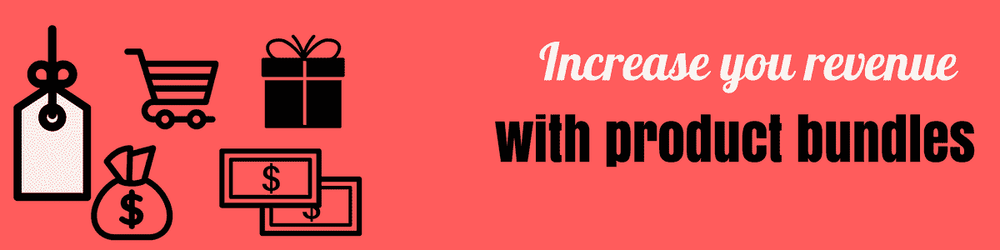
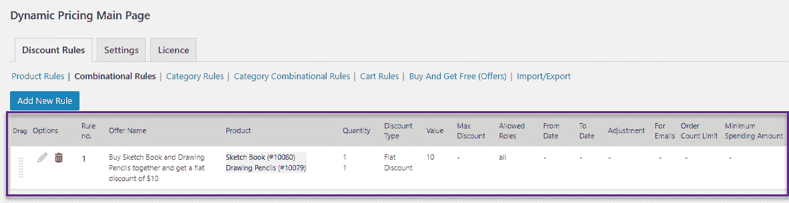
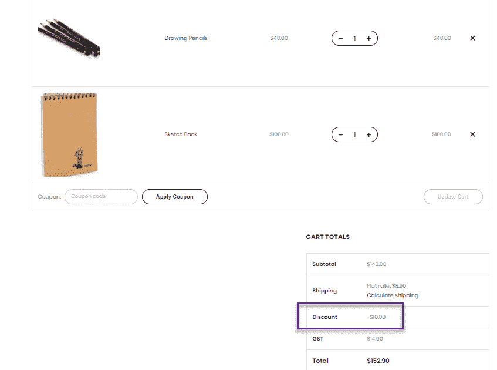
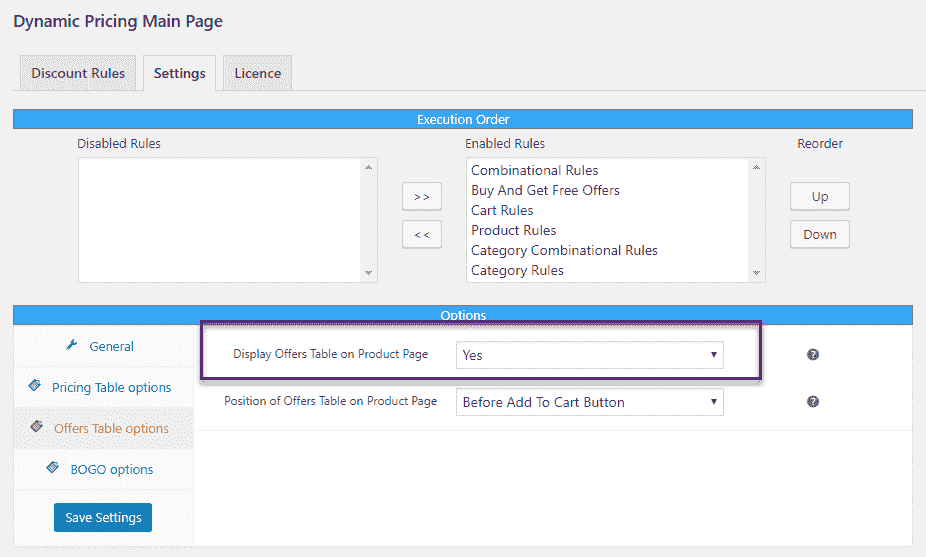
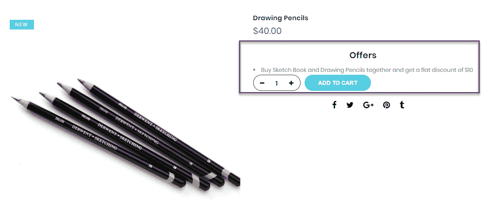
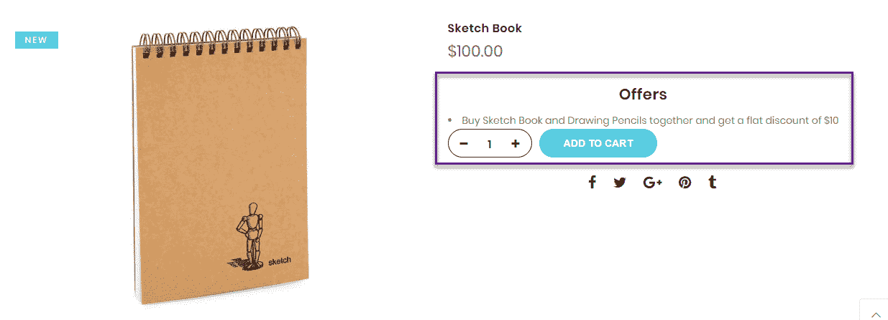
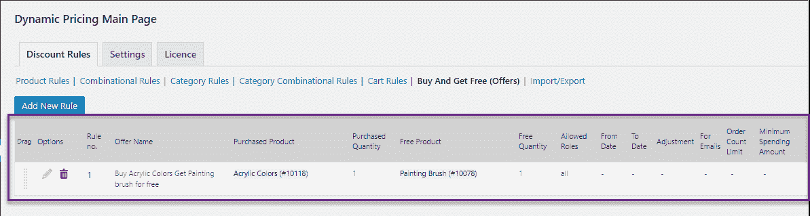
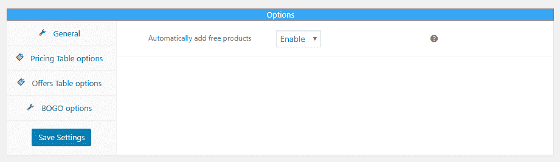
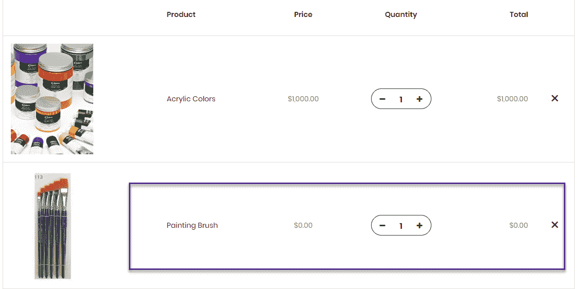
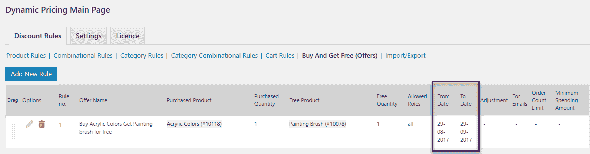

# 如何通过创建产品捆绑来增加你的 WooCommerce 商店的销售额？

> 原文：<https://medium.com/hackernoon/how-to-increase-sales-in-your-woocommerce-shop-by-creating-product-bundles-3cb1c9ee70c3>

一旦你开了一家 [WooCommerce](https://hackernoon.com/tagged/woocommerce) 商店，订单开始涌入，你下一步想做什么？增加销售会是你首先想到的事情。那么，你打算怎么做呢？有许多方法可以实现目标销售。在这篇文章中，我们将讨论这样一种增加销售的方法。

这种策略是利用一种受欢迎的[产品](https://hackernoon.com/tagged/product)来增加一种非销售产品的销量。当你发现两个或更多产品之间的潜在联系，并且其中一个表现明显好于其他产品时，那么恭喜你，你找到了正确的组合。

在本文中，我们将向您展示如何通过使用 XAdapter 的[动态定价和折扣插件创建产品捆绑包来增加您商店的销售额。让我们探索用这个插件创建产品包的各种方法。](https://www.xadapter.com/product/dynamic-pricing-discounts-woocommerce/)

1.  **通过创建组合规则**

使用[动态定价和折扣插件](https://www.xadapter.com/product/dynamic-pricing-discounts-woocommerce/)，您可以创建产品或类别的组合。

举以下例子——

在上面的例子中，当速写本和绘图铅笔一起购买时，店主希望提供 10 美元的固定折扣。这里选择的折扣类型是统一折扣。可以选择的其他折扣类型有百分比折扣和固定价格。

在创建产品组合时，明智地选择产品非常重要。确保只捆绑通常一起购买的产品。例如，一件正式的衬衫和一顶帽子的组合几乎没有任何意义。而正式的衬衫和领带的组合就可以。因此，在创造组合时，从买家的角度来看很重要。请务必注意以下事项——您的大多数客户会一起购买哪些产品？如果顾客购买了一个品类，他还会对哪个品类感兴趣？

当客户购买该组合时，购物车页面将如下所示

您可以看到对该组合应用了 10 美元的统一折扣。

现在，你肯定想让你的顾客知道与他们将要购买的产品相关的特殊折扣。所以，在设置页面，启用“优惠表”。

然后，您可以在产品页面上看到可用的报价。现在，您的客户知道他们一起购买这两种产品时得到的优惠。

**2。通过创建买一送一规则**

创建捆绑包的第二种方式是通过“BOGO”规则。这通常用于促销目的。假设你推出了一款新产品，但不确定你的客户会如何接受。因此，测试它的最好方法是把它作为礼物送给你的客户。

同样，为了使这个实验成功，智能捆绑是必要的。你不会想把不必要的礼物送给不需要的顾客。这种情况弊大于利。

在上面的例子中，当客户购买丙烯颜料时，我将画笔作为免费产品赠送。

当你把一个免费产品和另一个一起赠送时，最好是当顾客把后者加入购物车时，免费产品自动加入购物车。此功能可在设置页面中启用

因此，购物车会自动装载免费产品

另一种使产品捆绑有利于你的商店的方法是在创建规则时设置一个日期范围。

在“BOGO”规则的情况下，你可以送出节日特定的礼物。例如，在圣诞节期间，你可以免费赠送蜡烛、巧克力。类似地，您也可以为组合规则设置战略性的日期范围。

您可以根据用户角色进一步限制规则。您可以选择只向特定的客户群发放免费礼品或组合折扣。

就是这样。希望这个简单的策略能让你的商店更上一层楼。

销售愉快！