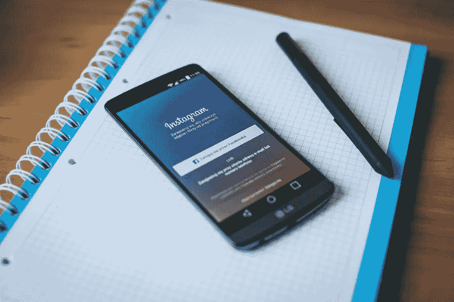
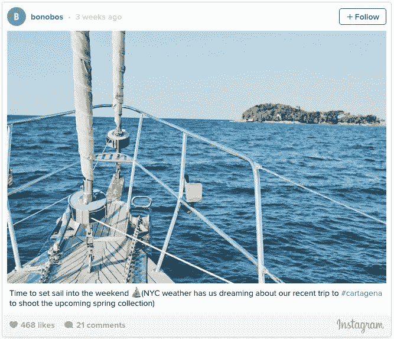
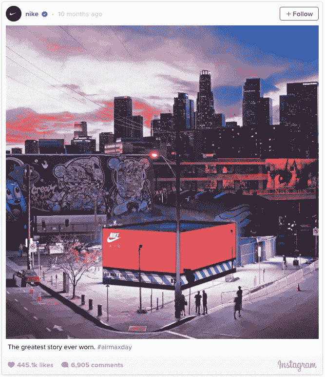

# 如何通过 Instagram 增加网页流量

> 原文：<https://medium.com/hackernoon/how-to-increase-web-traffic-through-instagram-c5dde02853b4>

分享照片现在是社交媒体上[企业](https://hackernoon.com/tagged/business)和消费者最常用的功能之一。很少有社交媒体网站能像 Instagram 一样利用这一趋势。这个照片分享应用已经发展到[4000 万用户，每天产生 35 亿个赞](http://home.bt.com/tech-gadgets/phones-tablets/its-instagrams-fifth-birthday-heres-some-fun-facts-to-celebrate-11364009165320) **。**更令人印象深刻的是，这款应用*才出现 5 年*。

企业明白，他们需要去消费者所在的地方。Instagram 提供了一个平台，让企业每天都能接触到数百万消费者。这显然对今天的经济很重要。然而，如果它如此重要，为什么没有人知道如何使用该应用程序来增加网络流量？

*如果你* [*谷歌*](https://hackernoon.com/tagged/google) *如何通过* [*脸书*](https://www.google.com/webhp?sourceid=chrome-instant&ion=1&espv=2&ie=UTF-8#q=how%20to%20increase%20web%20traffic%20through%20facebook) *和* [*推特、*](https://www.google.com/webhp?sourceid=chrome-instant&ion=1&espv=2&ie=UTF-8#q=how%20to%20increase%20web%20traffic%20through%20twitter) *增加网页流量，你会被近 2 亿条结果淹没。如果你对 Instagram 做同样的事情，谷歌只会产生 900 万个结果。为什么会有这样的出入？为什么没人谈论 Instagram？该应用程序与用户量竞争，但似乎商家对其好处一无所知。*

或者也许企业只是不明白如何正确使用它来增加网络流量。以下是你如何利用这个应用程序来增加你的网络流量:

# 提供优秀的内容

不言而喻，但只发布伟大的内容来赢得观众，让他们点击你的网站。不过，这是有代价的，说起来容易做起来难。图像需要逼真，以适应消费者。过于专业的帖子可能会与用户产生隔阂，但仅仅一张 iPhone 照片可能不足以吸引用户。

关键是发布专业的照片，让你的观众产生共鸣。你发布的照片和视频应该能够挖掘出你的访问者脑子里在想些什么。力争单篇帖子解决一个问题。

为了和你的观众建立联系，试着在 Instagram 上把你的生意人性化。企业很难与消费者沟通，因为人们忘记了公司是由人组成的。Instagram 使企业能够消除这种脱节。看看下面 Bonobos 最近的帖子是如何做到这一点的:

在纽约市的暴风雪中，许多人可能会梦见热带天堂。倭黑猩猩想表明他们就像他们的顾客一样，希望得到同样的东西。该图像看起来不像是在专业摄影师的工作室中拍摄的。图像中没有服装，也没有推销。这只是一种与消费者感同身受的努力。

这张图片的伟大之处还在于，450 个赞是倭黑猩猩个人资料中最受欢迎的图片之一。

这都是为了什么？当你开始发布相关内容时，你的观众会对你忠诚。他们会乐于看到你的帖子，查看你的个人资料，关注你，点击你的网站。

顺便说一下，永远不要从其他社交媒体网站截图帖子，并在 Instagram 上分享。这只是懒惰的表现

# 专注于视频

如今，几乎每个人都有一台可以装进后口袋的高质量相机。拿出手机——我是说，相机——拍张照片上传非常容易。这有什么问题？太多人在做了。据 TechCrunch 报道，用户每天上传 4000 万张图片 **。**

尽管发布视频很容易，但很少有品牌和企业将 Instagram 的努力集中在后者上。2014 年，耐克开始发布专属于其 Instagram 粉丝的精彩视频。结果呢？一个 [**追随者增加 200%**](http://www.entrepreneur.com/article/243219)3。2014 年 4 月，耐克在社交平台上有 400 万粉丝，但现在拥有 3440 万粉丝。虽然他们的转化率未知，但许多追随者成为网站访问者和客户。

想想在 Instagram 上向下滚动你的 feed。你会在照片上看到很多很多不到一秒钟就让人赞叹的照片。你将决定喜欢、评论或继续滚动。当你偶然看到一个视频帖子时，你实际上会等待更长的时间来观看视频。这些视频只有 15 秒长，但这比你看一个图片帖子的平均时间长 15 倍。

如果你想让用户点击你的网站，关键是让他们看你的帖子的时间比看别人的时间长。视频需要更多的努力，制作成本可能会更高，但绝对值得。结果不言自明。

# 定期改变你的传记中的链接

Instagram 的不同之处在于，提供行动号召(CTA)比在脸书和 Twitter 上更难。Instagram 不允许你在帖子上发布你的网站的直接链接。相反，你能提供的唯一链接是你的简历。企业出错的地方是提供了一个链接到他们的网站主页。多无聊啊。

虽然你不能轻易与你的追随者分享链接很不方便，但这也有一些好处。人类的注意力持续时间 [**比金鱼的**](http://www.telegraph.co.uk/news/science/science-news/11607315/Humans-have-shorter-attention-span-than-goldfish-thanks-to-smartphones.html) 短，所以花时间点击你的个人资料和链接的用户将是一个有价值的访问者。你抓住了他们的兴趣，现在他们正在从你这里寻找更有趣的内容。

发布一个链接到你的主页的问题是它浪费了访问者的时间。你没有引导他们去你网站上你想让他们去的地方，而是让他们自己决定。他们很可能只是回去寻找有趣的猫视频，而不是专注于做出决定。机会浪费了。

相反，你简历中的链接应该反映你个人的网站目标。

*刚贴了一篇新文章，想让大家看？在你的简历中贴上链接。*

创造一个你想让人们购买的新产品？在你的简历中贴上链接。

*想通过登录页面收集更多电子邮件地址？在你的简历中贴上链接。*

# 旨在被发现

最后，这里是帮助你在 Instagram 上被发现并增加网站曝光率的最后几个技巧。

*一定要用 Instagram 的 hashtags* 。但是绝对不要逾期。 [**Buffer 报告通过标签的最高交互发生在具有超过 11 个标签的帖子上**](https://blog.bufferapp.com/a-scientific-guide-to-hashtags-which-ones-work-when-and-how-many) 。虽然互动很棒，但你不想用一个看起来像点击诱饵的帖子来惹恼你现有的追随者。如果你迫切需要更多的互动，去找 11 个标签吧。你肯定会获得更多的网络流量。但是一旦你在平台上更有经验了，就不要超过 5 分钟。

*利用* *影响者*。Instagram 现在因创造了一波在线影响者而闻名(或声名狼藉)。成千上万的人通过张贴关于特定利基的帖子建立了大量的追随者。每个话题都有一个影响者。获得更多关注者、喜欢和网络流量的最简单方法是利用这些有影响力的人所拥有的受众。通过直接信息或电子邮件联系他们，问他们是否愿意在他们的个人资料中宣传你。许多人会对这项服务收费，只在几个小时内发布你的内容。尽管这可能看起来不太理想，但他们只是在防止自己的形象变得过于张扬。这实际上对你更好，因为帖子的印象在 6 小时后会急剧下降。如果你有很多追随者，并接触到你所在领域的一个有影响力的人，你可以免费交叉推广彼此的内容。

最后，如果所有这些都失败了，考虑为 Instagram 上的*广告付费。该应用刚刚向所有企业和网站开放了广告解决方案，因此抓住这个机会可能是明智的。*

*原载于*[*theamericanidealist.com*](http://theamericanidealist.com/blog/2016/2/10/how-to-increase-web-traffic-through-instagram)*。*

> [黑客中午](http://bit.ly/Hackernoon)是黑客如何开始他们的下午。我们是阿妹家庭的一员。我们现在[接受投稿](http://bit.ly/hackernoonsubmission)并乐意[讨论广告&赞助](mailto:partners@amipublications.com)的机会。
> 
> 如果你喜欢这个故事，我们推荐你阅读我们的[最新科技故事](http://bit.ly/hackernoonlatestt)和[趋势科技故事](https://hackernoon.com/trending)。直到下一次，不要把世界的现实想当然！

