# 如何在云服务器上安装 Symfony 3

> 原文：<https://medium.com/hackernoon/how-to-install-symfony-3-on-cloud-server-d4415b5f6ed1>

Symfony 是领先的现代 PHP 框架，借助其不同的组件，用于创建安全的网站和 web 应用程序。这是一个流行的 MVC 框架，可以节省处理典型开发任务的时间，比如内容呈现、引导流量、创建持久模型等。

要安装和运行 Symfony 3，您的系统需要满足以下一系列要求:

*   最低版本为 5.5.9 的 PHP
*   设计者
*   JSON 已启用
*   ctype 已启用
*   应设置 date.timezone(默认时区无效)

注意:如果你想使用任何可选组件，请参见运行 Symfony 的这些[要求。](http://symfony.com/doc/current/reference/requirements.html)

如果你想知道如何在 Cloudways 上安装 Symfony，你可以简单地遵循这个简单的分步指南。准备好了吗？我们开始吧！

## 步骤 1:准备您的服务器和应用程序

注册或登录到您的 Cloudways 帐户，并通过从“选择您的应用程序”下拉列表中选择 PHP Stack 来创建一个新的服务器。此外，相应地命名您的应用程序、服务器和项目。

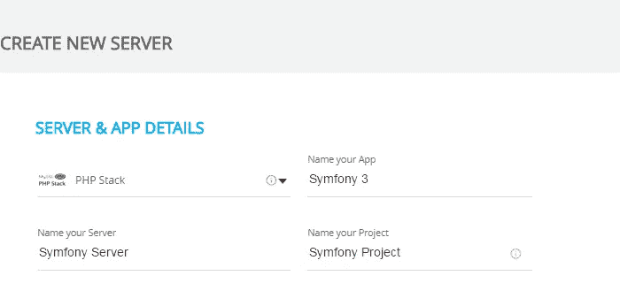

## 步骤 2:选择云提供商

现在选择你最喜欢的云提供商。

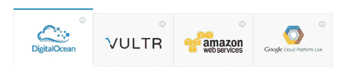

## 步骤 3:服务器大小和位置

在“服务器大小”字段中，扩展到 1GB。

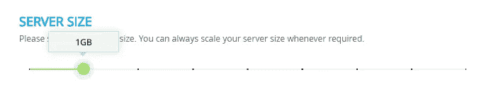

记住延迟差异，现在在“位置”字段中选择您的服务器位置。

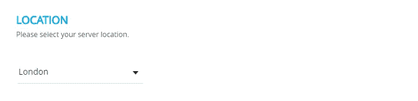

要启动您的服务器，请单击页面右下角的“启动”按钮，并等待一段时间。一个工作示例:

## 步骤 4:服务器时区

一旦启动，改变你的服务器时区，因为这是安装 Symfony 的要求(Symfony 不支持时区的默认值)。在“服务器管理”下，转到“设置和软件包”

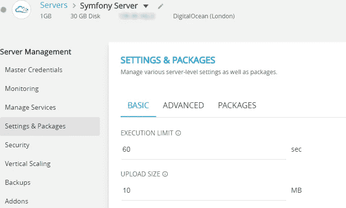

在“基本”标签中，你可以看到“PHP 时区”将服务器时区更改为您各自的位置。

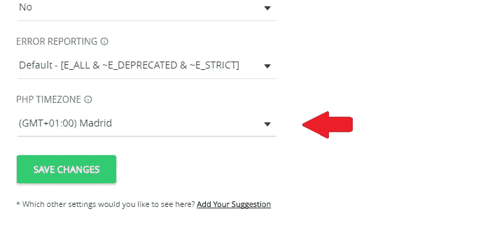

## 步骤 5: SSH 终端

更改服务器时区后，在“服务器管理”中点击“主凭证”下的“启动 SSH 终端”,在这里您可以找到您的 SSH 终端登录凭证。

使用您的主凭据登录 SSH。

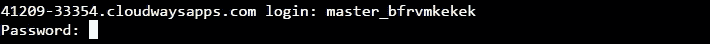

## 步骤 6:清空 public_html 目录

现在删除 public_html 目录中的所有文件。导航到您的 public_html 文件夹，并使用 rm -Rf *命令删除所有文件。

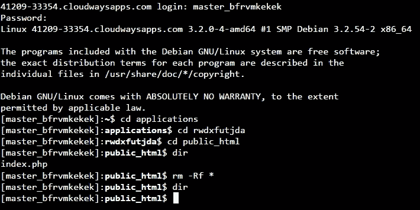

## 步骤 7: Symfony 3 安装

现在，在您的“public_html”目录中，运行以下命令在您的服务器上安装 Symfony 3:

> composer create-project symfony/framework-standard-edition your _ project _ name " 3.0。*"

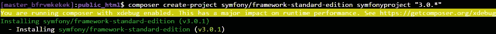

对于 3.1:

> composer create-project symfony/framework-standard-edition your _ project _ name " 3.1 "

## 步骤 8:数据库信息和完成项目安装

现在 Symfony 将开始下载到您的服务器。在下载过程中，它会要求您的数据库信息。

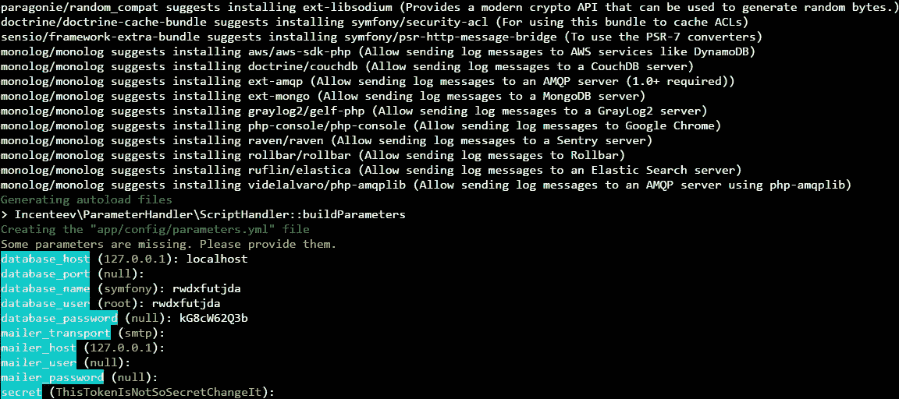

您可以在“应用程序管理”下找到您的数据库信息，进入“访问详细信息”并查看 MySQL 访问。

提供数据库信息后，几秒钟后你会看到下面的屏幕，这意味着 Symfony 已经安装成功。

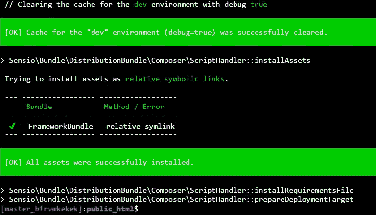

## 步骤 9: Composer 存储库

现在，我们将使用 composer install 命令检查是否需要安装或更新应用程序所需的 composer 依赖项。导航到您的项目目录并运行命令。

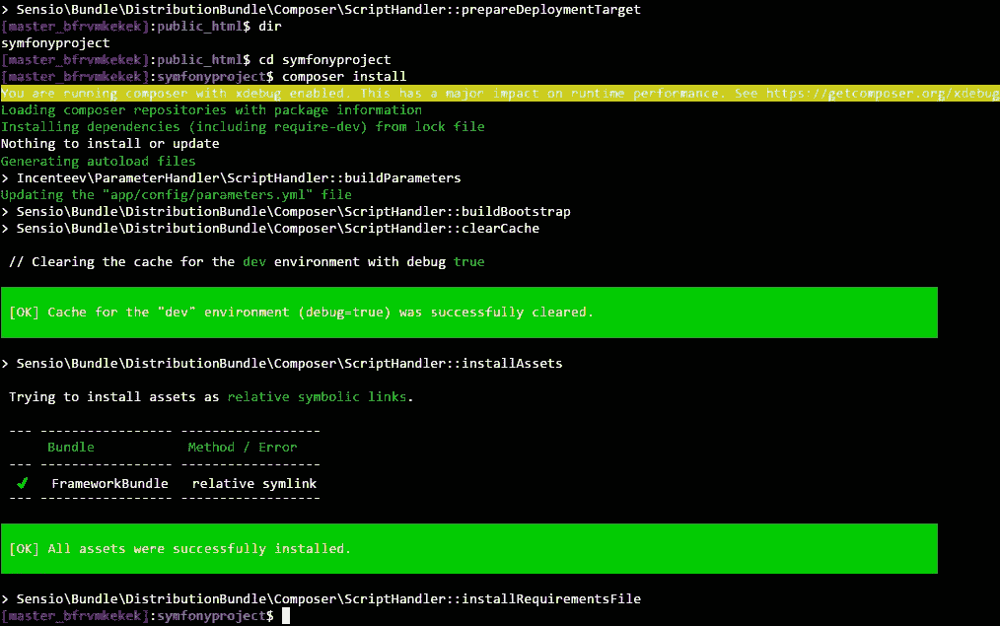

## 步骤 10:安装完成

成功安装后，在“应用程序管理”中进入“访问详细信息”并复制您的应用程序 URL。

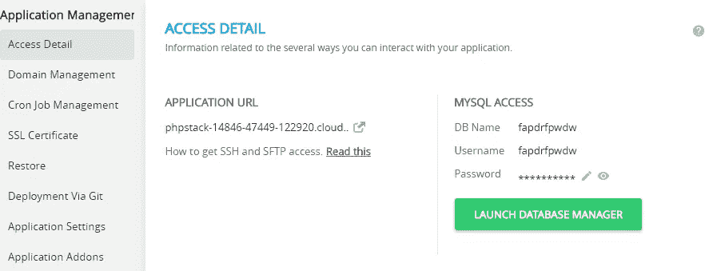

打开您最喜欢的网络浏览器，通过以下 URL 访问 Symfony 的欢迎页面:
http://your _ application _ URL/your _ project _ directory/web

Symfony 欢迎页面应该是这样的:

你有它！您的 Symfony 项目已经可以开发了。如果你在安装 Symfony 3 时有任何问题，欢迎在下面评论。如果您仍然不是 Cloudways 大家庭的一员，那么您可以从这里开始免费试用，体验最轻松的体验。

*原载于 2016 年 1 月 26 日 www.cloudways.com**[*。*](https://www.cloudways.com/blog/install-symfony-3-on-cloud/)*

******

> *[黑客中午](http://bit.ly/Hackernoon)是黑客如何开始他们的下午。我们是这个家庭的一员。我们现在[接受投稿](http://bit.ly/hackernoonsubmission)并乐意[讨论广告&赞助](mailto:partners@amipublications.com)机会。*
> 
> *如果你喜欢这个故事，我们推荐你阅读我们的[最新科技故事](http://bit.ly/hackernoonlatestt)和[趋势科技故事](https://hackernoon.com/trending)。直到下一次，不要把世界的现实想当然！*

**