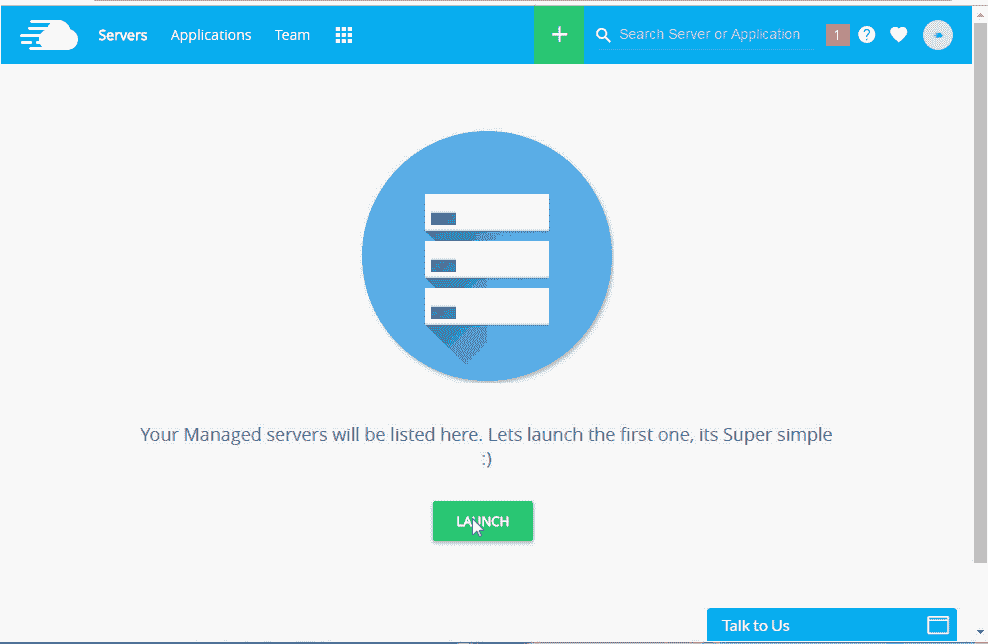

# 如何在云服务器上安装顶级 PHP 微框架

> 原文：<https://medium.com/hackernoon/how-to-install-top-php-micro-frameworks-on-a-cloud-server-2de5af00ca01>

在软件开发中，我们总是通过遵循标准的安全和开发规则，找到符合国际代码惯例的快速应用程序开发的方法。虽然我们有几个 PHP 开发框架，但是对于一个你必须在一天或几个小时内开发的应用程序，该怎么办呢？

答案在于微框架。

## 什么是微框架？

微框架是一个用于 web 应用程序框架的术语，通常来源于全栈框架。它们有助于创建发送和接收 HTTP 请求的应用程序，将 HTTP 请求路由到特定的控制器，并发送和返回控制器响应。它们通常用于为其他服务或工具创建 API 应用程序。

从不同的框架中衍生出许多微观框架。我们将分别讨论它们，以及如何在云服务器上轻松安装它们。

## 顶级 PHP 微框架

下面是我们将在本文中涉及的 PHP 微框架列表:

*   Silex
*   微小的
*   流明
*   子弹 PHP
*   柠檬酱
*   波浪框架

为了在云服务器上安装 Restful 微框架，我通过启动数字海洋服务器在 Cloudways 上制作了一个 PHP 应用服务器。

Cloudways 还提供了预装的 Composer，所以我们不需要安装它。启动应用程序后，移动到 public_html 文件夹，然后运行安装命令。

## Silex 微框架

Silex 是用 Symfony 组件和 Pimple 构建的 PHP 微框架。Silex 可以用来制作单页应用程序。Silex 有一个基于 Pimple micro 服务容器的扩展系统，使得它更容易与第三方库绑定。它使用 symfony HTTPKernel 来请求和响应 HTTP 请求。

## 装置

> composer 需要 silex/silex "~2.0 "

## 代码示例

只需定义一个控制器并将它们映射到路线

> 要求 _ 一次 __ 目录 _ _。'/../vendor/autoload . PHP '；
> 
> $ app = new Silex \ Application()；
> 
> $app->get('/hello/{name} '，function($name) use($app) {
> 
> 回复“你好”。$ app-> escape($ name)；
> 
> });
> 
> $ app-> run()；

## 纤细的骨架

Slim 是一个 PHP 微框架，可以帮助你快速编写简单而强大的 web 应用程序和 API。其核心是，Slim 是一个接收 HTTP 请求、调用适当的回调例程并返回 HTTP 响应的调度程序。一个 slim 应用程序包含不同的路由来响应特定的 HTTP 请求。首先，启动并配置 slim 应用程序，然后定义控制器路由，最后运行应用程序。

**安装**

> 作曲家要求苗条/苗条的“^3.0”

**代码示例**

> use \Psr\Http\Message\ServerRequestInterface as Request;
> 
> use \Psr\Http\Message\ResponseInterface as Response;
> 
> require ‘vendor/autoload.php’;
> 
> $app = new \Slim\App();
> 
> $app-> get('/hello/{name} ')，function(Request＄Request，Response＄Response){
> 
> $ name = $ request-> get attribute(' name ')；
> 
> $ response-> getBody()-> write(" Hello，$ name ")；
> 
> return $ response
> 
> });
> 
> $ app-> run()；

## 流明

Lumen 是 Laravel 创作者 Taylor Otwell 的一个新项目。Lumen 依赖于 laravel 基础并与其组件一起工作，但 lumen 是为微服务而构建的。Lumen 适用于能够从 Laravel 的便利和强大功能中获益的项目和组件，但是可以牺牲一些可配置性和灵活性来换取速度的提高。

## 装置

> //在项目文件夹中
> 
> composer 需要“laravel/lumen-installer”
> 
> //用于全局安装
> 
> composer global 需要“laravel/lumen-installer”

安装之后，您需要通过在 SSH 中运行命令来设置 lumen 的路径。

> 导出路径="$PATH:$HOME/vendor/bin "

## 代码示例

> /**
> 
> * Reimagine what you expect…
> 
> */
> 
> $app-> get('/'，function() {
> 
> return ['version' => '5.3']
> 
> });
> 
> /**
> 
> *从您的微框架…
> 
> */
> 
> $app->post('framework/{id} '，function($framework) {
> 
> $this->调度(新能源($框架))；
> 
> });
> 
> $app->get('api/users/{id} '，函数($id) {
> 
> //一些代码
> 
> });

## 子弹 PHP

Bullet PHP 是一个有用的微框架，用于创建自动确认 HTTP 请求的 REST API。Bullet 是面向资源和 URI 的，预装了强大的 HTTP 特性，如内容协商和缓存。Bullet PHP 中的应用程序是围绕 HTTP URI 和定义的路径构建的。它一次处理一个代码段，并为该代码段执行回调。

## 装置

> composer 需要 vlucas/bullet PHP

## 代码示例

> $ App = new Bullet \ App()；
> 
> $app->path('foo '，函数($request) use($app) {
> 
> 返回“foo”；
> 
> });
> 
> $app->path('bar '，函数($request) use($app) {
> 
> $foo = $app->run('GET '，' foo ')；// $foo 现在是一个“Bullet\Response”实例
> 
> 返回$foo->content()。“酒吧”；
> 
> });
> 
> echo $app->run('GET '，' bar ')；//具有 200 OK 状态的 echos 'foobar '

## 柠檬酱

Limonade 是一个用于快速 web 开发和原型制作的 PHP 微框架。它的灵感来自于框架，比如 Sinatra 或者 Ruby 中的 Camping，或者 Lua 中的 Orbit。它的目标是简单、轻便和极其灵活。

## 装置

> $ wget[https://github.com/sofadesign/limonade/archive/master.zip](https://github.com/sofadesign/limonade/archive/master.zip)

## 在 SSH 中解压缩文件夹

> $ unzip master.zip

## 示例代码

> require _ once ' vendors/limon ade . PHP '；
> 
> 分派('/'，'你好')；
> 
> 函数 hello()
> 
> {
> 
> 返回“你好，世界！”；
> 
> }
> 
> run()；

## 波浪框架

Wave 松散地建立在模型-视图-控制架构和工厂方法设计模式上，是为 web 服务、网站和信息系统而设计的。这个微框架是围绕原生 API 架构、缓存和智能图像和资源管理构建的。Wave 是一个紧凑的框架，不包括可选的库，占用空间很小，开发时考虑到了轻量级的速度和优化。

默认情况下，Wave 带有一个视图控制器和一个网关，用于具有干净 URL 的网站功能，还包含一个前端 JavaScript 控制器。

## 装置

> $ wget[https://github . com/kristovaher/Wave-Framework/archive/master . zip](https://github.com/kristovaher/Wave-Framework/archive/master.zip)

## 在 SSH 中解压缩文件夹

> $ unzip master.zip

## 代码示例

> $ API result = $ this-> API(' user-log in '，array('username'=>'bluth '，' password ' = > ' 123456 ')；
> 
> if($ this-> checktrue false($ API result)){
> 
> // API 调用成功
> 
> }否则{
> 
> // API 调用失败，原因可能是错误或失败响应代码
> 
> }

## 最后的话

既然您已经熟悉了在云主机上安装一些顶级 PHP 微框架，那么处理共享主机的麻烦就没有意义了。还有几个框架，像 Flight 和 success PHP 等。，您也可以在 Cloudways PHP 堆栈上尝试。

如果你对这篇文章有任何疑问或任何问题，请使用下面的评论区！

*原载于 2016 年 9 月 28 日*[*【www.cloudways.com*](https://www.cloudways.com/blog/install-php-microframeworks-on-cloud-server/)*。*

> [黑客中午](http://bit.ly/Hackernoon)是黑客如何开始他们的下午。我们是阿妹家庭的一员。我们现在[接受投稿](http://bit.ly/hackernoonsubmission)并乐意[讨论广告&赞助](mailto:partners@amipublications.com)机会。
> 
> 要了解更多信息，请阅读我们的“关于”页面、[在脸书](http://bit.ly/HackernoonFB)上给我们点赞/发消息，或者简单地发送 [tweet/DM @HackerNoon。](https://goo.gl/k7XYbx)
> 
> 如果你喜欢这个故事，我们推荐你阅读我们的[最新科技故事](http://bit.ly/hackernoonlatestt)和[趋势科技故事](https://hackernoon.com/trending)。直到下一次，不要把世界的现实想当然！