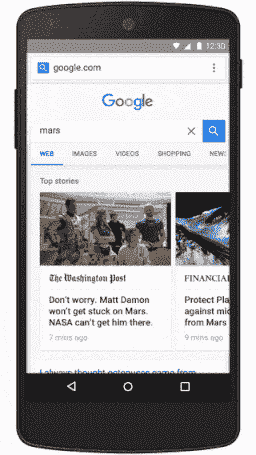
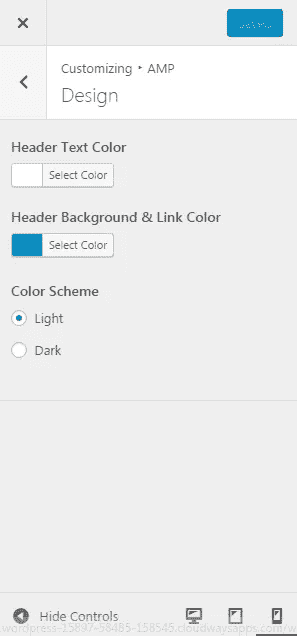

# 如何在 WordPress 中集成 AMP 并在 Google 搜索中显示

> 原文：<https://medium.com/hackernoon/how-to-integrate-amp-in-wordpress-and-display-it-in-google-searches-e1a6ee0e66c5>

今天是速度和可读性的时代。如果你不考虑这些事实，你就会落后。每个人都想在搜索引擎结果页面(SERP)中排名更高，相信我，有适当的指南和调整可以帮助你实现这一点。其中之一是加速移动网页(AMP ),这实际上是最近的热门话题。

## **什么是 AMP？**

这是一个开源项目[，由谷歌于 2015 年启动](https://googleblog.blogspot.com/2015/10/introducing-accelerated-mobile-pages.html)，旨在创建可以在任何地方即时加载的移动优化内容。

## **为什么是 AMP？**

根据 Marketingland 的说法，现在大部分数字增长来自于手机的使用。如今，智能技术代表了 65%的数字媒体时间，而桌面正成为越来越多的数字用户的第二接触点。

谷歌主动向移动用户提供优化的内容，可以以最快的方式加载。谷歌也开始在通过手机进行的谷歌搜索中提升 amp 整合网站，而不是无 AMP 网站。

**AMP 如何工作？**

AMP 将您的页面结构分为三个部分来提升您的网站:

*   AMP HTML: 这是一个新的重新设计的 HTML 版本，带有自定义 AMP 命令，可以删除任何额外的 HTML 元素。
*   AMP JS:JavaScript 的重新设计版本只允许异步脚本，这有助于以更快的方式加载 JS。
*   **AMP CDN:** AMP 内容由谷歌的内容交付网络进行缓存，这有助于从缓存中交付内容。

## **AMP 如何在谷歌搜索中显示？**

当访问者用手机在谷歌上搜索时，你的 AMP 页面就会显示出来。这是一个很棒的 GIF 图，展示了你的页面在 SERP 中的显示方式。

## 在 WordPress 上集成放大器

考虑到 AMP，Automattic 的重要性，WordPress.com 背后的机构主动让 AMP 与 WordPress 兼容，并发布了一个名为 [AMP](https://wordpress.org/plugins/amp/) 的插件。它可以很容易地在 WordPress.org 知识库中找到。

## **安装插件的步骤**

安装这个插件并没有什么特别的要求。

1.  登录你的 WordPress 管理仪表板。
2.  导航到**插件- >添加新的**。搜索**放大器**。
3.  安装并激活插件。

是的，你完了！

要测试您的 amp 版本帖子，请打开任何帖子并在 URL 的末尾附加“ **/amp** ”。

**比如:**如果你有一个网址【example.com/post1】的**的**，你的 AMP 网址应该像**的 example.com/post1/amp**

默认情况下，AMP 有自己的布局来显示 AMP 相关的帖子。但是您可以通过导航到**外观- >放大器**来对其进行一点定制。

## **限制:**

WordPress 上的 AMP 有一些需要考虑的限制。

1.  它只对帖子有效。
2.  目前不支持页面和归档。

今天，我只介绍了 WordPress 上的 AMP 和集成的概述。这里面有更多的深度。如果你想知道更多，这里有一篇关于 WordPress 上 [AMP 的很棒的文章。](https://teslathemes.com/blog/setting-up-wordpress-for-amp-accelerated-mobile-pages/)

> [黑客中午](http://bit.ly/Hackernoon)是黑客如何开始他们的下午。我们是阿妹家庭的一员。我们现在[接受投稿](http://bit.ly/hackernoonsubmission)并乐意[讨论广告&赞助](mailto:partners@amipublications.com)的机会。
> 
> 如果你喜欢这个故事，我们推荐你阅读我们的[最新科技故事](http://bit.ly/hackernoonlatestt)和[趋势科技故事](https://hackernoon.com/trending)。直到下一次，不要把世界的现实想当然！

