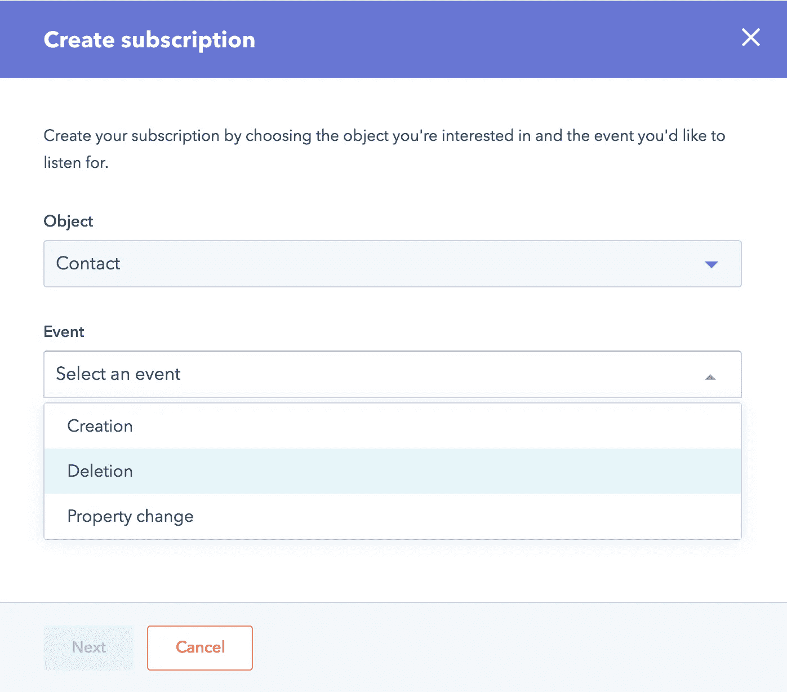
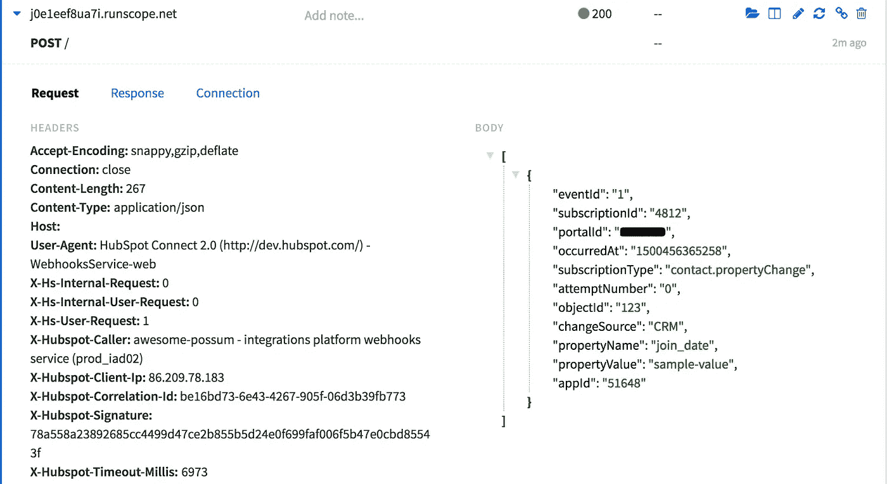
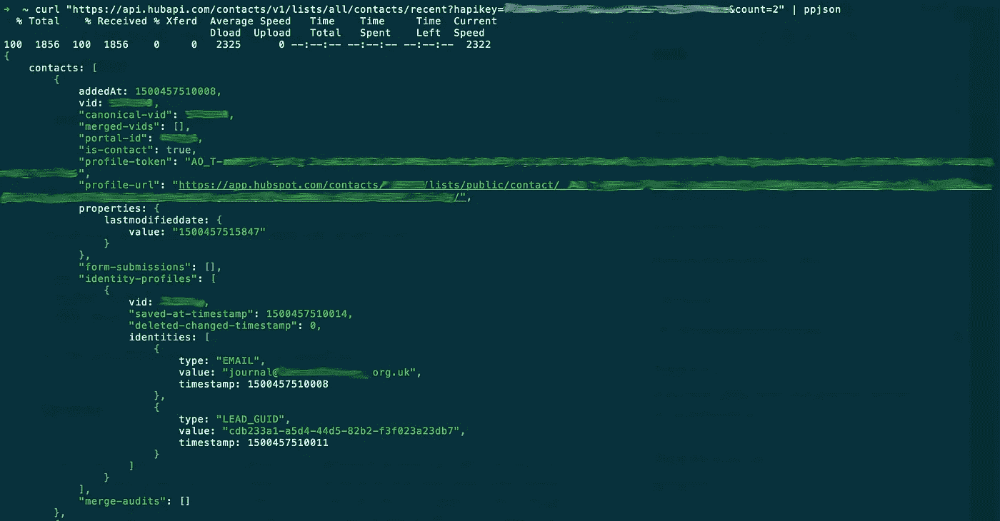

# 如何将 Hubspot 与任何东西集成，并构建自己的工具

> 原文：<https://medium.com/hackernoon/how-to-integrate-hubspot-with-anything-and-build-your-own-tools-da14d66eb75b>

## 将 Hubspot 与您的客户使用的其他任何东西集成，并使用原始 Hubspot 数据运行定制报告

仅在一年之内，[营销](https://hackernoon.com/tagged/marketing) [技术](https://hackernoon.com/tagged/technology)领域就增长了 40%，现在有多达 5000 多种解决方案可供选择。很可能你(和你的客户)已经在使用很多不同的营销工具，你必须在某个时候让他们互相合作。

如果你的客户是 Hubspot 的用户，你会得到很好的帮助，因为 Hubspot 提供了很多与其他工具集成的灵活性。这种集成可以通过三种方式实现，我将在本文中一一介绍。第三个选项(也是我认为最有趣的选项)让您可以完全访问客户 Hubspot 门户的所有数据和事件。

# 集成

首先要看的是[集成目录](https://www.hubspot.com/products/integrations)。您可能会找到您需要的集成:
—将 Hubspot 数据/事件导出到第三方软件中(例如，用于安排会议、生成发票或填充报告仪表板)
—从外部数据/事件(例如，从销售线索生成表单、客户支持平台或调查结果)更新您的 Hubspot 数据库
有时，现有的集成可能无法让您准确完成*您想要的任务，例如，无法导入您需要的所有数据字段或无法对某些事件做出响应。*

Hubspot’s CEO Brian Halligan presenting Hubspot Connect

# Webhooks

如果现有的集成都不能满足您的需求，Hubspot 提供的下一个选项是通过 webhooks 将事件推送到第三方应用程序。
有时也称为*反向 API* ，webhooks 是用户定义的对外部服务的 HTTP 回调，通常在预定义事件发生时触发。Hubspot 支持 webhooks 这一事实意味着，当您的 Hubspot 联系人、公司或交易之一发生事件时，您可以通过编程方式获得另一个营销工具的通知:
—联系人/公司/交易的属性发生变化
—创建新的联系人/公司/交易
—删除现有的联系人/公司/交易

Setup a webhook for when a contact is deleted

由于 webhooks 是由事件触发的，因此它们可以用于在另一个应用程序中启动外部工作流。
如果你想了解更多关于如何在 Hubspot 中设置 webhooks 的信息，我已经在这里写了相关内容[。
请注意，webhooks 也可以在 Hubspot 工作流程中设置，以便在联系人达到预定义状态时通知第三方软件。](/@getlionel/what-are-hubspot-webhooks-and-why-are-they-useful-a0caed6d09b6)

例如，webhooks 是启动 Zapier 任务的一个很好的方式，它可能反过来让你更新第三方软件中的数据。标准的 Zapier-Hubspot 集成非常有限，但是添加您自己的 webhooks 将会有所帮助。更多信息[点击这里](/@getlionel/how-to-connect-hubspot-and-zapier-b6ceaee9972f)。

A Hubspot webhook captured in Runscope.com for debugging

# 使用原始轮毂点数据

但是，如果你找不到你想要的集成，如果它缺乏特性，或者如果你想**为你的客户开发你自己的报告工具**，该怎么办呢？

Hubspot 允许您下载 CSV 或 XLS 格式的联系人、公司和交易文件，但是这些文件不包含实体的唯一标识符(id 见下)。这意味着:
—不保留关系(联系人属于哪家公司，交易与哪家公司相关联等)
—没有 id，您无法将您的更改同步回 Hubspot

因此，为了更深入地集成 Hubspot 数据，Hubspot 提供了一个全面的 API。API ( *应用编程接口*)是编程脚本插入的内容，用于将数据拉入/推出现有软件。
Hubspot API 是官方集成的基础，因为它的访问是公开的，所以你也可以创建自己的集成。

Hubspot API 设计得很好，用 JSON 格式化数据，并为一切提供端点:您在门户中看到的所有数据都可以通过编程访问。

A JSON payload of the last created Hubspot contacts

那么它能用来做什么呢？它可以帮助解决的一个业务问题是对 Hubspot 数据进行定制查询。如果您需要同时基于联系人/公司/交易/所有者和任务属性创建列表，唯一的方法就是与 Hubspot API 接口。销售模块中的列表工具仅允许您查询一个给定属性的属性。
营销模块允许通过工作流进行更强大的细分，但是基于任务的查询不可用。
如果您希望根据每个公司的计划任务轮换销售线索，门户网站不支持。

> 我想要一份我的所有联系人的列表，这些联系人在 100 多天前最后一次被呼叫，交易价值超过 1，000，并且在接下来的 2 周内没有相关的任务计划。

为了满足这样的业务需求，可以将 Hubspot 的所有数据导入到传统数据库中，这种数据库允许使用 SQL 等标准查询语言，可以基于任何内容编写查询。
使用 API 需要 2 个步骤:
—一次初始数据转储，确保包含所有自定义字段
—通过设置 webhooks 或拉取最新修改/创建的联系人/公司/交易来持续更新数据库。

有了足够的 SQL 知识，您可以在几秒钟内根据最复杂的标准创建列表，并生成任何报告。由于您已经保存了 id，您可以再次使用 API 将复制数据库中的任何更新(属性或关联)同步回 Hubspot。

例如，您可以:
—固定联系人-公司关联(我使用的一个数据库有数千个联系人，带有*公司名称*字段，但没有关联的公司， 该链接已在一个请求中恢复)
—查找重复公司
—仅针对没有计划任务的公司轮换销售线索
—在 Zapier 而不是 Hubspot 工作流中查找联系人/查找公司/电子邮件联系人
—创建涉及任务或呼叫的提醒(例如基于数量变化)
—为您的客户设置白标报告
—基于第三方软件的销售线索活动对销售线索进行细分和评分
—向您的销售线索发送定制调查

An SQL query showing companies in Lead lifecycle stage with no task planned either on the company or any of its associated contacts

您还可以从其他营销工具导入数据，并将其合并到同一个数据库中，以创建多源查询和报告。另一个软件中的任何数据都可以用来增强您的 Hubspot 数据库，就像 Wistia integration 让您可以根据线索查看使用情况更新您的线索得分一样。可能性是无限的。

不是每个营销工具都会让你这么做。有了 Hubspot 的 API，很高兴知道你永远不会被卡住。如果您担心您的特定需求可能会超出 Hubspot 列表和工作流当前的功能，您总是可以通过接口 API 来扩展它。

想让我知道这些技术是如何帮助我的客户每年节省 19 万英镑的吗？喜欢这篇文章并在 [LinkedIn](https://linkedin.com/in/martinlionel) 上给我留言！

*莱昂内尔是总部位于伦敦的初创公司 Wi5 的首席技术官，也是《面向未来的工程文化课程* *的作者。你可以在*【https://getlionel.com】*上联系他*