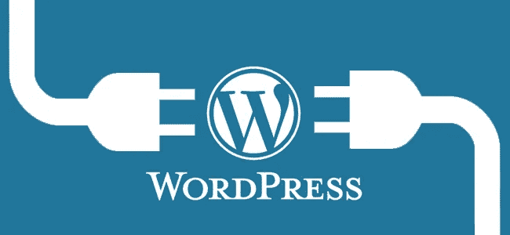
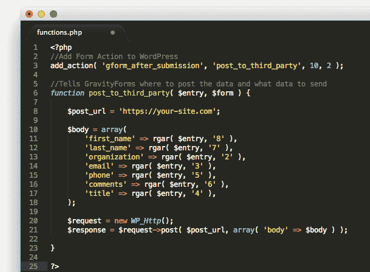
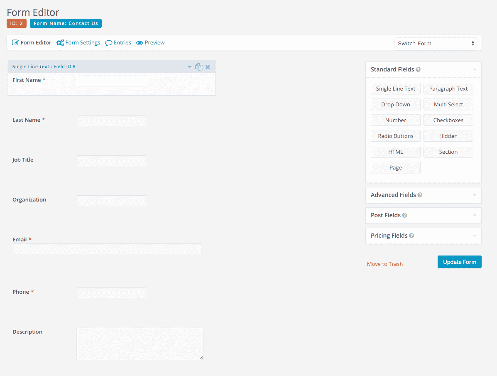

# 如何将 WordPress 表单集成到 FileMaker 应用程序中

> 原文：<https://medium.com/hackernoon/how-to-integrate-wordpress-forms-into-the-filemaker-application-c8118a3272d4>

对于任何商业专业人士来说，提交表单是改善公司及其网站的关键组成部分。从有机会创造新的客户，与客户讨论技术问题，并获得如何改进产品的反馈，这些形式可以极大地影响企业的成功，并为消费者和企业提供一种易于使用的联系方式。

然而，在管理内容时，混乱和不适当的数据处理可能会导致客户填写表单，却永远收不到回复。虽然使用你的个人电子邮件甚至团队电子邮件可能是一种常见的做法，但这可能会导致提交的表格淹没在你作为企业收到的电子邮件的海洋中，并且永远不会被你或你的团队解决，从而导致客户感觉被忽视或不重要。

最重要的是，由于被迫将数据从电子邮件传输到应用程序，而不是完全绕过电子邮件，您可能会丢失这些数据，或者在此过程中被黑客窃取并向黑客提供您的客户信息。事实上，在移动数据时，您可能会在眨眼之间丢失这些数据，尽管有大量的[数据恢复服务](https://www.krollontrack.com/services/data-recovery/)可以帮助您检索这些数据，但这进一步证明了将这些表格传输到您的安全 FileMaker 应用程序可以确保您的客户和您的公司的安全。因此，您可以将这些提交内容连接到您的电子邮件，而不是连接到您的 FileMaker 应用程序，这样就能够相应地管理它们，并确保每一个提交内容都得到及时的回复，并在必要时存档以备后用。除此之外，您还可以学习如何创建一个有效的办公室头脑风暴平台，并在分析数据以进行改进时将这些表单提交考虑在内。

为了将 WordPress 表单放到你的 FileMaker 仪表板中，你必须首先决定你打算使用什么样的 WordPress 表单。对于本教程，我们将使用 Gravity Forms，因为它是寻找易于编辑选择的个人的最佳选择，因为它的 WYSIWIG 界面允许用户在实际内容出现在网站上之前就将其可视化，而不是依赖自定义代码来实现他们想要的形式。我们还将使用 PHP 代码来命令 WordPress 将表单提交发送到我们的 FileMaker 应用程序，而不是电子邮件。

要做到这一点，您需要告诉 WordPress 将帖子发送给第三方，并在表单提交后使用第 3 行的代码来完成:

**add _ action(' g form _ after _ submission '，' post_to_third_party '，10，2)；**

第 6 行的代码:

***功能*post _ to _ third _ party(＄entry，＄form){**

从那里，在函数 post_to_third_party 中，您可以定义一个站点来发送第 8 行中的数据，使用:

**$post_url= 'https://(插入您网站的名称)。com’；**

一旦完成并插入您的站点，您就可以为正文创建一个数组，其中包含您希望包含的任何内容，包括他们的姓名、电子邮件、电话和评论。完成后，表单的代码将如下所示:

一旦完成，您的表单将准备好通过 HTTP post 发送到您的站点，然后 Gravity Forms 将向您发送一个状态，让您知道表单已完成。该表单最终看起来如下图所示，并将利用 FileMaker PHP API 将数据放入您的 FileMaker 仪表板中，这样一旦收到数据，就不需要将数据输入 FileMaker。

最后，这样做的主要好处是，不仅能够确保正确接收和管理客户的个人信息，而且能够防止数据入侵。随着过去几年对电子邮件帐户的攻击越来越多，利用第三方提交包括电子邮件、电话号码、姓名和职业等内容的表单可以确保，即使您被入侵，您客户的数据仍然是安全的。最重要的是，有了 [FileMaker 15 安全增强功能](https://dbservices.com/articles/filemaker-15-security-enhancements/)，您可以放心，您的 FileMaker 应用程序比您的电子邮件的薄弱安全性要安全得多，并确保您的所有团队及时提交表单，并在此过程中以有效的方式保持联系。

> [黑客中午](http://bit.ly/Hackernoon)是黑客如何开始他们的下午。我们是 [@AMI](http://bit.ly/atAMIatAMI) 家庭的一员。我们现在[接受投稿](http://bit.ly/hackernoonsubmission)并乐意[讨论广告&赞助](mailto:partners@amipublications.com)机会。
> 
> 如果你喜欢这个故事，我们推荐你阅读我们的[最新科技故事](http://bit.ly/hackernoonlatestt)和[趋势科技故事](https://hackernoon.com/trending)。直到下一次，不要把世界的现实想当然！

