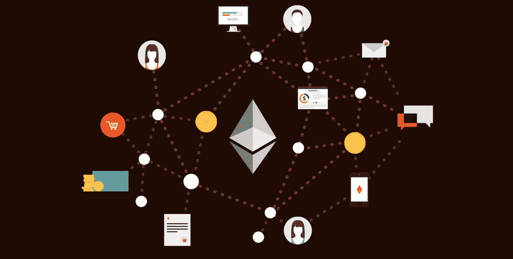
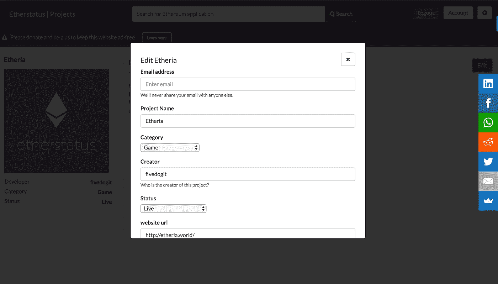

# 保持最大的以太坊应用数据库最新。

> 原文：<https://medium.com/hackernoon/how-to-keep-the-largest-ethereum-app-database-up-to-date-b7ef04f715f6>

## Etherstatus 推送大更新，收集信息更快更可靠。

上周我报道了以太坊的[状态，概述了超过 400 个](https://hackernoon.com/these-projects-are-going-to-make-or-break-ethereum-eaaf1b0463b6)[以太坊](https://hackernoon.com/tagged/ethereum)项目最突出的类别和状态。保持所有这些项目与时俱进是一项艰巨的任务，对一个人来说无疑是太多的工作了。

这就是为什么今天我们开放网站让任何人添加以太坊项目或编辑现有项目。

**它是如何工作的？**

Etherstatus 正在与一个信任系统合作，在这个系统中，每个用户从零开始，并且能够创建编辑(对以太坊项目的修改)。但是，这些编辑需要得到具有更高信任级别的用户的确认(对于您提交的每个成功的编辑，您都会获得信任)。

Editing projects with a single click

一旦你达到一定程度的信任，你也可以添加项目到[数据库](https://hackernoon.com/tagged/database)并监控较低级别用户的变化。整个系统的设计是为了保护数据库，保持整个网站的透明和独立(维基百科风格)。

**基于奖励的编辑**

该网站仍将基于捐赠。支付开发成本后，所有剩余部分将归实际编辑或创建项目的用户所有。如果累计捐赠金额太低，我们可能不得不转向广告。

Etherstatus 的下一阶段将完成公共 API，这意味着第三方网站可以实现 Etherstatus 数据库。

如果你对这些月度报告或 API 感兴趣，请加入我在 http://eepurl.com/cNVHxT 的邮件列表，

欢迎捐款:[0xe 139 aa 506614 E0 fac 30222 B3 af 55 DCE 0 ed 521 ea 7](https://etherscan.io/address/0xe139aa506614e0fac30222b3af55dce0ed521ea)

也可以联系 marc@etherstat.us

马克·塔伦
[etherstatus.com](http://www.etherstatus.com)
[twitter.com/MarcThalen](https://twitter.com/MarcThalen)
[以太斯塔](http://www.etherstatus.com)us.com 捐款:[0xe 139 aa 506614 E0 fac 30222 B3 af 55 DC E0 ed 521 ea 7](https://etherscan.io/address/0xe139aa506614e0fac30222b3af55dce0ed521ea)

> [黑客中午](http://bit.ly/Hackernoon)是黑客如何开始他们的下午。我们是阿妹家庭的一员。我们现在[接受投稿](http://bit.ly/hackernoonsubmission)并乐意[讨论广告&赞助](mailto:partners@amipublications.com)机会。
> 
> 如果你喜欢这个故事，我们推荐你阅读我们的[最新科技故事](http://bit.ly/hackernoonlatestt)和[趋势科技故事](https://hackernoon.com/trending)。直到下一次，不要把世界的现实想当然！

