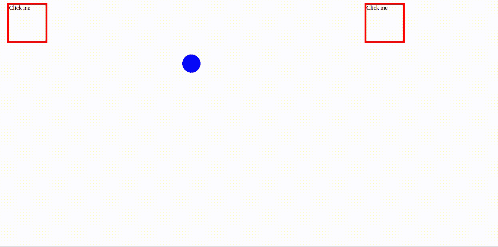
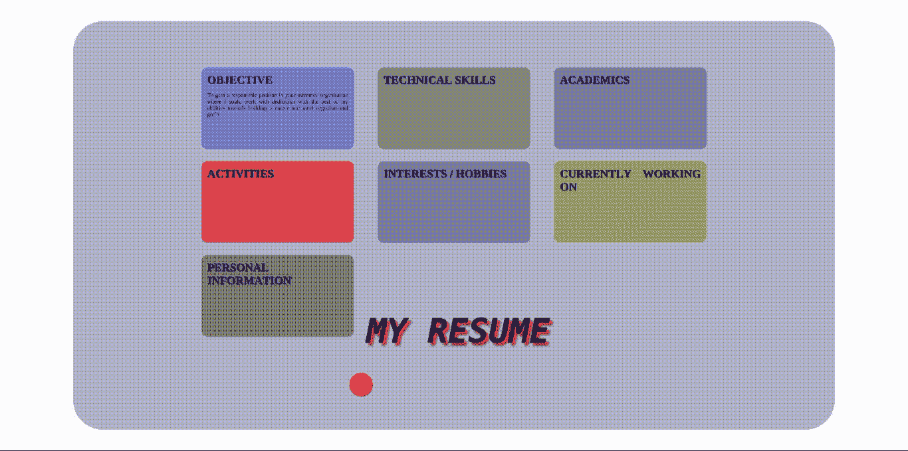

# 如何知道编程是否适合你

> 原文：<https://medium.com/hackernoon/how-to-know-if-programming-is-your-cup-of-tea-94c4b1391a>

> 也发表在我的科技博客

我已经在[创业公司](https://hackernoon.com/tagged/startups)工作两年了。当我回头看时，它似乎是不真实的。两年前，当我还在上大学的时候，如果有人告诉我，我会被录用，我会欣喜若狂——这就是我在学术上有多糟糕。

在大学里，我发现大多数计算机科学课程都很枯燥。我的意思是，当然，他们中很少有人感兴趣。但是它们都不够有趣，不能让我长时间保持忙碌。c？天啊，学习指针真是一场噩梦。关系数据库？起哄！Visual C？呸，所有的代码只是为了渲染一些蹩脚的房子？我可以画得更好！Java？咩。

> 我能在笔记本上看《老友记》吗？太好玩了！

在工程学的前三年，我对这些学科的感觉差不多就是这样。正如你可能已经猜到的，我的成绩被搞砸了，很糟糕(然而，在我的辩护中，我确实喜欢 Unix 和操作系统这样的科目！).

但是当你周围的人都是在学术上很棒的人，或者是编程极客，或者是 A 和 B 都是。让你担心。这让你担心你可能永远找不到工作，即使你找到了，你也很可能得到一份糟糕的工作。我只能怪自己。作为一个仍在思考该做什么的人，编程的世界不仅让我着迷，也让我害怕。我该从哪里开始呢？我该怎么办？编程似乎很难。我会喜欢吗？如果人们一直说这很容易，那是不是意味着我就是个笨蛋？

正是在这个时候，JavaScript 席卷了整个世界；人们已经开始探索，看看它能提供什么。我们工科最后一年有 Web 编程，于是我开始读 HTML5，JS，CSS3。在大量的谷歌搜索和学习编程教程中的一些例子之后，很快我就可以写一个小程序来完成这个任务

这很容易做到——在 CSS3 中为具有位置属性的球体定义类，并为它们定义转换。然后使用 JavaScript 中的 *onclick* 事件处理程序，在单击其中一个框时更改球体的类名，瞧，您得到了一个漂亮的球体，它会按照您的指示移动！

当我看到那个蓝色的小球在移动时，这就是我的感受—

*   这太酷了。这远没有我想象的那么复杂！
*   整个程序用了不到 20 行代码
*   当我写 C 或 Perl 代码时，使用 *vi* 在某个黑屏上写东西，并在一个他们称为*终端*的黑屏上再次看到输出，这当然不会令人厌烦

我迷上了，并开始学习越来越多。很快，我从移动蓝色球体的简单程序发展到使用 HTML5、CSS3 和 JavaScript 写我的简历

[impress.js](http://impress.github.io/impress.js/#/bored) is really impressive!

我知道那时候这仍然是相当业余的东西，但我不在乎。我第一次知道编程确实是我的强项，如果我没有用 JavaScript 编写第一个程序，这是不可能的。

现在有许多人从 C++或 Java 开始，热爱它，并且仍然在使用它编写软件。但不是所有人都是那样的。帖子——“[一个人不仅仅是学习编码](https://medium.freecodecamp.com/one-does-not-simply-learn-to-code-f25bacdc5b62#.s4oo793ws)”非常有意义。许多人甚至没有试水就放弃了，那些试水的人——他们后来放弃了，因为水对他们来说太深了。他们最终认为编程不适合他们。

我的第一门编程语言是 JavaScript 是一门引起编程社区强烈反应的语言——人们要么喜欢它，要么讨厌它。但是我认为你应该选择它作为你的第一语言。

JavaScript 不是评判性的。它不会强迫你在编写第一个 Hello World 程序之前学习一打概念。你甚至不需要声明数据类型。您可以在终端上执行 JavaScript 代码，或者如果您不喜欢终端，您可以在 web 浏览器中使用开发人员控制台，或者您可以将其嵌入到 HTML 页面中，并在浏览器中查看输出。它允许你进行函数式编程和面向对象编程。

我终于在一家初创公司找到了一份前端开发人员的工作。事实证明，它充当了学习进一步编程概念的某种“门户”。以前听起来很无聊的事情，现在对我来说听起来很有趣。很快我就从前端转向了全栈——我开始喜欢架构数据库(非 SQL 数据库，如 Cassandra 和 MongoDB ),用 NodeJS 和 Golang 编写 RESTful APIs，为客户端使用 ReactJS，甚至在 Github 上启动了一个[开源项目](https://github.com/booleanhunter/ReactJS-AdminLTE)。

我不打算在这篇文章中“推广”JavaScript 我很清楚它的[怪癖](https://arielelkin.github.io/articles/why-im-not-a-react-native-developer)。但是我们浪费了太多的时间——几小时、几天，甚至几个月，试图弄清楚编程是否适合我们，做我们不想做的事情。我们宁愿退出，选择不做，因为学习东西可能是一件痛苦的事情。在这种时候，拥有一个使用起来不费吹灰之力且对初学者友好的工具或方法会非常有帮助。所以在你开始学习之前，记住这些要点会帮助你管理你的期望-

*   每种语言都有它的缺陷，这种语言也不例外。JS 很好学，但是需要一段时间才能掌握；所以，不要想当然地认为你会在一周内成为某种“忍者”或“摇滚明星”。
*   要明白，你一开始写的东西大多会被其他程序员认为是“垃圾”。不要放弃。当你开始学习的时候，写一些糟糕的代码是可以的。但是如果你发现你喜欢它，那么你*不要*写低劣的代码是非常重要的。
*   缩进很重要。它帮助你避免错误，也确保你的代码在别人看到的时候不会看起来像一大堆呕吐物。

> “好吧。我从哪里开始？”

强烈推荐从这里开始——[从零到前端英雄(上)](https://medium.freecodecamp.com/from-zero-to-front-end-hero-part-1-7d4f7f0bff02#.d4j59lfic)。这很酷，我希望当我开始我的旅程时有这个教程。

这将足以帮助你开始。还有大约一百万件事情需要记住，但是你不需要知道所有的事情——至少一开始不需要。重要的是要知道在可预见的未来你是否会喜欢这样做——越早实现越好。

所以，来一次信念的飞跃吧。谁知道呢，也许你真的会喜欢它！如果你磨练自己的技艺并努力工作，你可能会发现自己扮演了一生中的角色。

> 喜欢你读的书吗？你应该 [*订阅*](https://forum.booleanhunter.com/) *。我不会浪费你的时间。*

你也可以在我的科技博客中阅读这篇文章！

## **感谢您的阅读。如果你是一个初学者，并且你有兴趣知道我是如何编写这些程序的，请随时查看我在 Github 上的******！****

************

> **[黑客中午](http://bit.ly/Hackernoon)是黑客如何开始他们的下午。我们是 [@AMI](http://bit.ly/atAMIatAMI) 家庭的一员。我们现在[接受投稿](http://bit.ly/hackernoonsubmission)，并乐意[讨论广告&赞助](mailto:partners@amipublications.com)机会。**
> 
> **如果你喜欢这个故事，我们推荐你阅读我们的[最新科技故事](http://bit.ly/hackernoonlatestt)和[趋势科技故事](https://hackernoon.com/trending)。直到下一次，不要把世界的现实想当然！**

****