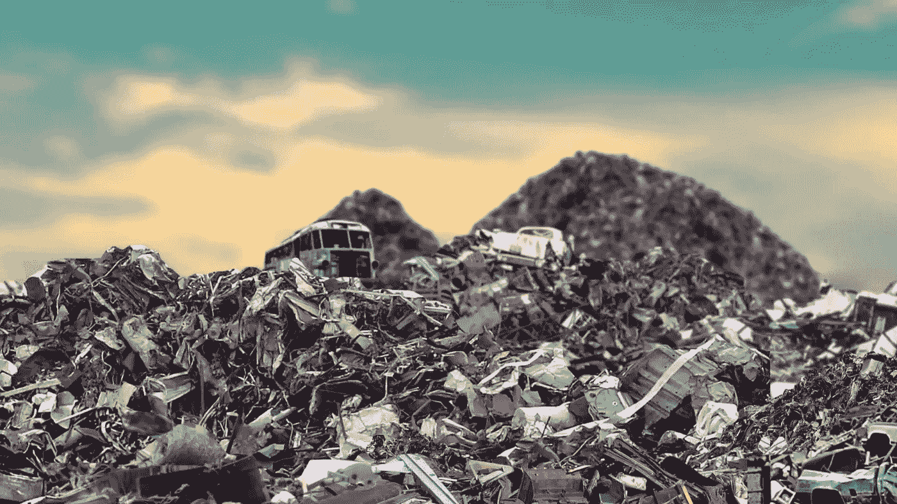

# 如何知道你买的是不是加密货币垃圾

> 原文：<https://medium.com/hackernoon/how-to-know-if-youre-buying-cryptocurrency-junk-f03f2a49c3c>

我们购买加密货币，期望它们在某个时候升值。

然而，99%的加密货币是垃圾，如果不是更多的话。

垃圾，意味着它们的价值在未来会显著降低，如果在某个时候不是 0。

**没有锁定期。**如果人们第一天就拿到工资，那会大大降低交付项目的动力。

**募集金额无上限。**项目融资越多，项目增值的可能性越小。这种结构不利于向投资者回报价值。

**没有工程队。**超级技术空间。创始人需要懂技术。

**谁是合理的客户。**这个项目怎么赚钱？真实世界的应用是什么？目前有没有非区块链对等词？有业务用例吗？这是在解决消费者当前的问题吗？