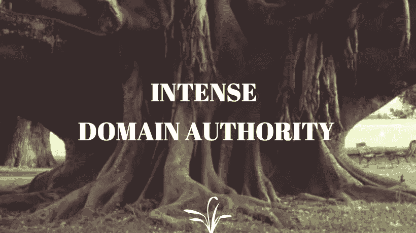
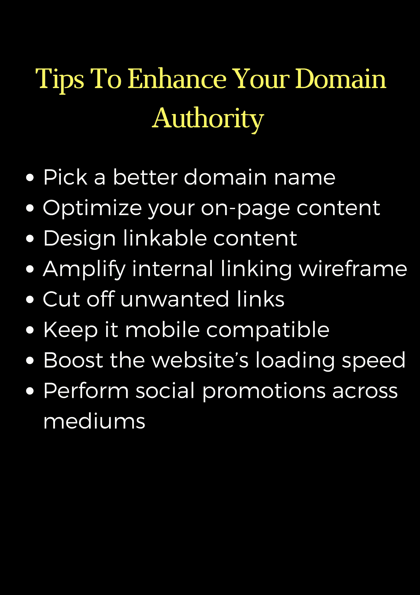
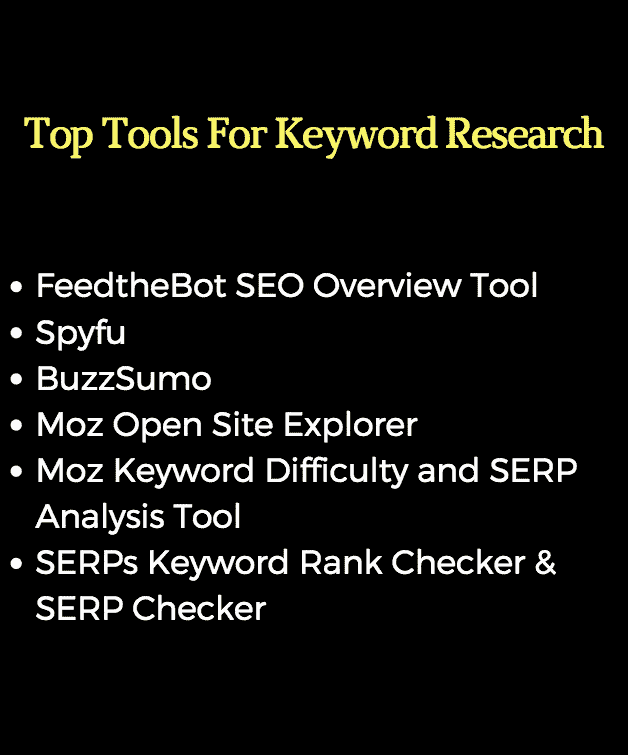

# 如何合法地从竞争对手那里窃取网络流量

> 原文：<https://medium.com/hackernoon/how-to-lawfully-steal-web-traffic-from-competitors-18b8841b2b31>

Steal Web Traffic

要将更多的用户转化为顾客，一个网站得有****的访客流量*** 。如果你没有时间坐下来，等待有机交通，你可能会想到从你的竞争对手那里窃取它。*

# *想想这个…*

**

*A missing cake analogy :P*

*有没有为深夜的渴望攒下一块**蛋糕**就？后来才发现它不见了。*

***悲 s**t！***

*在我身上发生过无数次。*

*但实际上，那块蛋糕从来就不属于你。最早利用它的人可以享受所有的奶酪。*

*是啊！我也有点流口水了…*

*嗯，前面提到的**蛋糕假说**是你和竞争对手的 **SEO 大战**的类比。出现在任何搜索引擎的首页(最好是最抢手的**谷歌**搜索引擎)。*

*不，不是笑。*

*为了帮助你摆脱这种疯狂，我在这篇博客中解释了 **3 种更强的方法**，你可以用它们将竞争对手的网络流量转移到你的网站/网页上。*

> *严格来说是合法途径。*

# *#Hack1 —增强您的域名权威*

**

*Enhance Your Domain Authority*

*决定网站搜索引擎排名的一个重要因素是域名权威。*

> *“MOZ 开发的一种度量标准”*

*有了**最高域权限**，一个网站就能出现在搜索引擎排名的顶端。从本质上来说，域权限的范围是从 **1 到 100** (1 是最差的 DA 分数，一直到 100 是最好的 DA 分数)。*

> *在为任何网页生成域权限分数之前，Moz 会寻找 40 个不同的元素。*

*一些最重要的因素是，*

*   *MozRank —寻找反向链接的数量，更关注这些反向链接的质量。*
*   ***MozTrust** —分析您的反向链接与可信网站的密切程度。*
*   ***优质内容** —扫描您网站内容的质量。*
*   ***社交信号** —将你在社交媒体上分享最多的内容(可能分享了 100 次)视为可信内容。它像病毒一样传播，而其他人没有，这肯定是有原因的。*
*   ***搜索引擎友好度** —分析你的网站结构，查看你网站的 UX/CX。*

**

*Enhance Your Domain Authority*

# *#Hack2 —瞄准竞争对手的关键词*

**

*Target Your Competitors’ Keywords*

*不要烦恼。*

*天哪！谷歌和让我们来做这件事。所以。*

> *但是，**脸书**还不允许我们开展直接针对竞争对手粉丝页面的活动。唉！*

*嗯，了解和定位竞争对手的关键词使用通常是在所有的数字广告平台上进行的。尽管瞄准竞争对手是我们可以使用的低级伎俩之一，但几乎每个企业都在这么做。一个很好的理由是，为了更快达到高度并保持更长时间，必须执行一些**黑帽子戏法**。*

*由于**谷歌**非常聪明地识别一个网站是否代表一个特定的身份，它可以很容易地找出原始查询。因此，如果你使用任何黑帽的伎俩，你的广告可能会表现不佳。*

*但是，让我们用更聪明的方式做正确的事情。以下是一些正在使用的**关键词劫持**。*

**

*Target Your Competitor’s Keywords*

# *# hack 3——变得极具影响力*

**

> *“你们都具备成为影响者的条件”*

*但是为什么还没有进步呢？唯一的原因可能是，你放弃得太早了！*

> *与你的观众建立亲和力从来都不是一项一夜成名的运动。*
> 
> *不是一个古怪的猫视频，你看:P*

*它需要不断地致力于产生可操作的/引人注目的内容。因此，作为第一步，发布一些**教育内容**，开始你的内容战略。当你看到一大群热情的读者定期访问你的网站时，那就发布一些强大的**行为诱导内容**。Btw **，这两种**的博客**很容易区分。***

*从历史上看，用户在大多数时候使用口碑购买科学。继续这种做法，现在他们通过一个随意的电话或交叉检查各种门户网站上的产品评论来接受建议。同样，我们需要意识到网络用户已经发生了很大的变化，并且正在使用终极决策原则来支持他们更新的**偏好**。*

> *你越吸引他们，他们就越有可能考虑你。*

*也许，让正确的受众看到的唯一方法是逗留在你的用户花费大部分时间的地方。通过正确定位你的业务，帮助用户满足他们的需求，你可以成为一个有影响力的人。*

## *如何成为有影响力的人？*

*   *增加社会证据*
*   *始终如一，对你的工作负责*
*   *与你的追随者产生共鸣*
*   *持有权威的声音(不要过分)*
*   *使用 **FOMO** 来调谐它们*
*   *为你的领域选择正确的主题*
*   *随处可用(尝试客座博文)*

**

*Become Highly Influential*

*嘿，我正在打盹。*

**

*让我们在下一篇博客中学习一些更扣人心弦的成长秘诀。*

# *再见:)*