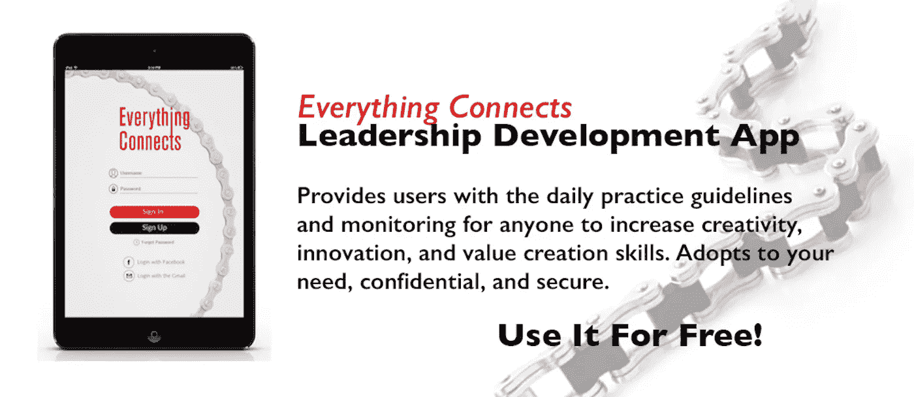

# 如何度过不确定的时期

> 原文：<https://medium.com/hackernoon/how-to-lead-through-uncertain-times-4e5dc6971c4c>

[Image: unsplash user [Taylor Nicole](https://unsplash.com/@taynicole0630)]

这里有三条来自英国退出欧盟(以及当前美国总统竞选)的重要领导力提醒，可以立即应用到我们的任何组织中(不管我们的政治信仰或党派)。

当英国人民投票决定脱离欧盟时，我正在伦敦出差。

世界似乎越来越变得不可预测和不确定。

那些投票支持英国退出欧盟的人希望重获民主主权，从日渐衰弱的欧洲计划中解脱出来。

在思考投票结果的震惊时，我最担心的是他们社会的分裂性。

许多年长的欧洲人认为这是将年轻人从欧洲的暴政中“拯救”出来，而年轻人则看到了欧洲拓宽他们视野的潜力。进步和富裕的伦敦人自然视自己为欧洲人，而其他英格兰人对此不寒而栗。苏格兰人希望保持与欧洲的联系，这样他们就能从联合王国的牢笼中自由飞翔。几十年来，这些分歧一直被掩盖，但这次公投让它们变得非常清晰。

[哈佛商学院高级研究员、美敦力前董事长&首席执行官比尔·乔治](http://www.billgeorge.org/)在最近的[文章](http://www.billgeorge.org/page/fortune-5-lessons-business-leaders-can-learn-from-brexit)中写道:

“美国面临着类似的问题:工人阶级的愤怒，对联邦政府的敌意，以及将问题归咎于“其他人”——拉美裔人、穆斯林、非裔美国人和中国——的愿望。这些情绪转化为对移民、全球化、自由贸易和技术的恐惧——所有这些主题都助长了对政府和体制的不信任。”

无论你是在管理一个国家还是管理一个团队，如果你不能让人们达成一致，试图就任何决定达成共识实际上是不可能的。

> “分歧导致分歧，分歧导致不和谐。”

尤其是对于商界领袖来说，这种状况应该迅速得到解决。然而，仍然有许多公司的恐怖故事，那些当权者已经失去了与他们的人民或他们的客户的联系，并付出了最终的代价。分了，必然会跌。

当外部力量分裂一家公司或一个团队时，领导者必须采取行动来弥合裂痕，并找到一些共同点。以下是来自英国退出欧盟(以及我们当前的美国总统竞选)的三个关键领导力提醒，可以立即应用于我们的任何组织(无论我们的政治信仰或党派如何):

## 接受冲突是不可避免的

我们生活在一个复杂的世界里。重要的是要认识到:

*   我们都是复杂系统的一部分
*   没有人能控制一个复杂的系统
*   分裂是任何复杂系统的自然组成部分
*   复杂性不能归结为原话

> "成功在于首先接受，然后处理复杂的情况."

这就是欧盟委员会主席让-克洛德·容克在英国退出欧盟投票后所说的，“欧洲不仅仅是一件理智的事情。显然，我们必须思考，但同样，当你悲伤时，悲伤是可以接受的，在英国的这次投票后，我感到悲伤，我并不掩饰这一点。可以说，英国的投票切断了我们的一只翅膀，但我们仍在飞翔。”

当没有参与时，强烈的观点有变成极端观点的风险——当我们不想理解“另一方”的本质时，妥协变得越来越困难。

冲突的产生是有原因的，尽管掩盖这些原因更容易，但拉近人们距离的唯一方法是谈论他们所关心的问题。

## 冷静的头脑会占上风

从我们的历史开始，“他们和我们”现象就主导了我们的自然选择。智人成为主导物种，技术先进的国家接管了全球，强大的公司成为社会经济趋势的驱动力。当我们需要解决分歧时，重要的是不要给那些分歧贴上对错的标签——重要的是让人们尽可能地彼此靠近。

这种亲密感来自于通过包容找到共同的身份和目标。

正如英国董事学会总干事[西蒙·沃克](http://next.ft.com/content/44a18eee-39e9-11e6-9a05-82a9b15a8ee7)所说，“这不是英国商界想要的结果，但既然这个国家已经投票脱离欧盟，我们的领导人必须尽可能平稳地管理过渡。经济和政治动荡将不可避免。重要的是，在与欧盟建立新关系的同时，政府应专注于恢复稳定。”

我们的共性经常淹没在分歧中——如果来自广泛人群的意见被接受并以开放的心态进行辩论，分歧通常会自动愈合。

> “让人们朝同一个方向看从来都不容易，但如果他们被排除在辩论之外，那就不可能了。”

## 积极的激励是无可替代的

最成功的领导者能够激励和影响每个人:他们的管理团队、员工、顾客、客户、合作伙伴、投资者和其他许多人，不管情况如何。

没有清晰的交流，灵感就不会产生。这种沟通方式不仅意味着清晰地表达你的信息，还意味着积极倾听——不带偏见或判断，真正愿意考虑不同的观点。这是关于尊重和准确地交换信息，而不仅仅是传递信息。注意他们的事实和情感内容是更好的相互理解。

成功会迅速膨胀自我，导致领导的孤立和对他人的持续生存和发展能力至关重要的人的疏远。如果不能用有意识的同理心激励他人，最优秀、最聪明的人将会被推翻。

> “需要一个充满希望的人，以积极、诚实、向前看的态度来激励和影响参与建设和发展企业和社区的人。”

版权所有 2014 年由费萨尔霍克。保留所有权利。

[图片:unsplash 用户[泰勒妮可](https://unsplash.com/@taynicole0630)

…..

我是一名[企业家兼作家](http://faisalhoque.com/speaking/)。 [SHADOKA](http://shadoka.com/) 等公司创始人。Shadoka 促进企业家精神、增长和社会影响。《万物互联——如何在创意、创新和可持续发展的时代进行变革和领导》(麦格劳·希尔，2014 年)和《 [*生存并茁壮成长:弹性企业家、创新者和领导者的 27 种实践*](http://survivetothrive.pub/) 》(励志出版社，2015 年)的作者。在推特上关注我 [@faisal_hoque](http://twitter.com/faisal_hoque) 。

*免费使用* [*万物互联领导 app*](http://app.everythingconnectsthebook.com/login.php)*。*

> [黑客中午](http://bit.ly/Hackernoon)是黑客如何开始他们的下午。我们是 [@AMI](http://bit.ly/atAMIatAMI) 家庭的一员。我们现在[接受投稿](http://bit.ly/hackernoonsubmission)，并乐意[讨论广告&赞助](mailto:partners@amipublications.com)机会。
> 
> 如果你喜欢这个故事，我们推荐你阅读我们的[最新科技故事](http://bit.ly/hackernoonlatestt)和[趋势科技故事](https://hackernoon.com/trending)。直到下一次，不要把世界的现实想当然！

