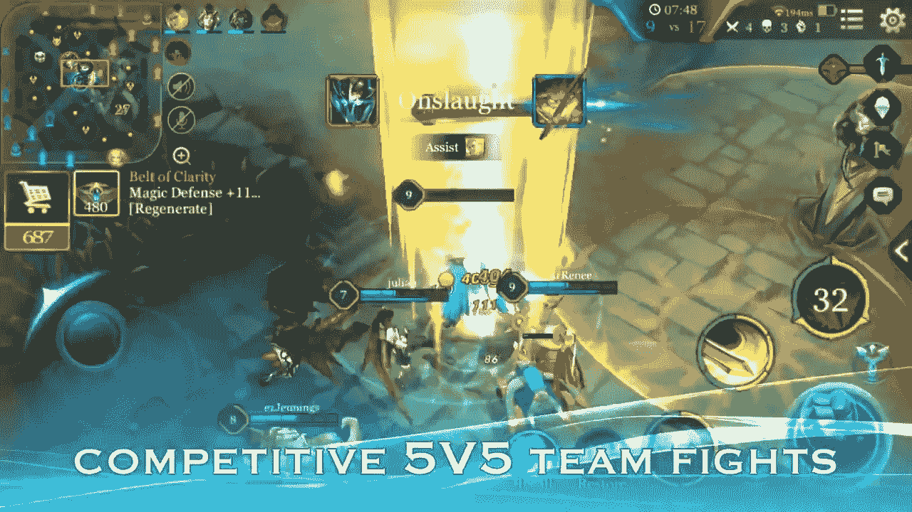
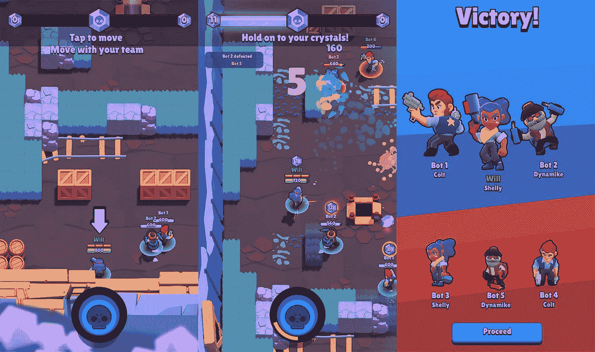
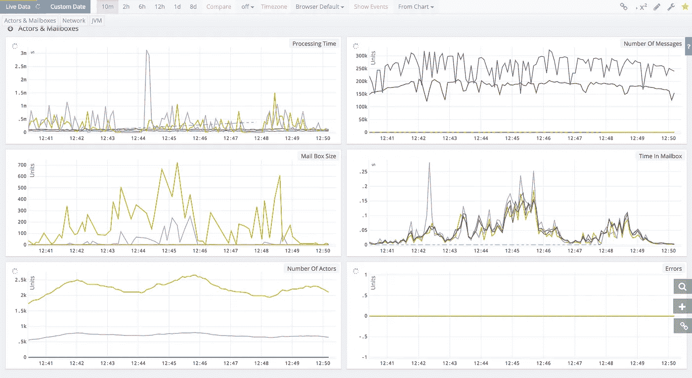
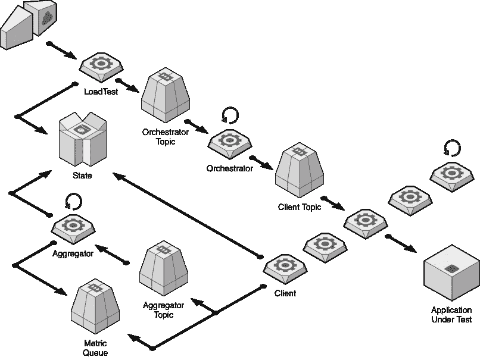
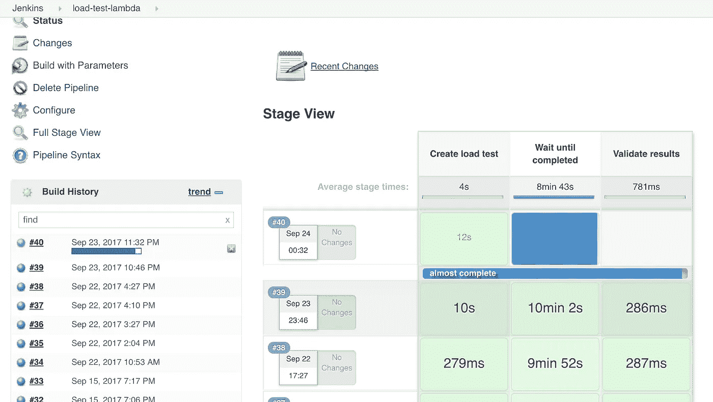

# 如何用 AWS Lambda 和 Akka 对实时多人手机游戏进行负载测试

> 原文：<https://medium.com/hackernoon/how-to-load-test-a-realtime-multiplayer-mobile-game-with-aws-lambda-and-akka-6900baa4c6ea>



Tencent’s Kings of Glory is one of the top grossing games worldwide in 2017 so far.

在过去的 12 个月里，我们已经看到许多基于团队的多人游戏上市，因为公司希望复制腾讯的*王者荣耀*(在西方被称为*英勇竞技场*)的成功，这是 2017 年全球票房最高的游戏之一。

甚至我们的合作伙伴 *Supercell* 最近也涉足了这一类型，推出了 *Brawl Stars* ，这为传统的 MOBA ( *多人在线战斗竞技场*)模式提供了不同的视角。



Supercell’s Brawl Stars offers a different experience to the traditional MOBA format, it is built with mobile in mind and prefers simple controls & maps, as well as shorter matches.

在 [***太空猿游戏***](http://spaceapegames.com) 这里，我们一直在探索一个竞技性多人游戏的想法，它还在原型中，所以我不能在这里谈论它。然而，我可以谈谈我们如何使用 AWS Lambda 来负载测试我们自己开发的网络堆栈。

# 为什么是 Lambda？

使用 EC2 服务器驱动负载测试的传统方法有几个问题:

*   **启动缓慢**:任何大规模的负载测试都需要许多 EC2 实例来生成期望的负载。因为保存这些 EC2 实例是要花费成本的，所以很可能只有在需要运行负载测试时才会产生它们。这意味着在每次测试之前有 10-15 分钟的准备时间，只是为了等待 EC2 实例准备就绪。
*   **浪费**:当负载测试是短暂的(比如说< 1 小时)时，你可能会招致大量的浪费，因为 EC2 实例是按小时计费的，最低收费为一小时([每秒计费](https://aws.amazon.com/blogs/aws/new-per-second-billing-for-ec2-instances-and-ebs-volumes/)将于 2017 年 10 月对非 Windows EC2 实例开放，这将解决这个问题)。
*   **难以部署更新**:为了更新负载测试代码本身(也许是为了向 bot 玩家引入新的行为)，您需要投资基础设施，以便在运行的 EC2 实例上更新负载测试代码。虽然这并不困难，毕竟，你可能已经为你的游戏服务器准备了一个类似的基础设施。尽管如此，这又是一个我很乐意避免的干扰。

AWS Lambda 解决了所有这些问题。

它确实引入了自己的限制，尤其是 5 分钟的执行时间限制。然而，正如我之前在中所写的那样，你可以通过将 Lambda 函数写成递归函数，并利用容器重用来从一次调用到下一次调用保持本地状态，从而绕过这个限制。

我非常喜欢诺德斯特龙公司的人在[无服务器大炮](https://github.com/Nordstrom/serverless-artillery)项目上所做的工作。不幸的是，我们不能在这里使用它，因为游戏(Unity3D 编写的客户端应用程序)通过 TCP 以自定义协议与多人服务器进行对话，在未来，这种对话也将通过可靠的 UDP 进行。

[](https://github.com/Nordstrom/serverless-artillery) [## nordstrom/无服务器-火炮

### 结合无服务器与火炮，你得到无服务器火炮即时，廉价，容易的性能测试在…

github.com](https://github.com/Nordstrom/serverless-artillery) 

# 阿卡

我们的多人服务器是用 Scala 和 [Akka](https://akka.io/) 框架编写的。为了帮助我们优化实现，我们收集了大量关于 Akka 系统和 JVM 的指标——GC、堆、CPU 使用、内存使用等。

Kamon 框架在这里是一个很大的帮助，它让我们快速了解 Akka 系统的运行——参与者的数量、消息的数量、消息在邮箱中等待的时间、我们处理每条消息的时间等等。

所有这些数据点都通过 [Telegraf](https://github.com/influxdata/telegraf) 发送到[波前](https://www.wavefront.com/)。



We collect lots of metrics about the Akka system and the JVM.

我们还有一个独立的基于 Akka 的负载测试客户端，可以模拟许多并发玩家。每个玩家都被模拟成一个*角色*，模拟 Unity3D 游戏客户端在比赛中的行为:

1.  寻找多人游戏
2.  连接到多人游戏服务器并进行自我认证
3.  玩一场 4 分钟的比赛，以每秒 15 次的速度发送输入
4.  报告“客户端”遥测数据，以便我们可以收集客户端体验的 RTT ( *往返时间*)，并使用这些遥测数据作为我们网络堆栈的定性测量

在负载测试客户端，我们使用 [t-digest](https://github.com/tdunning/t-digest) 算法来最小化在匹配期间跟踪 RTT 所需的内存占用。这允许我们在内存受限的环境中模拟更多的并发玩家，比如 Lambda 函数。

# AWSλ+Akka

我们可以在 Java8 Lambda 函数中运行负载测试客户端，并模拟每次调用 100 个玩家。为了模拟`X`并发玩家，我们可以通过 SNS 创建函数的`X/100`并发执行(它有一个*每条消息一次调用*的策略)。

为了创建一个逐渐增加的负载，一个递归`Orchestrator`函数将通过在 SNS 中发布更多的消息来逐渐增加当前执行的数量，每个消息触发一个新的递归负载测试客户端函数。



由 API Gateway 触发的`LoadTest`函数允许我们轻松地从 Jenkins 管道中启动负载测试。



使用**推拉**模式(详见[这篇文章](https://hackernoon.com/applying-the-pub-sub-and-push-pull-messaging-patterns-with-aws-lambda-73d5ee346faa)，我们可以跟踪所有并发负载测试客户端功能的进度。当他们都模拟完他们的比赛后，我们将启动`Aggregator`功能。

`Aggregator`功能将收集由负载测试客户端发布的 RTT 度量，并生成一个详细描述各种百分比 RTT 的报告。

```
{
  "loadTestId": "62db5790-da53-4b49-b673-0f60e891252a",
  "status": "completed",
  "successful": 43,
  "failed": 2,
  "metrics": {    
    "client-interval": {      
      "count": 7430209,
      "min": 0,
      "max": 140,
      "percentile80": 70.000000193967,
      "percentile90": 70.00001559848,
      "percentile99": 71.000000496589,
      "percentile99point9": 80.000690623146,
      "percentile99point99": 86.123610689566
    },    
    "RTT": {      
      "count": 744339,
      "min": 70,
      "max": 320,
      "percentile80": 134.94761466541,
      "percentile90": 142.64720935496,
      "percentile99": 155.30086042676,
      "percentile99point9": 164.46137375328,
      "percentile99point99": 175.90215268392
    }
  }
}
```

喜欢您正在阅读的内容，但需要更多帮助？我很高兴作为一名独立顾问提供服务，并帮助您完成无服务器项目——架构审查、代码审查、构建概念验证，或者提供关于领先实践和工具的建议。

我在**伦敦，英国**工作，目前是唯一一个在英国的 [**AWS 无服务器英雄**](https://aws.amazon.com/developer/community/heroes/yan-cui/) 。我有近 **10 年**的[经验](https://www.linkedin.com/in/theburningmonk/)在 AWS 中大规模运行生产工作负载。我主要在英国开展业务，但我愿意出差一周以上。为了了解我们如何合作，请告诉我更多关于你在这里试图解决的问题。

我还可以举办一个内部研讨会，帮助您的无服务器架构进入生产准备阶段。您可以在这里找到关于为期两天的研讨会[的更多信息，该研讨会将带您从 AWS Lambda 的基础一直到日志聚合、分发跟踪和安全最佳实践的通用操作模式。](https://theburningmonk.com/workshops/)

如果你喜欢按照自己的进度学习，那么你也可以找到所有与我为曼宁制作的[](https://bit.ly/production-ready-serverless)**视频课程相同的研讨会内容。我们将讨论的主题包括:**

*   **认证 *&* 授权与 API 网关 *&* 认知**
*   **本地测试 *&* 运行功能**
*   **CI/CD**
*   **日志聚合**
*   **监控最佳实践**
*   **X 射线分布式跟踪**
*   **跟踪相关 id**
*   ***性能&成本*优化**
*   **错误处理**
*   **配置管理**
*   **金丝雀部署**
*   **VPC**
*   **安全**
*   **Lambda、Kinesis 和 API 网关的最佳实践**

**你还可以用代码 **ytcui** 获得**票面价格的 6 折优惠**。不过，这个数字只有在我们参加曼宁的早期访问计划(MEAP)时才有效。**