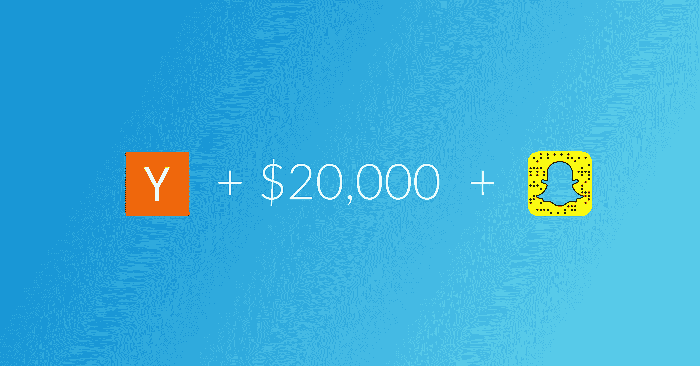
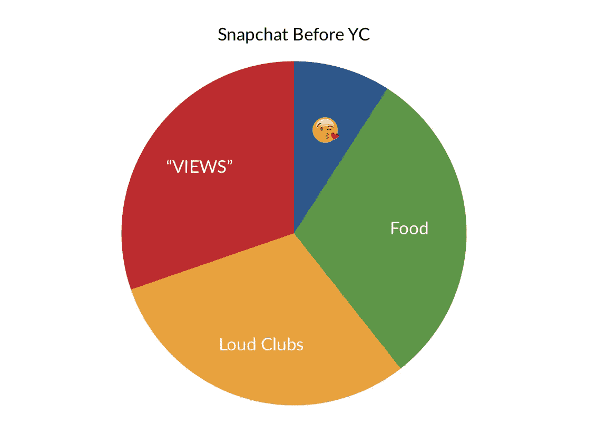
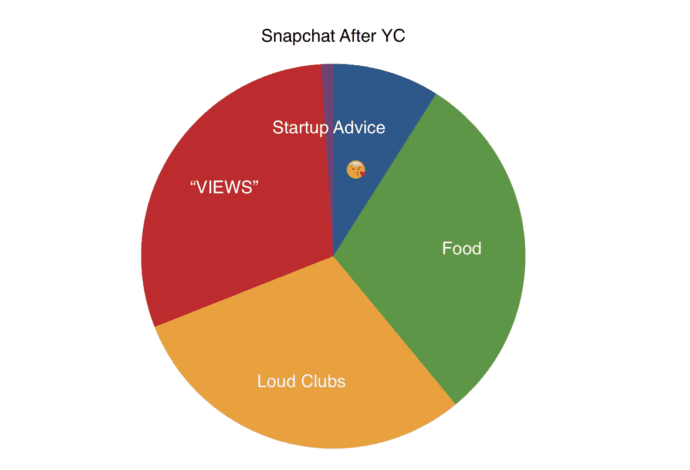
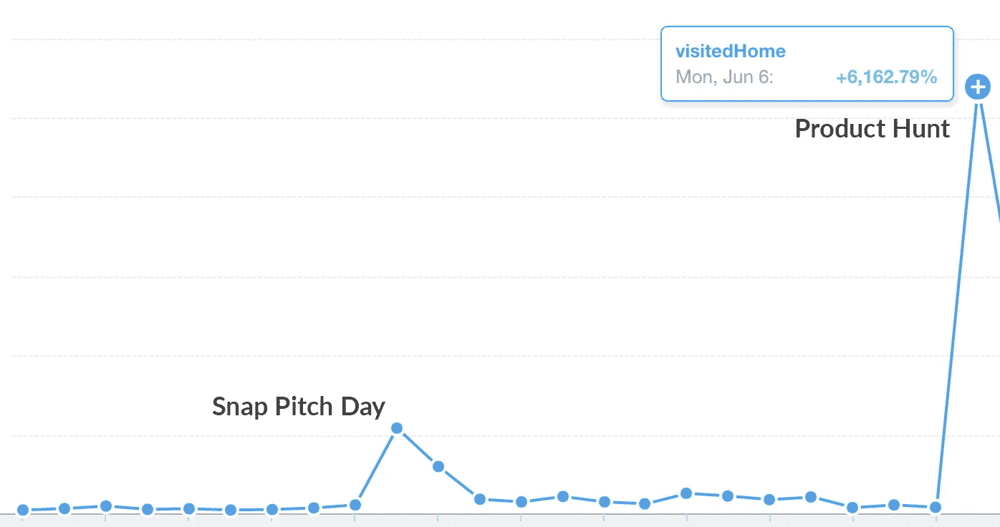

# 我们如何在 Snapchat 上赚了 20，000 美元并进入 Y Combinator。

> 原文：<https://medium.com/hackernoon/how-to-make-20-000-on-snapchat-and-get-into-y-combinator-2513a7ee371d>

当贾斯汀·坎(Justin Kan)开始通过 [Snapchat](https://hackernoon.com/tagged/snapchat) 接受 Y Combinator 的奖学金时，互联网并没有被逗乐。

Snapchat 本来应该是一个奇怪的地方，青少年会把他们不想备份的消失的照片发送到 iCloud。

突然，Y Combinator 加入了游戏，一小部分 snappers 会转向友好的幽灵，寻求半精心设计的、斗志昂扬的、有点搞笑的[初创公司](https://hackernoon.com/tagged/startup)的推介。

我们的初创公司 Fiix 就是其中之一。当我们申请 pitch 时，这只是为了寻求刺激，但当我们收到那封金色的“Fiix 将登上贾斯汀的 Snapchat”电子邮件时，我们感觉就像查理一样。

在我们的球场上，我们使出浑身解数:疯狂的增长，大$$$，吸毒队，和一些模仿(包括德雷克)。在第一个小时内，贾斯汀有超过 2000 名观众观看了他的故事，全天有 500 人在 Snapchat 上添加了我们。

接下来的一周，贾斯汀的 snapchat 粉丝投票选出了他们最喜欢的人。几天后，我们接受了 YC 奖学金的采访，采访对象是 Adora Cheung(Homejoy 的首席执行官)。我们阅读了所有的[“如何进入 YC”中级职位](/search?q=YC%20interview)，进行了面试，并在第二天获得了一个奖学金名额。

周二晚上 5 点，接受邮件确切地说，但不确切地说，就像:

> *“欢迎来到 YC，我们需要你明天早上去加州山景城…*

*我们必须在第二天早上 8:30 从多伦多飞往加利福尼亚，而我们离最近的机场也有几个小时的路程！所以我迅速拿起装了一周衣服的洗衣袋，跳上我看到的第一辆出租车，奔向机场。我们甚至在出租车上订了机票。在机场，我们了解到美联航可以向您出售加拿大航空的座位并确认您的预订，但只能在“2 小时传播期”后通知加拿大航空(或另一家航空公司)您的预订。*就算航班 2 个半小时后起飞！**

*为了说服他们让我们登机，我们说了一切，每个联合创始人都尝试了不同的渠道。Zain 在和 WestJet 通话，我在和 Air Canada 通话， [Arif](https://www.linkedin.com/in/arif-bhanji-3154243a) 在和客服通话。在某个时候，我们会说这样的话，“明天早上，加利福尼亚有一个人想给我们一大笔钱，如果你不让我们上这班飞机，我们公司就要倒闭了”。谢天谢地，在飞机起飞前 45 分钟，加拿大国际航空公司的 1 号员工(在 YYZ 对罗斯大喊)让我们上了飞机。*

*在维加斯停留了一夜后(显然我们没有在那里睡觉),我们到达了 YC 总部。我们从[的首席执行官那里听到了关于董事会](https://www.crunchbase.com/person/sanjay-dastoor)、 [Quora](https://www.wikiwand.com/en/Adam_D'Angelo) 和贾斯汀本人的消息。*

*在经历了这一切之后，YC 给了我们 2 万美元的资助，以及太多的 AWS 积分。*

*但是，故事并没有就此结束。*

*Eric 原来是产品搜索的头号猎人，并帮助我们上了它的封面。*

*早餐前从 Product Hunt 到 Menlo Park 的交通比旧金山还糟糕。主页的访客增加了 6000%，我们仍然在免费的 Heroku 计划中😂。*

**

*这是一个很难学习的课程，但是 Snapchat 不仅仅是为了糟糕的食物照片，它是一个将梦想变成现实的网络。YC 对此很认真，我们在这个平台上发现了很多聪明的人，有很好的想法。它感觉原始，诚实，有趣。成长秘籍，创业人生，A+内容，[在 snap 上关注我(kmx411)。](http://snapchat.com/add/kmx411)*

*下次你的车有任何问题，记得 [Fiix](https://www.fiix.io) 。或者至少[访问我们的网站](http://www.fiix.io),这样我们就可以用重新定位的广告来打击你；)*

**

*关于 [Fiix](http://www.fiix.io) :*

> *Fiix 是一家总部位于多伦多的组织，在您的家中或办公室提供经济、便捷的按需汽车维修服务。*
> 
> *Fiix 提供获得全面许可的顶级技工，他们会来找你，这样你就不必在修理厂浪费时间。诚实、信任、便利和实惠是我们业务的重中之重，因为我们努力消除拥有汽车的烦恼。*
> 
> *我们的一些汽车维修服务包括:轮胎更换、机油更换、汽车检查、刹车片更换、起动机更换、电池更换等等。请访问 www.fiix.io 了解更多信息，并查看我们的完整服务列表。*

******

> *[黑客中午](http://bit.ly/Hackernoon)是黑客如何开始他们的下午。我们是 [@AMI](http://bit.ly/atAMIatAMI) 家庭的一员。我们现在[接受投稿](http://bit.ly/hackernoonsubmission)并乐意[讨论广告&赞助](mailto:partners@amipublications.com)机会。*
> 
> *如果你喜欢这个故事，我们推荐你阅读我们的[最新科技故事](http://bit.ly/hackernoonlatestt)和[趋势科技故事](https://hackernoon.com/trending)。直到下一次，不要把世界的现实想当然！*

**