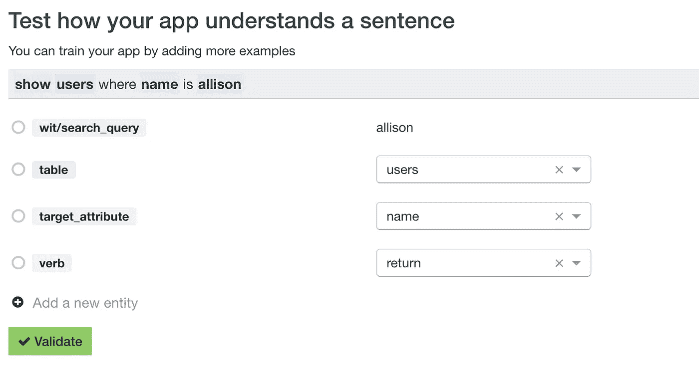

# 如何制作一个与你的 Rails 数据库对话的聊天机器人

> 原文：<https://medium.com/hackernoon/how-to-make-a-bot-that-talks-to-your-rails-database-af400a98d07d>

今天是复活节星期五，我在 ProductHunt 上遇到了这个很酷的初创公司，它将简单的英语转换成 SQL 查询。所以类似于*“向用户显示墨尔本***”**的东西，它会处理并输出类似

```
*SELECT * FROM users WHERE city = ‘Melbourne’;*
```

我认为这是最棒的，我必须找到所有这些是如何工作的。我的组织中的非技术人员真的可以使用这样的东西。想象一下进入松弛状态

> 本周有多少用户注册了？

或者

> **/db_bot** 查找 5 个最新用户

所以我的目标变成了如何制作一个能与我的 Rails 数据库对话的机器人。

1.  我需要做的第一件事是研究自然语言处理。你基本上可以将机器学习应用于一个短语并提取含义。这是目前所有的热潮，所以我想肯定有一个很好的免费图书馆。在权衡了几个选项之后，Wit.ai 似乎是我所需要的完美人选。
2.  Wit.ai 是一个界面，在这里你可以用你希望你的机器人理解的语句和短语来训练你的机器人。实际上开始非常容易。看看下面我所做的，但本质上我在我的短语含义中指定了相关的词，意思是稍后将作为属性返回。看看他们的文件[https://wit.ai/docs](https://wit.ai/docs)了解更多。



3.现在我已经训练好了我的初始短语，让我们跳进一些红宝石。Wit.ai 有宝石棒！安装[红宝石](https://github.com/wit-ai/wit-ruby)并直接跳进去。真的很好用。发送一条消息，并获得您在上一步中设置的所有实体的散列。使用所有这些数据足以让我们构建数据库查询。

```
> Wit.message('Find users where name is Allison')
=> {
  "verb" => [
    {
      "confidence" => 0.9961181593747102,
            "type" => "value",
           "value" => "return"
    }
  ],
  "table" => [
    {
      "confidence" => 0.9972328497408993,
            "type" => "value",
           "value" => "users"
    }
  ],
  "target_attribute" => [
    {
      "confidence" => 0.9919267848022522,
            "type" => "value",
           "value" => "name"
    }
  ],
  "search_query" => [
    {
      "confidence" => 0.9543589657183698,
            "type" => "value",
           "value" => "allison",
       "suggested" => true
    }
  ]
}
```

4.剩下的就相当简单了。您将实体分配给变量，应用一点小魔法，viola 就有了您的第一个查询。

```
[@class](http://twitter.com/class) = [@table](http://twitter.com/table).singularize.camelize.constantize
@class.where(@target_attribute.to_sym => @search_query)
```

这是我之前准备的一个例子。你可以在 [Github](https://github.com/dawilster/db_bot) 上找到源代码

```
> bot = DbBot.message('How many users signed up this week?')
> bot.response
=> "5 users"
> bot = DbBot.message('Find the last 10 users') 
> bot.response
=> "There you go"
> bot.collection
=> #<ActiveRecord::Relation [#<User id: 1...
```

还有很多东西需要进入 [db_bot](https://github.com/dawilster/db_bot) 中，但它是我最终想要驱动 Slack bot 的基础，我们的团队可以用它从我们的数据库中提取数据。

[](http://bit.ly/HackernoonFB)[](https://goo.gl/k7XYbx)[](https://goo.gl/4ofytp)

> [黑客中午](http://bit.ly/Hackernoon)是黑客如何开始他们的下午。我们是 [@AMI](http://bit.ly/atAMIatAMI) 家庭的一员。我们现在[接受投稿](http://bit.ly/hackernoonsubmission)并乐意[讨论广告&赞助](mailto:partners@amipublications.com)机会。
> 
> 如果你喜欢这个故事，我们推荐你阅读我们的[最新科技故事](http://bit.ly/hackernoonlatestt)和[趋势科技故事](https://hackernoon.com/trending)。直到下一次，不要把世界的现实想当然！

