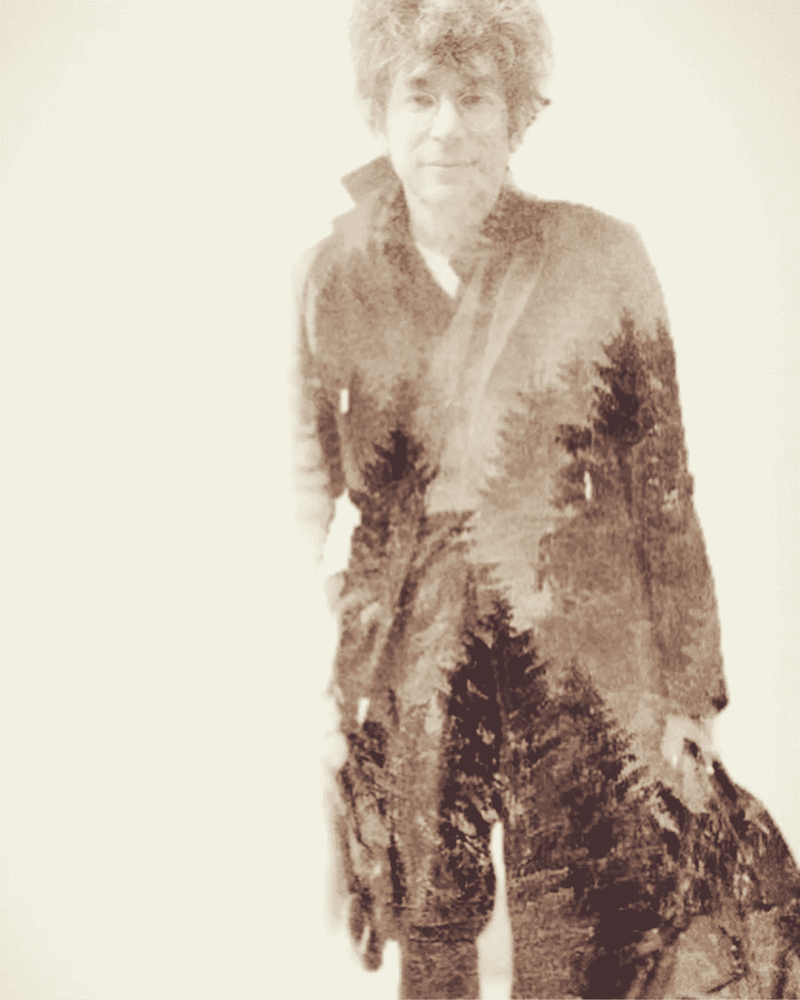
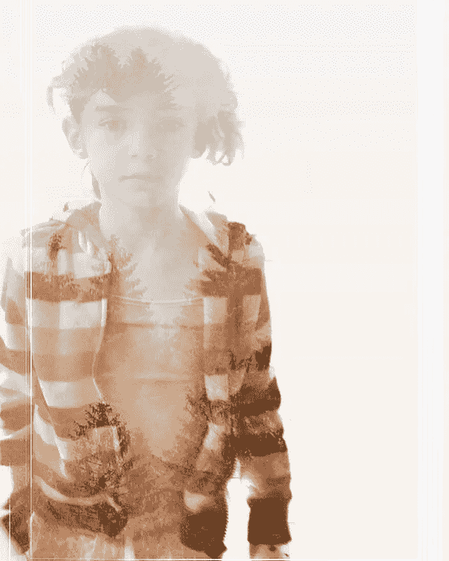
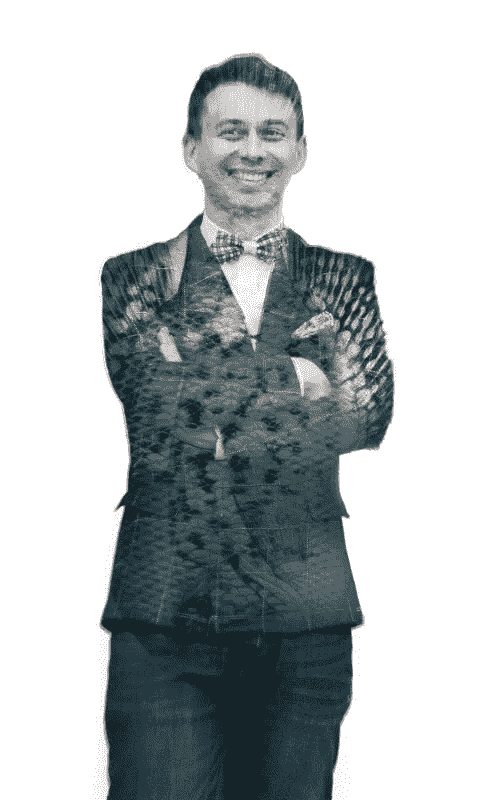
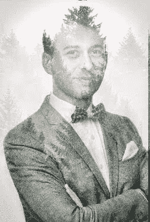
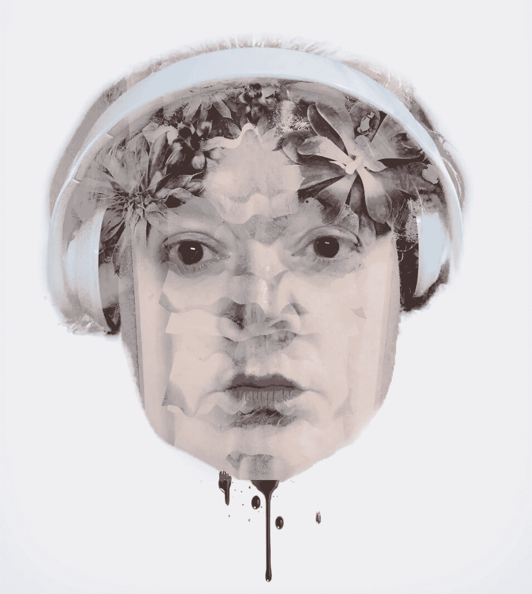
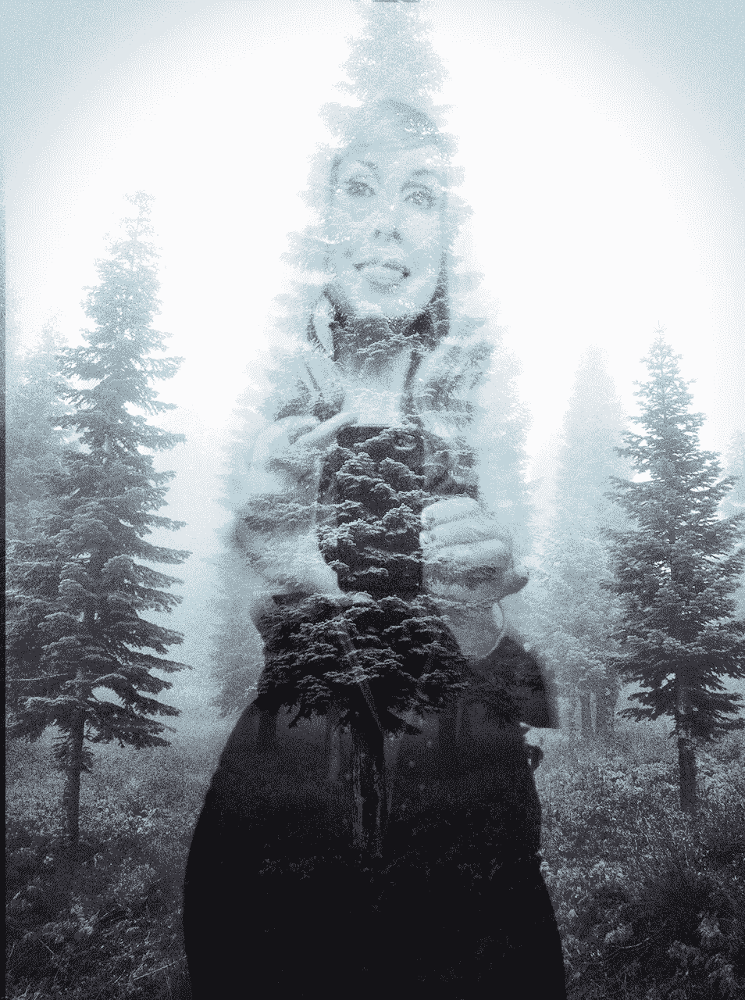

# 如何使用光线应用程序进行双重曝光

> 原文：<https://medium.com/hackernoon/how-to-make-a-double-exposure-using-the-enlight-app-29c273fca314>

[James Altucher](https://medium.com/u/cac1bc5422de?source=post_page-----29c273fca314--------------------------------)

昨天，我徒劳地寻找一个好的 [Enlight app](https://itunes.apple.com/us/app/enlight/id930026670?mt=8) 教程，以学习如何制作我在互联网上到处看到的那些很酷的双重曝光。

我看了几个视频，但似乎无法找出制作双重曝光的第一个也是最重要的部分，所以我决定制作自己的教程。给你。对于这些双重曝光，我使用我的 iPhone，因为 Enlight 目前只适用于苹果公司。

My daughter and [Marcin Osman](https://medium.com/u/5f3c362efbbb?source=post_page-----29c273fca314--------------------------------)

如果你不想阅读文本，而更喜欢看相同材料的视频教程，你可以这样做:

第一步:选择一张有一个人的照片。在光线 app 中打开。
第二步:从下拉菜单中选择图片。
第三步:选择调整。
第四步:选择工具。
第五步:选择基本。
第六步:选择偏置。
第七步:沿着屏幕向右滑动手指，直到屏幕变成 100%白色。
第八步:选择蒙版。
第九步:选择擦拭。
第十步:用手指在屏幕上摩擦，让图像出现。
步骤 11:如果摩擦过多的图像，请选择“应用”将其移除。
第 12 步:在你制作了人物的图像并有了 100%的白色背景后，点击右上角的复选标记。
第十三步:选择保存按钮，点击保存照片。第十四步:选择你的背景照片。森林，鱼类，树木很适合这种渗透图像。在 Enlight 中打开这张照片。
第十五步:选择工具。
第十六步:选择混音器。步骤 17:选择你的人物图像，100%白色背景。
第十八步:选择工具。
第十九步:选择混合。第 20 步:选择屏幕。
第 21 步:在 iPhone 屏幕上水平滑动手指，尝试透明度。步骤 22:选择工具来移动你的人像，找到双重曝光的最佳位置。用两个手指在屏幕上放大或缩小。第 23 步:当你的图像看起来不错时，选择复选标记。第 24 步:裁剪你的图片。选择画布，然后选择裁剪。
第 25 步:选择滤镜
第 26 步:选择 BW
第 27 步:选择看起来很酷的。第 28 步:打对勾。第 29 步:在滤镜下，选择 DUO
第 30 步:再次尝试，直到你找到一些看起来很酷的滤镜(我喜欢 Playa)。
步骤 31:点击复选标记
步骤 32:选择保存按钮，然后点击保存照片。

你完了。:)

我的流血头像照片更像是四倍曝光，最后加了滴血。我得为那个做一个不同的教程。

Daphne Young

如果这还不够，这里有一个动画视频一步一步向你展示如何制作一个鱼人。

有趣的是，波兰企业家[马尔辛·奥斯曼](https://medium.com/u/5f3c362efbbb?source=post_page-----29c273fca314--------------------------------)给了我一些汤姆的除臭剂，作为交换，我给了他上图中的双重曝光。你可能知道马尔钦，因为他是最近在波兰书店买到了 T2·加里·维纳查克的书的企业家。不管怎样，我和 Marcin 都在“选择你自己脸书”小组，昨晚他看到了我在新闻提要中对 [James Altucher](https://medium.com/u/cac1bc5422de?source=post_page-----29c273fca314--------------------------------) 的双重曝光。他问我能不能做一个他，他很客气的问我需要什么回报。我告诉他汤姆的除臭剂(我讨厌买必需品)。我们说话这会儿他正发给我。我为他完成了大约 5 次不同的双重曝光。我喜欢超额交货。

> [黑客中午](http://bit.ly/Hackernoon)是黑客如何开始他们的下午。我们是 [@AMI](http://bit.ly/atAMIatAMI) 家庭的一员。我们现在[接受投稿](http://bit.ly/hackernoonsubmission)并乐意[讨论广告&赞助](mailto:partners@amipublications.com)机会。
> 
> 如果你喜欢这个故事，我们推荐你阅读我们的[最新科技故事](http://bit.ly/hackernoonlatestt)和[趋势科技故事](https://hackernoon.com/trending)。直到下一次，不要把世界的现实想当然！

